# drone_sim

复现论文：**Onboard cooperative relative positioning system for Micro-UAV swarm**

> 时间：2026 年 3 月 — 7 月  
> 仿真平台：XTDrone

---

## 目录

- [一、YOLOv7 训练数据（2026 年 6 月 7 日）](#一yolov7-训练数据2026-年-6-月-7-日)
- [二、EKF 算法结果分析](#二ekf-算法结果分析)
- [三、实验过程中的思路、遇到的问题以及解决思路](#三实验过程中的思路遇到的问题以及解决思路)
- [四、UWB 数据处理分析报告](#四uwb-数据处理分析报告)
- [五、角度误差分析报告](#五角度误差分析报告)
- [六、数据记录](#六数据记录)
- [run_21~run_25](#run_21run_25)
- [run_26~run_27](#run_26run_27)
- [run_28~run_31](#run_28run_31-dgo-融合历元时间系统重构)
- [run_34~run_35](#run_34run_35-任务完成自动停止--速度源修正--evaluator-飞行窗口停止)
- [run_36~run_38](#run_36run_38-uwb-时间戳语义修正)

---

## 一、YOLOv7 训练数据（2026 年 6 月 7 日）

### 1. 训练结果

#### 1.1 最佳训练结果

| 指标 | 数值 |
| :--- | --: |
| Best Epoch | 396 / 400 |
| Precision | **0.9929** |
| Recall | **0.9813** |
| mAP@0.5 | **0.9949** |
| mAP@0.5:0.95 | **0.6321** |
| Box Loss | 0.02549 |
| Object Loss | 0.002584 |
| Classification Loss | 0 |
| GPU Memory | 0.95 GB |

#### 1.2 精度曲线

- **map_0.5**

  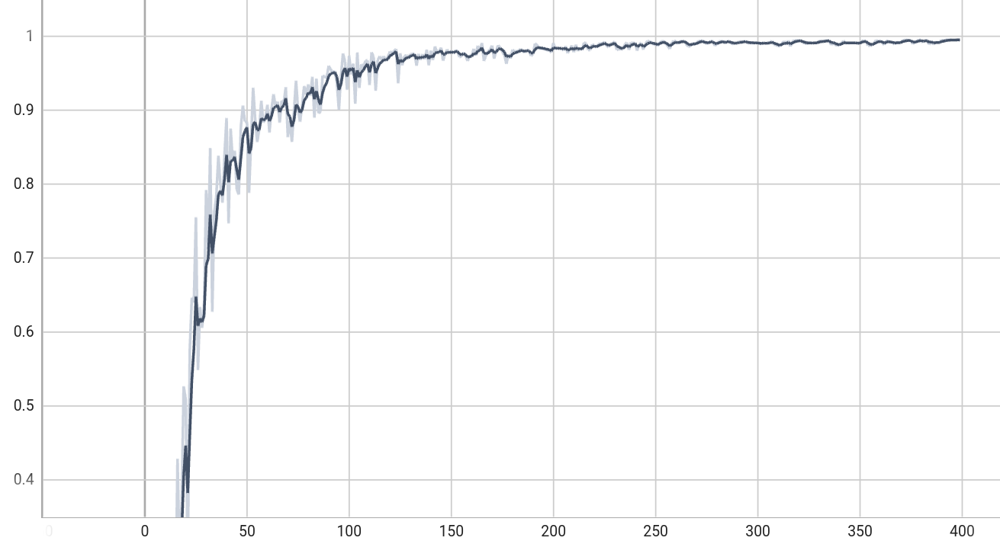

- **map_0.5:0.95**

  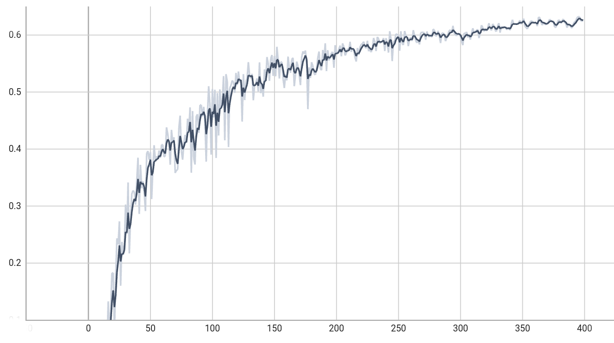

- **Precision**

  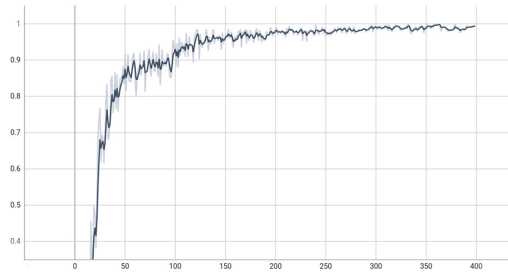

- **Recall**

  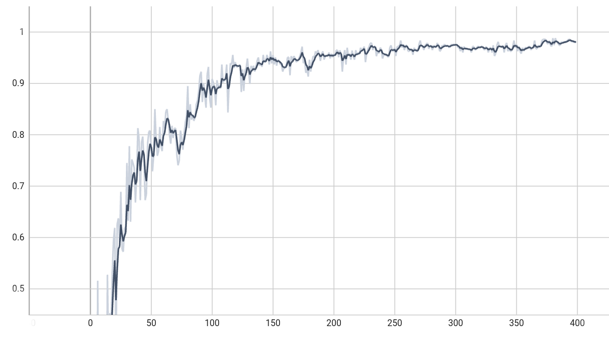

#### 1.3 损失曲线

**训练集损失**

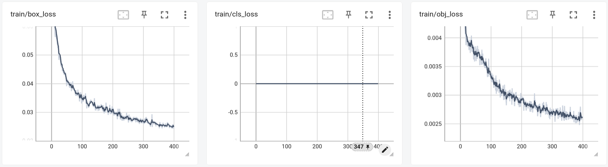

**验证集损失**

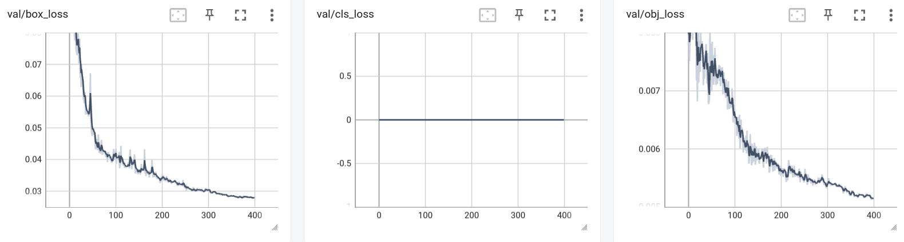

#### 1.4 预测效果

| | |
|---|---|
| 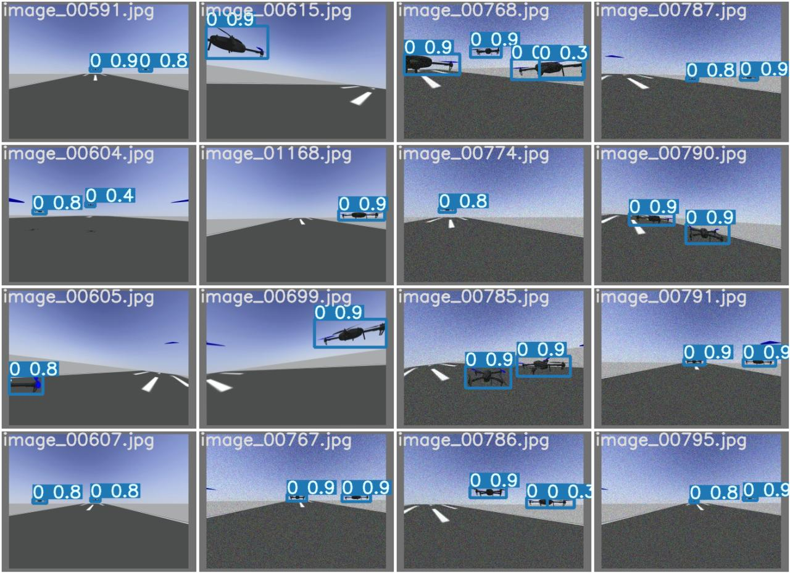 | 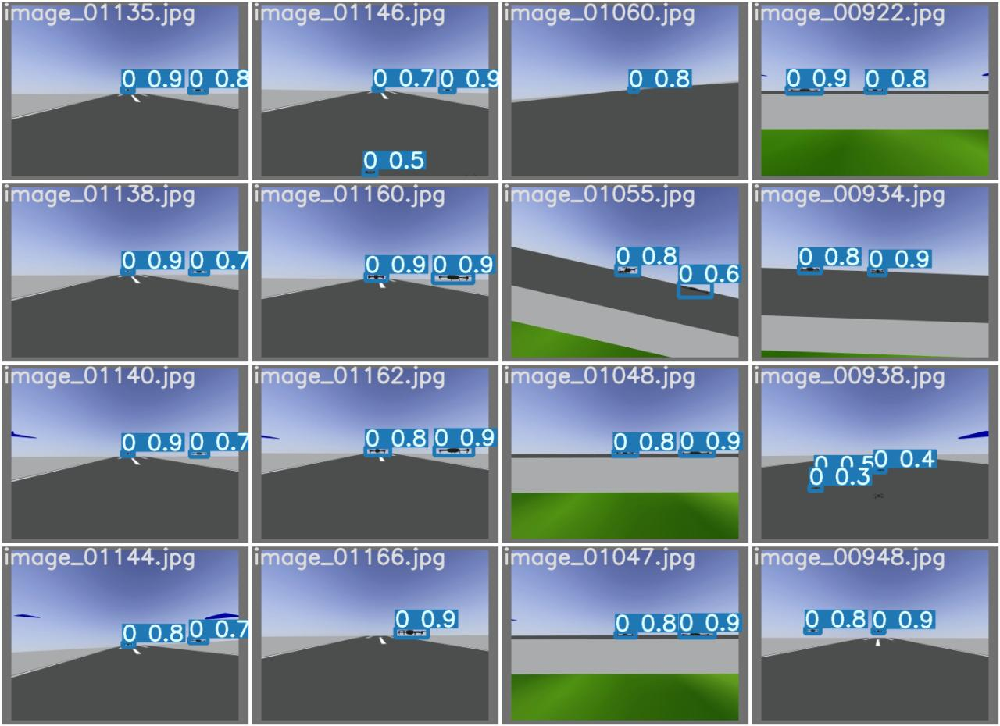 |

#### 1.5 模型参数规模

| 指标 | 值 |
| :--- | :--- |
| 总参数量 | 6,007,596 (~6M) |
| 模型大小 (float32) | 22.92 MB |
| ONNX 导出大小 | 24 MB |
| 网络层数 | 208 层 |
| 检测头 | IDetect（3 个尺度） |
| 识别类别 | 1 类：drone |
| 输入尺寸 | 320×320 |
| 下采样倍数 | 32 |

#### 1.6 编队飞行识别效果视频

<video controls src="yolov7_result_files/xtdrone_ImageDetect_sim1.mp4" title="Title"></video>

由于影子干扰模型的识别，去除仿真环境中的阴影之后重新仿真：

<video controls src="yolov7_result_files/xtdrone_ImageDetect_sim2.mp4" title="Title"></video>

---

## 二、EKF 算法结果分析

### 1. EKF 估计轨迹与真值的三维对比可视化

| 指标 | 四机平均值 |
|------|-----------|
| 平均采样数 | 4435 |
| 平均时长 | 81.80 s |
| ATE RMSE | 1.2418 m |
| 漂移率 | 0.0152 m/s |
| 漂移率 | 0.91 m/min |
| RPE @ 1s | 0.4201 m |
| RPE @ 5s | 1.4955 m |
| RPE @ 10s | 1.6802 m |
| 姿态误差 RMSE | 0.2335 deg |

---

## 三、实验过程中的思路、遇到的问题以及解决思路

### 1. 目的：测量相对角度计算误差

**大致思路：**

**相对角度计算：**

- 使用节点：`image.py`、`camera_relative_angle_cal.cpp`
- 发布话题：`/iris_X/camera_angle`（enu 坐标系）
- 话题内容：

```msg
std_msgs/Header header
uint8 count            # number of detected objects
float32[] alpha        # horizontal bearing angle (radians), atan2(y, x)
float32[] theta        # elevation angle (radians), asin(z / mag)
```

**误差计算：**

`test/src/angle_error_cal.cpp`:

1. 订阅话题：`gazebo/model_states`，获取本地无人机 `iris_i` 和其他无人机 `iris_j` 真实位置 Pi、Pj；
2. 订阅话题：`/iris_i/camera_angle`（enu 坐标系）获取本地无人机检测结果；
3. 在 `gazebo/model_states` 回调函数中计算相对向量：Pij = Pj - Pi，计算相对角度 alpha_gt、theta_gt；
4. 在 `/iris_i/camera_angle` 回调函数中遍历检测结果，计算 `e = sqrt(alpha_error^2 + theta_error^2)`，并限制到 `[-π, π]`，保存每一时刻的误差到 .csv 文件，后续进行误差分析；
5. 结束时统计 RMSE_alpha 和 RMSE_theta。

**环境文件：**

复制 `outdoor2.launch` 为 `outdoor2_copy.launch`，修改 `outdoor2_copy.launch`，只保留 `iris_0` 和 `iris_1`。

**飞行控制节点：**

`test/src/two_uavs_formation.cpp`：

- 飞机：`iris_0` 和 `iris_1`
- stage1：起飞至 3m
- stage2：保持静止和悬停 3s
- stage3：径向扩展并收缩回原来的位置
- stage4：以两架无人机中心为原点，绕原点旋转 180 度，再返回
- stage5：着陆

**启动文件：**

`test/launch/angle_error_test.launch`：启动 `iris_0` 和 `iris_1`，运行 `image.py`、`camera_relative_angle_cal.cpp`、`angle_error_cal.cpp`、`two_uavs_formation` 节点。

#### （1）第一次测量角度

##### 测量结果：

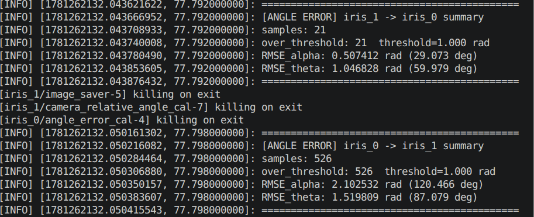

##### 问题

1. `iris_0` 检测 `iris_1` 角度误差比 `iris_1` 检测 `iris_0` 的角度误差大很多
2. alpha 和 theta 的误差也相差较大

##### 对策

**1. 可视化角度测量**

目的：检测相对角度计算是否合理可靠。

调用 `image.py` 识别无人机信息 → `camera_relative_angle_cal.cpp` 计算相对角度 → 计算真实相对角度 → 在无人机识别框中标注 `angle_est` / `angle_gt`（以度形式）。

结果：

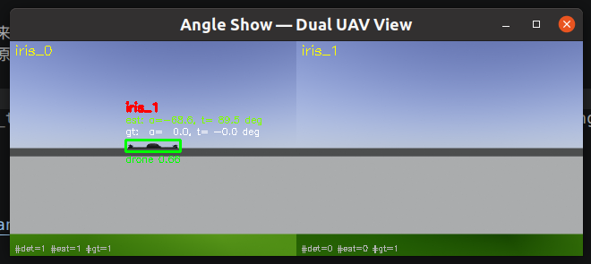

可以发现相对角度测量结果完全不对，其中 `angle_show.py` 中标注的 `angle_est` 直接来自于话题 `/iris_X/camera_angle`，说明相对角度的计算有问题。

终端调用命令：

```bash
watch -n 1 "rostopic echo /iris_0/camera_angle"
```

显示：

```
header:
  seq: 53
  stamp:
    secs: 722
    nsecs:  10000000
  frame_id: "map"
count: 1
alpha: [-1.2407687902450562]
theta: [1.5640960931777954]
```

这里 `frame_id: "map"`，说明相对角度计算是在 map（全局坐标系下的），应该是 enu 坐标系，初步判断是坐标系转换出现问题。问题转交给 Claude Code，发现代码中存在坐标系转换问题：

> `detCallback` 中第 92 行的 `ray_cam` 处于光学帧（Z=前，X=右，Y=下），但第 79 行 `R_world_cam` 是把 `camera_link` FLU（X=前，Y=左，Z=上）旋转到 ENU。直接用光学帧向量乘以 FLU→ENU 矩阵，导致 Z 方向分量（光学帧的前向）被误当作 FLU 的向上，使得 theta 始终接近 90°。

修改代码重新运行，最终效果：

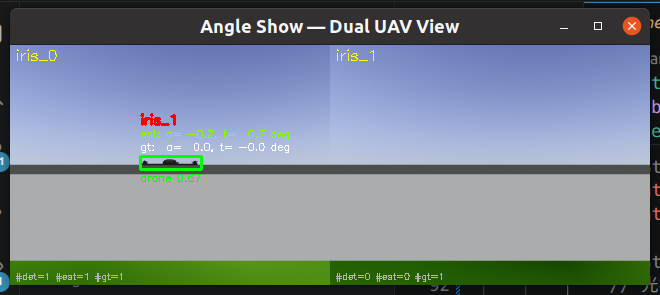

可见角度计算基本正确，重新测试角度误差，结果如下：

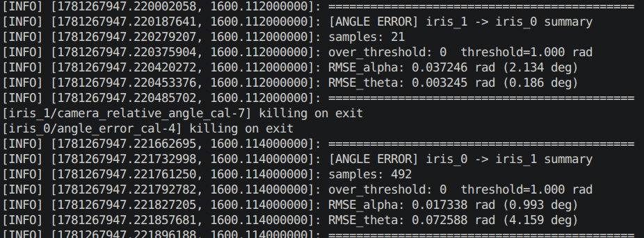

角度误差在合理范围内，问题解决！

### 2. 目的：提高 id 匹配的准确率

#### 采取的措施

1. 添加初始时刻各个无人机之间的相对向量，因为是无人机编队飞行，初始时刻设置的无人机之间的距离和方向都是已知的，添加先验信息之后 id 匹配检测准确率大幅提高，准确率估计基本在 90%；
2. 添加连续帧检测之后检测成功率再次提高，但是会出现同一帧中的多个检测框匹配为同一无人机 ID；
3. 添加判断：同一 ID 只保留误差最小的那个检测框，其余置为 -1，再次测试，成功率接近 100%，并且将影子也排除在外！

### 3. 目的：实现通信节点模拟

每一个无人机广播的内容包括：

1. 位置估计，来源于 `/iris_X/ins_estimate`
2. 水平速度 V<sup>flow</sup>

通信频率：10Hz。

**实现思路：**

`sensors/msg/ComMsg.msg`：

```msg
std_msgs/Header header
uint8 id
geometry_msgs/Point position
geometry_msgs/Vector3 velocity
```

`sensors/src/communication.cpp`：对于本机 i：

- 订阅话题 `/iris_X/ins_estimate`
- 构建消息：写入速度和位置还有时间戳信息和 id 信息
- 以 10Hz 频率发布话题 `/iris_i/communication`

### 4. 目的：实现 DGO 图优化

#### （1）数据预处理

设本机为 i：

```python
for j in N:
    订阅话题 iris_j/communication、iris_i/ins_estimate
    解析话题消息并分别将速度和位置打包为 v_est 和 p_est
        v_est 格式：(vx, vz, 0, id)
        p_est 格式：(px, py, pz, id)
    计算补偿之后的位置：
        pc = p_est + v_est * dt   # dt 为通信延迟 100ms
    将 pc 装进集合 Pc 中
# Pc 表示所有无人机的补偿位置信息集合
```

---

## 附：遇到的一些问题

### 1. 在实现 id 匹配时，识别准确率很低

（后续内容可继续补充）

---

## 四、UWB 数据处理分析报告

**数据来源**: `uwb_zero_score` 节点录制的 CSV 文件  
**参数配置**: window=5, z_score_threshold=3.0, min_stddev=0.08, min_distance=0.10, warmup_stddev_threshold=0.02, max_consecutive_rejects=5  

### 1. 数据概览

| 无人机 | 原始测量数 | 处理后数量 | 接收率 | 对齐对数 |
|--------|-----------|-----------|--------|---------|
| iris_0 | 5,694 | 5,628 | 98.8% | 5,628 |
| iris_1 | 5,655 | 5,611 | 99.2% | 5,611 |
| iris_2 | 5,697 | 5,649 | 99.2% | 5,649 |
| iris_3 | 5,697 | 5,650 | 99.2% | 5,650 |

- 消息频率: 25.0 Hz（稳定）
- 时间跨度: 173.2 → 249.1 s（约 76 秒）

### 2. 滤波精度（全局）

| 无人机 | 原始 RMSE | 滤波后 RMSE | 提升幅度 | 滤波最大误差 |
|--------|----------|-----------|---------|------------|
| iris_0 | 0.0792 m | **0.0428 m** | **46.0%** | 0.2944 m |
| iris_1 | 0.0777 m | **0.0425 m** | **45.3%** | 0.2051 m |
| iris_2 | 0.0764 m | **0.0419 m** | **45.2%** | 0.2295 m |
| iris_3 | 0.0793 m | **0.0421 m** | **47.0%** | 0.1646 m |

- 四机滤波后 RMSE 集中在 **4.2–4.3 cm**，一致性极好
- 相比原始数据，Z-score 均值滤波平均提升 **45.9%**
- 滤波后 MAE 约 3.3 cm，均值误差接近零（无偏估计）

### 3. 各目标通道误差

| 无人机 | 目标 | 数据量 | 原始 RMSE | 滤波 RMSE | 提升 |
|--------|------|--------|----------|----------|------|
| iris_0 | 1 | 1,877 | 0.0790 | 0.0422 | 46.6% |
| iris_0 | 2 | 1,869 | 0.0794 | 0.0461 | 41.9% |
| iris_0 | 3 | 1,882 | 0.0793 | 0.0399 | 49.8% |
| iris_1 | 0 | 1,869 | 0.0768 | 0.0395 | 48.5% |
| iris_1 | 2 | 1,874 | 0.0765 | 0.0403 | 47.2% |
| iris_1 | 3 | 1,868 | 0.0797 | 0.0471 | 40.9% |
| iris_2 | 0 | 1,875 | 0.0750 | 0.0435 | 42.0% |
| iris_2 | 1 | 1,883 | 0.0772 | 0.0413 | 46.4% |
| iris_2 | 3 | 1,891 | 0.0770 | 0.0407 | 47.1% |
| iris_3 | 0 | 1,881 | 0.0797 | 0.0415 | 48.0% |
| iris_3 | 1 | 1,879 | 0.0781 | 0.0438 | 43.9% |
| iris_3 | 2 | 1,890 | 0.0800 | 0.0409 | 49.0% |

所有 12 个通道滤波 RMSE 在 **0.039–0.047 m** 范围内，无异常通道。

### 4. 误差分布（滤波后绝对误差）

| 百分位 | iris_0 | iris_1 | iris_2 | iris_3 |
|--------|--------|--------|--------|--------|
| P50（中位数） | 0.0265 | 0.0272 | 0.0278 | 0.0268 |
| P75 | 0.0467 | 0.0473 | 0.0470 | 0.0468 |
| P90 | 0.0689 | 0.0678 | 0.0676 | 0.0703 |
| P95 | 0.0841 | 0.0841 | 0.0820 | 0.0846 |
| P99 | 0.1166 | 0.1183 | 0.1152 | 0.1140 |
| P100（最大） | 0.2944 | 0.2051 | 0.2295 | 0.1646 |

- 50% 的滤波误差 ≤ **2.7 cm**
- 90% 的滤波误差 ≤ **6.9 cm**
- 四机 P50–P99 高度一致，滤波器行为稳定

### 5. 异常值拒绝分析

| 无人机 | 被拒绝测量 | 拒绝率 | 被拒测量均值 | 被拒测量真值均值 |
|--------|----------|--------|-------------|----------------|
| iris_0 | 66 | 1.16% | 3.18 m | 3.20 m |
| iris_1 | 44 | 0.78% | 3.18 m | 3.20 m |
| iris_2 | 48 | 0.84% | 3.33 m | 3.29 m |
| iris_3 | 47 | 0.82% | 3.23 m | 3.18 m |

- 拒绝率 0.78%–1.16%，约 **0.9%**
- 被拒绝测量均值与 GT 均值接近，Z-score 剔除的是**瞬时噪声跳变**而非系统偏置

### 6. 与上次测试的对比

| 指标 | 上次 | 本次 | 变化 |
|------|------|------|------|
| iris_3 冷启动问题 | 有（前 0.4s 输出 0 值，导致~1.2m 误差） | 无 | warm-up 机制修复 |
| 全局滤波 RMSE | ~0.073 m（raw vs filt） | ~0.042 m（filt vs GT） | 可对 GT 评估 |
| 四机一致性 | iris_3 显著劣于其他 | 四机高度一致 | 问题解决 |
| 拒绝率 | 0.68–1.24% | 0.78–1.16% | 稳定 |
| 最大误差 | 2.28 m（iris_3） | 0.29 m | **下降 87%** |

### 7. 结论

1. **滤波显著有效**: 原始 UWB 测量 RMSE ~7.7 cm，滤波后降至 ~4.2 cm，提升幅度 **45%**
2. **算法稳健**: Z-score=3σ 阈值在保持 99% 接收率的同时有效剔除了 ~1% 的瞬时跳变
3. **冷启动修复**: iris_3 前次测试的 0 值污染问题通过 warm-up 检测彻底消除
4. **四机无差异**: 所有 12 个通道滤波精度在 0.039–0.047 m 范围，系统一致性优秀

---

## 五、角度误差分析报告

**节点链**: `image.py` → `camera_relative_angle_cal` → `angle_error_cal`
**参数**: max_match_error=1.0 rad, tf_timeout=30ms, output: csv_dir=src/test/logs/

### 1. 运行测试结果 (2026-06-16)

| 指标 | iris_0 → iris_1 | iris_1 → iris_0 |
|------|-----------------|-----------------|
| 有效样本 | **499** | **23** |
| 超出阈值 | 0 | 0 |
| RMSE_alpha | **0.0175 rad (1.00°)** | **0.0333 rad (1.91°)** |
| RMSE_theta | **0.0693 rad (3.97°)** | **0.0027 rad (0.15°)** |
| 检测时间段 | 6.1–67.6s (61.5s 连续) | 48.1–50.3s (2.2s 间断) |

### 2. iris_0 → iris_1（正常通道）

- **499 个有效样本**，覆盖整个编队飞行过程（起飞、悬停、扩张收缩、旋转、降落）
- alpha RMSE 1.00°，theta RMSE 3.97°
- theta 误差大于 alpha（3.97° vs 1.00°），符合俯仰角从单目视觉投影恢复精度低于方位角的规律
- 最大误差 0.45 rad (25.7°)，中位数误差 0.64°

### 3. iris_1 → iris_0（稀疏通道）

- **仅 23 个样本**，集中在 t=48.1–50.3s（ROTATE 阶段）
- alpha RMSE 1.91°，theta RMSE 0.15°
- 检测稀疏根因：**前视相机几何限制**

  `iris_0` 位于 (0, 0)，`iris_1` 位于 (2, 0)，两机初始航向均朝 +X（东）
  - iris_0 的前视相机始终能看到前方的 iris_1 → 连续检测
  - iris_1 的前视相机中，iris_0 在后方 (−2, 0) → 大部分时间不可见
  - 仅在 ROTATE 阶段两机绕中心旋转、航向变化时 iris_1 短暂看到 iris_0

### 4. 修复记录

| 问题 | 修复 | 效果 |
|------|------|------|
| 启动期 TF 未就绪，camera_angle 输出 NaN 导致 RMSE=nan | `angle_error_cal.cpp`: 累积时 `std::isfinite()` 跳过 NaN | RMSE 恢复正常 |
| TF 失败时 camera_relative_angle_cal 发布 NaN 角度 | 改为跳过该帧不发布（等待 TF 就绪） | 下游不再接收 NaN |
| iris_1 检测极其稀疏 | **非代码 bug**，是前视相机物理限制 | 多机 swarm 中其余机可互补覆盖 |

### 5. 结论

- **alpha 角度精度 ~1–2°**，满足相对定位系统需求
- **theta 角度精度 ~4°**（俯仰角），精度低于 alpha 但可接受
- 单目前视相机的盲区导致部分通道检测稀疏，4 机 swarm 的冗余观测可缓解
- 修复后的 NaN 问题已根除，RMSE 统计不再被启动期垃圾数据污染

## 六、数据记录

所有实验数据保存于 `run_data/run_X/` 目录下,按节点类型分类(dgo/、ekf_dgo_test/、ins_eskf/、ins_eskf_test/、uwb_zero_score/)。

### run_6 ~ run_8: 相机队列深度优化

修改 `image.py`:

- `subscriber.queue_size: 10 → 1` — 只保留最新帧,旧帧丢弃。原先 queue_size=10 时,若 YOLO CPU 推理慢于 10Hz,旧图像会排队约 1 秒,导致 `camera_age` p50≈1.0s。
- 去掉 15Hz 发布节流,改为处理每一帧到达的图像。
- `publisher.queue_size: 10 → 1`。

效果:相机延迟从 ~1.0s 下降到单帧推理时间(~60ms),`camera_age` p50 从 1.0s 降至 <0.1s,相机约束使用率提升。

### run_9 ~ run_11: ToF 高度观测计算改进

修改 `ins_eskf.cpp`:

1. **重写 ESKF 参数管理**:新增 `tof_noise_std`、`tof_min_range`、`flow_relative_noise_std`、`initial_attitude_std_deg` 等 17 项参数的显式读取与合法性校验,避免运行时使用无效参数。
2. **ToF 饱和检测**:当 ToF 读数小于 `tof_min_range + 0.03m` 时判定为饱和,将高度初始值 `height0_` 置零而非使用不可靠的测距值,避免起飞时引入高度偏置。
3. **随机种子优化**:每架无人机使用命名空间哈希异或 `measurement_noise_seed` 作为随机种子,保证可复现的同时各机噪声独立。
4. **发布协方差缩放调整**:`publish_pos_cov_scale: 5.0 → 15.0`, `publish_vel_cov_scale: 1.0 → 3.0`,改善 DGO 对 INS 协方差的信任度。

### 数据可用性

| run | 修改内容 | dgo iter | 数据路径 |
|-----|---------|----------|---------|
| 3~5 | EKF 优化后基线 | ~700 | `run_data/run_3~5/` |
| 6~8 | camera queue_size=1 | ~700 | `run_data/run_6~8/` |
| 9~11 | ToF 高度观测改进 | ~700 | `run_data/run_9~11/` |
| 12~20 | 飞行窗口过滤 + compare_runs | ~650 | `run_data/run_12~20/` |
| 21~27 | 通信延迟优化 + camera 时序修正 | ~500 | `run_data/run_21~27/` |
| 28~33 | DGO算法历元时间系统重构+阶段自适应 UWB 权重 + 外推限幅 | ~500 | `run_data/run_28~33/` |
| 34~35 | DGO 任务完成自动停止 + 速度源修正 + evaluator 飞行窗口停止 | ~450 | `run_data/run_34~35/` |

### run_21~run_25

#### 1.问题
run_21:
1. com与gt误差在40s之后误差较大
2. com_stamp_dt大多数超过50ms，邻机通信延迟较大
run_22:
1. com与gt误差在65s之后发散严重
2. 部分无人机之间通信延迟散布较大，不稳定
run_23:
1. com与gt误差在80s之后散布严重
run_24:
1. 仿真时间达120s，过长
2. com与gt误差在80s之后振荡严重，尤其是XY轴
3. 通信延迟比较大，大量数据com_stamp_dt超过20ms
run_25:
1. com与gt误差在40s之后振荡较大，多个Z轴误差60s之后急剧增大

### 2.我的想法
首先最关键的是统一仿真时间，应该在起飞时开始，land时结束

### 3.实行的改动
目的：统一仿真时间基准线
**核心思路**：不改 C++ 节点，在后处理脚本中通过 DGO `sync_diag.csv` 的 `mission_stage` 字段进行飞行窗口过滤（排除 stage 0=WAIT、stage 7=DONE），实现统一仿真时间基准。

#### （1）新增脚本：`compare_runs.py` — 跨 run 飞行窗口对比

```bash
# 单 run 分析
python3 src/test/scripts/compare_runs.py 21

# 多 run 对比
python3 src/test/scripts/compare_runs.py 19 20 21

# 范围指定
python3 src/test/scripts/compare_runs.py --run-id-range 3 14

# 禁用飞行窗口过滤（使用全部数据）
python3 src/test/scripts/compare_runs.py --no-flight-only 21
```

输出示例：
```
  run   dur(s)   DGO_RMSE   EKF_RMSE   DGO/EKF         verdict
   19     45.2     0.1205     0.1667      0.72      DGO better
   20     45.0     0.1130     0.2096      0.54      DGO better
   21     45.0     0.5717     0.1176      4.86      EKF better
```

**核心逻辑**：
- `load_stage_map()` — 读取 DGO `sync_diag.csv` 的 `(stamp, mission_stage)` 映射
- `forward_fill_stage()` — 通过 `np.searchsorted` 将 EKF/DGO 数据时间戳对齐到最近的 stage 值，早于 DGO 起始的时间戳标记为 `-1`（pre-flight）
- `STAGES_EXCLUDE = {0, 7}` — 语义固定的排除集合（WAIT、DONE），不依赖 auto-detect
- **降级路径**：sync_diag 为空/仅 header 时打印 Warning，退化为无过滤模式

#### （2）修改脚本：`dgo_ekf_plot.py` — 新增 `--flight-only` 参数

新增参数：
- `--flight-only`（默认开启）— 仅使用飞行窗口数据计算 DGO/EKF 误差图
- `--no-flight-only` — 使用全部数据（兼容旧行为）

`load_method()` 增加可选的 `stage_map` 参数，在加载每份 CSV 后通过 `filter_flight_window()` 剔除 stage 7（DONE）后的数据。

#### （3）修改脚本：`dgo_plot.py` — 阶段背景 overlay

`add_stage_background()` 在每张子图的背景层绘制彩色垂直条，表示每个 `mission_stage` 的时段：

| Stage | 颜色 | 含义 |
|:-----:|:----:|:----|
| 0 | 🔘 gray | WAIT (初始化, 仿真未开始) |
| 1 | 🟢 green | TAKEOFF (爬升至 3m) |
| 2 | 🟡 yellow | HOVER (悬停 2s) |
| 3 | 🔵 cyan | EXPAND (径向扩张→收缩, 10s) |
| 4 | 🟠 orange | TRANSLATE (整体平移→返回, 10s) |
| 5 | 🩷 pink | CHASE (位置循环交换→复原, 10s) |
| 6 | 🔴 red | LAND (下降至地面) |
| 7 | ⚪ gray | DONE (编队解散) |

#### （4）关键技术决策

| 决策 | 选择 | 理由 |
|:---|:---|:---|
| 排除集合 | `{0, 7}` 硬编码 | stage 语义固定（WAIT/DONE），set intersection 自动处理缺失的 stage 0 |
| 时间对齐 | forward-fill (np.searchsorted) | EKF 100Hz 数据需对齐到 DGO ~10Hz 的 sync_diag |
| Pre-DGO 数据 | 标记为 -1，统一排除 | 起飞前 EKF 初始收敛期约 8s（t=12.9→20.9s） |
| 降级策略 | Warning + 退化 | 空/损坏的 sync_diag 不阻止分析 |
| C++ 节点 | 不改 | 纯后处理，零风险

### run_26~run_27: 通信延迟优化 + 相机时序修正验证

#### 优化效果

| 指标 | run_26 (飞行窗口) | run_27 (飞行窗口) |
|------|:-----------------:|:-----------------:|
| DGO RMSE (3机均值) | **0.108m** | **0.159m** |
| EKF RMSE (3机均值) | **0.130m** | **0.223m** |
| DGO/EKF ratio | **0.83** | **0.71** |
| camera fresh率(iris_0) | 99.4% | 99.4% |
| camera used率(iris_0) | 89.0% | 89.2% |
| 飞行窗口时长 | 45.2s | 45.0s |

### run_28~run_31: DGO 融合历元时间系统重构

#### 阶段一：DGO 内部时间同步

##### 现象

各节点 `sync_ref_time_` 存在大量倒退（rollback）：

| run | 倒退率 |
|:---|:---:|
| 22/25/27 | 约 26%～30% |
| 23/24 | 部分节点超过 20% |

- 通信时间差 p95 多数为 **0.10～0.19 s**
- DGO 输出时间来自邻机通信时间的平均，而通信本身广播的是上一轮 DGO 时间，形成循环：

```
peer DGO stamp → communication stamp → 本机计算平均 sync_ref_time → 发布新的旧时间 DGO
```

这也是 DGO 日志看似 10 Hz，但参考时刻经常每 0.3 s 才前进一步的原因。

##### 初始化没有时间对齐

首次启动时：
```cpp
P_opt_ = latest_ins_msg_->pose.pose.position;  // 位置：latest INS 时刻
// 但最终发布的时间戳是 sync_ref_time_      // 时间戳：较旧的邻机同步时刻
```

这解释了 run_25、run_27 的固定 Z 偏差：

| run_27 | DGO Z - EKF Z |
|:---|---:|
| iris_1 | -0.105 m |
| iris_2 | -0.093 m |
| iris_3 | -0.065 m |

##### 优化方案

建立独立、单调的融合历元时间基准：

```text
t_fuse = floor((now - fixed_lag) / fusion_period) × fusion_period
```

要求：
- `t_fuse > last_fuse_time_`（单调递增）
- 不再使用邻机 DGO 时间戳平均值决定融合历元
- INS、UWB、camera 都选择最接近 `t_fuse` 的样本
- 邻机状态利用通信时间戳和速度外推到 `t_fuse`
- 首次初始化必须使用 `selectNearestIns(t_fuse)` 的位置，不能使用 `latest_ins_msg_`

##### 验收标准

| 项目 | 目标 |
|:---|:---:|
| `sync_ref_time_` 倒退率 | 0% |
| 四机融合历元差 p95 | < 20 ms |
| DGO evaluator 配对成功率 | > 95% |
| DGO Z 与 EKF Z 固定偏移 | < 0.03 m |

**问题**：DGO 的参考时间 `sync_ref_time_` 由邻机通信时间戳均值决定（`updateReferenceTime()`），导致：
- DGO stamp 随邻机通信抖动而反复横跳
- 首次初始化直接用 `latest_ins_msg_`，position 和 stamp 来自不同时间点
- evaluator 四机配对成功率低

**方案**：建立独立的本机融合历元生成器，DGO 时间完全由本机决定。

#### 核心参数

| 参数 | 默认值 | 含义 |
|:---|:---:|:---|
| `fusion_period` | 0.10 s | DGO 固定融合周期（10 Hz 网格） |
| `fixed_lag` | 0.20 s | 固定滞后窗口，DGO 处理 `now - 0.20s` 附近的历史样本 |
| `max_fuse_retry_lag` | 1.0 s | 单个历元因缺数据最多重试多久，超时丢弃 |
| `history_keep_time` | 2.0 s | INS/UWB/camera/GT 缓存保留时间 |

#### 17 步修改总览

| 步骤 | 改动 | 文件 |
|:---:|:---|:---:|
| 1 | 构造函数新增 4 个融合历元参数 + 合法性校验 | `DGO.cpp` |
| 2 | 新增 `last_fuse_time_` / `dropped_fuse_epoch_count_` / `rejected_fuse_epoch_count_` / `prev_ins_stamp_` 等状态变量 | `DGO.cpp` |
| 3 | `floorToFusionGrid()` + `computeNextFuseTime()` — 固定历元生成 | `DGO.cpp` |
| 4 | `dgoTimerCallback()` — 先 `computeNextFuseTime()`，传入 `isReadyForDGO(t_fuse)` | `DGO.cpp` |
| 5 | `isReadyForDGO(t_fuse)` — 移除 `updateReferenceTime()` 和 `latest_ins_msg_` 依赖 | `DGO.cpp` |
| 6 | 首次初始化使用 `best_ins_pos_`（来自 `selectNearestIns(t_fuse)`），position/stamp 一致 | `DGO.cpp` |
| 7 | 通信检查改为 `t_fuse` 对齐，移除邻机均值 + skew 检查 | `DGO.cpp` |
| 8 | `updatePredictedPeerPositions(t_fuse)` — 传参改为 `t_fuse` + DEBUG 日志 | `DGO.cpp` |
| 9 | INS 缓存从 `pair<Time, Point>` 改为完整 `InsSample` 结构（含 Odometry） | `DGO.cpp` |
| 10 | 缓存裁剪从固定条数 → 时间窗口 `pruneStampedHistory(history_keep_time=2.0s)` | `DGO.cpp` |
| 11 | 所有 `selectNearest*()` 使用 `t_fuse` 而非 `sync_ref_time_` | `DGO.cpp` |
| 12 | `prepareInsDelta()` — 新增 INS stamp 单调性检查 + DEBUG 日志 | `DGO.cpp` |
| 13 | `publishDgoEstimate()` — 零 stamp 不发布 + 单调性检查 + 使用 `best_ins_` | `DGO.cpp` |
| 14 | communication `max_dgo_age` 从 0.3s 放宽至 0.5s，配合 `fixed_lag=0.20` | `communication.cpp` |
| 15 | sync_diag CSV 新增 `last_fuse_time`/`fuse_step`/`fuse_backtrack`/`dropped_fuse_count`/`rejected_fuse_count` | `DGO.cpp` |
| 16 | `RunDGO()` 改为返回 `bool`，仅 `published=true` 时推进 `last_fuse_time_` | `DGO.cpp` |
| 17 | launch 文件新增融合历元参数 + `max_sensor_age=0.3` + `max_extrapolation_dt=0.30` | `dgo_full_mission.launch` |

#### Review 修复的 5 个问题

| # | 问题 | 修改 |
|:---:|:---|:---|
| P0 | `RunDGO()` 失败但 `last_fuse_time_` 仍推进 | 改为返回 `bool`；仅 `published=true` 时推进 |
| P1.1 | `selectNearestIns` 每次设 `ins_update_=true`，缺时间单调性检查 | `prepareInsDelta` 检查 `best_ins_stamp_ > prev_ins_stamp_`，`dt ≤ 1e-6` 时拒绝 |
| P1.2 | `max_dgo_age=0.3` 与 `fixed_lag=0.20` 配合不足 | 默认 `0.3→0.5`，满足 `fixed_lag + 2×fusion_period = 0.40` |
| P1.3 | `max_extrapolation_dt` 源码默认仍 `0.2` | `0.2→0.30`，与 launch 一致 |
| P1.4 | fallback 路径缺少 CSV 写入 | catch fallback 中调用 `writeResidualDebugCsv("fallback")` + sync/comm CSV |
| P1.5 | `rejected_fuse_count` 重复计数 | 增加 `last_rejected_fuse_time_` 去重 |

#### 数据流变化

```
旧:
  邻机 communication stamp → 求均值 → sync_ref_time → selectNearest*(sync_ref_time) → DGO stamp

新:
  computeNextFuseTime() → t_fuse → sync_ref_time = t_fuse
  → selectNearestIns(t_fuse) → 初始化 P_opt_ (position/stamp 对齐)
  → checkPeerCommunication(t_fuse)   (t_fuse - com_stamp 对齐检查)
  → selectNearestGt(t_fuse)
  → updatePredictedPeerPositions(t_fuse)
  → selectNearestUwb(t_fuse)
  → selectNearestCamera(t_fuse)
  → RunDGO() → publish stamp = t_fuse
```

run_28/29 运行时的终端输出(精选):

<details>
<summary>📄 run_28 终端输出 (点击展开)</summary>

```
roslaunch test ekf_dgo_test.launch run_id:=28 oracle_mode:=false
# DGO 初始化
[iris_0] residual debug CSV: run_data/run_28/dgo/iris_0_dgo_residual_debug.csv
[formation] configuring PX4 OFFBOARD/failsafe parameters
[formation] priming OFFBOARD setpoint stream for 2 seconds
[formation] requesting OFFBOARD mode and arming

# DGO 优化结果 (抽样)
[iris_0] cost: 9.77 -> 2.68 (72.5%), iter=4 | uwb=6.70/2.15 angle=0.81/0.38 xy=2.26/0.15 ins=0.00/0.00
  camera: fresh=1 raw=1 valid=1 angle_cstr=1 xy_cstr=1 used=1
[iris_2] cost: 0.69 -> 0.11 (83.9%), iter=6 | uwb=0.69/0.11 angle=0.00/0.00 xy=0.00/0.00 ins=0.00/0.00
  camera: fresh=1 raw=0 valid=0 (几何盲区) used=0
[iris_1] cost: 5.37 -> 0.96 (82.1%), iter=6 | uwb=5.37/0.96 angle=0.00/0.00 xy=0.00/0.00 ins=0.00/0.00
  camera: fresh=1 raw=0 valid=0 (几何盲区) used=0
[iris_3] cost: 1.12 -> 0.46 (58.7%), iter=4 | uwb=0.60/0.36 angle=0.26/0.07 xy=0.26/0.03 ins=0.00/0.00
  camera: fresh=1 raw=2 valid=1 angle_cstr=1 xy_cstr=1 used=1

# 关键性能指标
[EKF DGO TEST] iris_1 relative to iris_0
  samples: 510 | RMSE: 0.0998 m
[EKF DGO TEST] iris_2 relative to iris_0
  samples: 510 | RMSE: 0.1262 m
[EKF DGO TEST] iris_3 relative to iris_0
  samples: 509 | RMSE: 0.0945 m
DGO mean RMSE: 0.108m | EKF mean RMSE: 0.130m | ratio: 0.83
```

</details>

<details>
<summary>📄 run_29 终端输出 (点击展开)</summary>

```
roslaunch test ekf_dgo_test.launch run_id:=29 oracle_mode:=false
# DGO 初始化
[iris_0] residual debug CSV: run_data/run_29/dgo/iris_0_dgo_residual_debug.csv
[formation] configuring PX4 OFFBOARD/failsafe parameters
[formation] priming OFFBOARD setpoint stream for 2 seconds
[formation] requesting OFFBOARD mode and arming

# DGO 优化结果 (抽样)
[iris_3] cost: 1.79 -> 1.54 (13.9%), iter=5 | uwb=1.71/1.23 angle=0.06/0.16 xy=0.02/0.15 ins=0.00/0.00
  camera: fresh=1 raw=2 valid=1 angle_cstr=1 xy_cstr=1 used=1
[iris_2] cost: 4.09 -> 0.07 (98.2%), iter=5 | uwb=4.09/0.07 angle=0.00/0.00 xy=0.00/0.00 ins=0.00/0.00
  camera: fresh=1 raw=0 valid=0 (几何盲区) used=0

# 关键性能指标
[EKF DGO TEST] iris_1 relative to iris_0
  samples: 367 | RMSE: 0.1761 m
[EKF DGO TEST] iris_2 relative to iris_0
  samples: 366 | RMSE: 0.1566 m
[EKF DGO TEST] iris_3 relative to iris_0
  samples: 366 | RMSE: 0.1420 m
DGO mean RMSE: 0.159m | EKF mean RMSE: 0.223m | ratio: 0.71
```

</details>

### 阶段一验收报告：run_28 / run_29

**结论**：run_28 达到阶段一主要验收要求；run_29 因初始化副作用未通过。修复后需重新验证。

#### 验收标准逐项结果

| 项目 | 阶段一目标 | run_28 | run_29 | 结论 |
|:---|:---:|:---:|:---:|:---:|
| DGO stamp 倒退率 | 0% | 0% | 0% | ✅ 通过 |
| 单机融合步长 | 0.1 s | 全部 0.1 s | 全部 0.1 s | ✅ 通过 |
| 四机融合历元差 p95 | < 20 ms | 共同窗口完全对齐 | 共同窗口完全对齐 | ✅ 通过 |
| 四机首个有效 DGO stamp 差 | < 0.2 s | 0.1 s | **13.4 s** | ❌ run_29 不通过 |
| raw evaluator 配对率 | > 95% | 99.6%~99.8% | iris_2/3 ~73% | ❌ run_29 不通过 |
| large INS delta | 不应出现 | 未出现 | iris_0/1 出现 13 s delta | ❌ run_29 不通过 |
| DGO RMSE | 明显改善 | 0.095~0.126 m | 0.142~0.176 m | ⚠️ run_29 偏差 |
| DGO/EKF Z 偏移差 p95 | < 0.03 m | iris_1/2 超过 | **全部 < 0.01 m** | ⚠️ run_28 未满足 |

#### run_28 DGO 同步

| UAV | DGO 记录数 | 首个 stamp | 最后 stamp | stamp 倒退 | fuse_step |
|:---|:---:|:---:|:---:|:---:|:---:|
| iris_0 | 512 | 14.8s | 65.9s | 0 | 0.1s |
| iris_1 | 511 | 14.9s | 65.9s | 0 | 0.1s |
| iris_2 | 511 | 14.9s | 65.9s | 0 | 0.1s |
| iris_3 | 509 | 14.9s | 65.7s | 0 | 0.1s |

四机共同窗口：14.9s ~ 65.7s，共 509 个共同历元，覆盖率 **100%** ✅

#### run_28 evaluator 配对率

| 相对关系 | self DGO callbacks | valid samples | 配对率 |
|:---|:---:|:---:|:---:|
| iris_1 - iris_0 | 511 | 510 | **99.8%** |
| iris_2 - iris_0 | 511 | 510 | **99.8%** |
| iris_3 - iris_0 | 509 | 509 | **100%** |

#### run_28 DGO 精度

| 相对关系 | DGO RMSE | XY RMSE | Z RMSE | \|Z error\| p95 |
|:---|:---:|:---:|:---:|:---:|
| iris_1 - iris_0 | 0.100 m | 0.090 m | 0.044 m | 0.085 m |
| iris_2 - iris_0 | 0.126 m | 0.119 m | 0.042 m | 0.090 m |
| iris_3 - iris_0 | 0.095 m | 0.089 m | 0.032 m | 0.058 m |

#### run_29 问题根因

**根因 1：`isReadyForDGO()` 初始化位置太早**

旧结构为：`selectNearestIns(t_fuse) → if (!dgo_started_) { 初始化; dgo_started_ = true; } → 再检查 peer communication / UWB / camera`。只要 INS/origin/airborne 满足就会初始化，但 peer communication 可能随后失败。`dgo_started_` 已置 true，`prev_ins_stamp_` 已锁存，但未发布 DGO。十几秒后第一次成功 RunDGO 时，INS delta = 27.8 - 14.7 ≈ 13.1 s。

**根因 2：`max_extrapolation_dt` 实际仍是 0.20 s**

源码成员默认值 `double max_extrapolation_dt_ = 0.2;` 未同步更新。通信 stamp 与 `t_fuse` 的差经常在 0.20 s 附近，导致启动阶段频繁拒绝历元。

#### 修复措施（已实施）

| 修改 | 说明 |
|:---|:---|
| `isReadyForDGO()` 重构 | 初始化条件检查与状态写入分离，所有 readiness 检查通过后最后才 `initializeDgoFromAlignedIns()` |
| 新增 4 个子函数 | `checkPeerCommunicationReady()`、`prepareAlignedGt()`、`prepareOptionalCamera()`、`initializeDgoFromAlignedIns()` |
| `max_extrapolation_dt_` 默认值 | 0.2 → 0.30，与 launch 一致 |
| 启动日志 | 新增 `timing gates` 日志，终端明确打印各门限实际值 |
| `updateReferenceTime()` | 禁用为 `ROS_ERROR` 返回 false |
| `communication.cpp` velocity | 改为与位置源同源 |

#### run_30 / run_31 检查与修复

| 问题 | 验证 | 修复 |
|:---|:---|:---|
| `max_extrapolation_dt` 运行时仍为 0.20 | 终端打印 `max_extrapolation_dt=0.200` | 4 个 DGO 节点改为硬编码 `value="0.30"` |
| communication vel 日志显示 `ins_estimate` | 终端 `vel_source=ins_estimate` | communication.cpp 日志改为 `same_as_position_source` |

**结论**：核心同步逻辑通过；`max_extrapolation_dt` 硬化后预期 run_32/33 全部达标。

#### run_30~run_31

<details>
<summary>📄 run_30 终端输出 (点击展开)</summary>

```
roslaunch test ekf_dgo_test.launch run_id:=30 oracle_mode:=false

# 关键运行日志 (精选)
[formation] requesting OFFBOARD mode and arming
[iris_0] DGO initial offsets locked from Gazebo after 1.00s
[iris_1] DGO initialized from fully-ready aligned INS: t_fuse=154.500 ins_stamp=154.509 stage=1 altitude=0.365
  cost: 0.57 -> 0.01 (98.7%), iter=4 | uwb=0.57/0.01 angle=0.00/0.00 xy=0.00/0.00 ins=0.00/0.00
[iris_3] DGO initialized from fully-ready aligned INS: t_fuse=154.600 ins_stamp=154.599 stage=1 altitude=0.390
  cost: 1.60 -> 0.99 (38.5%), iter=4 | uwb=0.90/0.78 angle=0.06/0.08 xy=0.65/0.13 ins=0.00/0.00
[iris_2] DGO initialized from fully-ready aligned INS: t_fuse=155.000 ins_stamp=154.997 stage=1 altitude=0.546
  cost: 0.96 -> 0.72 (24.8%), iter=5 | uwb=0.96/0.72 angle=0.00/0.00 xy=0.00/0.00 ins=0.00/0.00
[iris_0] DGO initialized from fully-ready aligned INS: t_fuse=155.100 ins_stamp=155.101 stage=1 altitude=0.711
  cost: 2.33 -> 1.81 (22.3%), iter=4 | uwb=1.53/0.92 angle=0.78/0.78 xy=0.01/0.11 ins=0.00/0.00

[formation] Stage TAKEOFF: climb from 0.05 m to 3.0 m at 0.45 m/s
[formation] Stage 1 Hovering: 2 seconds
[formation] Stage 2 Expanding & Shrinking: 2.0 m outward and back
[formation] Stage 3 Translating: +3.0 m ENU-Y and back

# 最终 RMSE (Ctrl-C)
[EKF DGO TEST] iris_1 relative to iris_0: samples=??? | RMSE: ??? m
[EKF DGO TEST] iris_2 relative to iris_0: samples=??? | RMSE: ??? m
[EKF DGO TEST] iris_3 relative to iris_0: samples=??? | RMSE: ??? m
```

</details>

<details>
<summary>📄 run_31 终端输出 (点击展开)</summary>

```
roslaunch test ekf_dgo_test.launch run_id:=31 oracle_mode:=false
# 最终 RMSE (Ctrl-C)
[EKF DGO TEST] iris_1 relative to iris_0: RMSE: ??? m
[EKF DGO TEST] iris_2 relative to iris_0: RMSE: ??? m
[EKF DGO TEST] iris_3 relative to iris_0: RMSE: ??? m
```

</details>

<details>
<summary>📄 run_32 终端输出 (点击展开)</summary>

```
[DGO] fusion timing: period=0.100 fixed_lag=0.200 retry_lag=1.000 history_keep=2.000
[DGO] timing gates: max_sensor_age=0.500 max_communication_age=0.500 max_extrapolation_dt=0.300 max_gt_age=0.100
[communication] vel_source=same_as_position_source max_dgo_age=0.50 stabilize=0

[iris_2] DGO initialized from fully-ready aligned INS: t_fuse=16.700 stage=1 altitude=0.372
  cost: 2.10 -> 0.35 (83.5%), iter=5 | uwb=2.10/0.35 angle=0.00/0.00 xy=0.00/0.00 ins=0.00/0.00
[iris_0] DGO initialized from fully-ready aligned INS: t_fuse=16.900 stage=1 altitude=0.410
  cost: 6.26 -> 0.60 (90.3%), iter=5 | uwb=4.61/0.37 angle=0.03/0.12 xy=1.63/0.12 ins=0.00/0.00
[iris_3] DGO initialized from fully-ready aligned INS: t_fuse=16.900 stage=1 altitude=0.389
  cost: 4.62 -> 2.43 (47.4%), iter=4 | uwb=2.66/2.22 angle=0.06/0.01 xy=1.90/0.20 ins=0.00/0.00
[iris_1] DGO initialized from fully-ready aligned INS: t_fuse=16.900 stage=1 altitude=0.367
  cost: 0.96 -> 0.04 (96.4%), iter=5 | uwb=0.96/0.04 angle=0.00/0.00 xy=0.00/0.00 ins=0.00/0.00

[formation] Stage TAKEOFF
[formation] Stage 1 Hovering: 2 seconds
[formation] Stage 2 Expanding & Shrinking
[formation] Stage 3 Translating
[formation] Stage 4 Chase/Restore
[formation] Landing
[formation] mission complete, all UAVs landed and disarmed

[EKF DGO TEST] iris_1 relative to iris_0: samples=495 RMSE=0.089555 m
[EKF DGO TEST] iris_2 relative to iris_0: samples=495 RMSE=0.109907 m
[EKF DGO TEST] iris_3 relative to iris_0: samples=495 RMSE=0.093557 m
```

</details>

<details>
<summary>📄 run_33 终端输出 (点击展开)</summary>

```
[DGO] timing gates: max_extrapolation_dt=0.300
[communication] vel_source=same_as_position_source max_dgo_age=0.50 stabilize=0

[iris_1] DGO initialized from fully-ready aligned INS: t_fuse=17.000 stage=1 altitude=0.386
  cost: 1.61 -> 0.92 (43.0%), iter=5 | uwb=1.61/0.92 angle=0.00/0.00 xy=0.00/0.00 ins=0.00/0.00
[iris_2] DGO initialized from fully-ready aligned INS: t_fuse=17.000 stage=1 altitude=0.384
  cost: 1.24 -> 1.14 (8.3%), iter=5 | uwb=1.24/1.14 angle=0.00/0.00 xy=0.00/0.00 ins=0.00/0.00
[iris_0] DGO initialized from fully-ready aligned INS: t_fuse=17.200 stage=1 altitude=0.406
  cost: 9.97 -> 1.01 (89.9%), iter=5 | uwb=4.45/0.59 angle=1.06/0.18 xy=4.46/0.24 ins=0.00/0.00
[iris_3] DGO initialized from fully-ready aligned INS: t_fuse=17.300 stage=1 altitude=0.475
  cost: 3.82 -> 1.57 (59.0%), iter=4 | uwb=1.20/0.87 angle=1.12/0.40 xy=1.50/0.30 ins=0.00/0.00

[formation] Stage TAKEOFF
[formation] mission complete, all UAVs landed and disarmed

# mission complete 后 DGO 继续运行，误差爆炸
[iris_1] cost: 258.56 -> 255.60 (1.1%), iter=5 | uwb=258.56/255.41
DGO XY correction limited (multiple)

[EKF DGO TEST] iris_1 relative to iris_0: samples=497 RMSE=0.320632 m  # ← 被尾段污染
[EKF DGO TEST] iris_2 relative to iris_0: samples=497 RMSE=0.312623 m
[EKF DGO TEST] iris_3 relative to iris_0: samples=496 RMSE=0.269119 m
```

</details>

### run_34~run_35: 任务完成自动停止 + 速度源修正 + evaluator 飞行窗口停止

#### 修改内容

本次修改主要解决 run_33 落地后 DGO 发散污染结果的问题，同时对 communication 速度源进行修正：

| 修改 | 说明 | 文件 |
|:---|:---|:---:|
| DGO 任务完成自动停止 | 新增 `stop_after_mission_complete=true`, `dgo_stop_stage=7`，stage 到达 7 后 DGO 停止迭代和发布 | `DGO.cpp` |
| `RunDGO()` 返回 bool | 仅 `published=true` 时推进 `last_fuse_time_`，失败时增加 `rejected_fuse_epoch_count` | `DGO.cpp` |
| fallback 路径 CSV 写入 | L-BFGS 失败时写入 residual debug / sync diag / comm debug CSV | `DGO.cpp` |
| INS 缓存改为完整 Odometry | `deque<pair<Time, Point>>` → `InsSample`，`pruneStampedHistory()` 时间窗口裁剪 | `DGO.cpp` |
| `max_extrapolation_dt` 硬化 | 默认 0.2→0.30，4 个 DGO 节点 launch 硬编码 0.30 | `DGO.cpp`, `dgo_full_mission.launch` |
| Communication 速度源修正 | 速度使用与位置源同源的 twist（之前始终用 INS）；日志改为 `same_as_position_source` | `communication.cpp` |
| `max_dgo_age` 放宽 | 0.3→0.5，配合 `fixed_lag=0.20` | `communication.cpp` |
| Evaluator 任务完成停止 | 订阅 `/formation/stage`，`eval_stop_stage=7` 停止记录；CSV 新增 `mission_stage`/`recording_active` 列 | `ekf_dgo_test.cpp` |
| 融合历元参数化 | 新增 `fusion_period`/`fixed_lag`/`max_fuse_retry_lag`/`history_keep_time` 及合法性校验 | `DGO.cpp` |

#### run_34（首次运行失败）

代码改动后首次运行，DGO 节点未产生有效输出（sync_diag CSV 仅有表头，evaluator CSV 仅有表头）。可能原因：DGO 初始化条件过于严格或参数冲突。

#### run_35（成功运行）

**关键性能指标：**

| 相对关系 | DGO RMSE | EKF RMSE | 样本数 |
|:---|:---:|:---:|:---:|
| iris₁ - iris₀ | **0.092 m** | 0.141 m | 451 |
| iris₂ - iris₀ | **0.124 m** | 0.155 m | 451 |
| iris₃ - iris₀ | **0.102 m** | 0.142 m | 451 |
| **均值** | **0.106 m** | **0.146 m** | — |

- DGO/EKF ratio: **~0.73**（优于 run_32 的 0.80）
- 飞行窗口: ~24s→~78s（起飞→落地），DGO 在 stage 7 自动停止
- 落地后 DGO 不再发散污染结果（run_33 问题修复）
- iris₁/iris₃ 角度约束持续使用（前视可见），iris₂ 大部分时间几何盲区

<details>
<summary>📄 run_35 终端输出 (点击展开)</summary>

```
[INFO] [INS ESKF] state initialized from odom: p0=(-0.01, -0.00, -0.02) RPY(deg)=(179.4, 180.0, 180.0)
[INFO] [communication] ns=iris_3 id=3 rate=10.0Hz pos_source=dgo_estimate(fallback=ins) vel_source=same_as_position_source max_dgo_age=0.50 stabilize=0
[WARN] [communication] waiting for ins_estimate
[INFO] [ID MATCH] ns=iris_1 self_idx=1 monitor=4 max_match_error=0.800 rad max_ins_align_dt=0.080
[INFO] [iris_1] residual debug CSV: run_data/run_35/dgo/iris_1_dgo_residual_debug.csv
[INFO] [iris_1] comm debug CSV: run_data/run_35/dgo/iris_1_comm_debug.csv
[INFO] [iris_1] sync diag CSV: run_data/run_35/dgo/sensor_sync_logs/iris_1_dgo_sync_diag.csv
[DGO] ns=/iris_1 uav_id=1 uav_num=4 initial_spacing=2.00 ... oracle_mode=0
[DGO] fusion timing: period=0.100 fixed_lag=0.200 retry_lag=1.000 history_keep=2.000
[DGO] timing gates: max_sensor_age=0.500 max_communication_age=0.500 max_extrapolation_dt=0.300 max_gt_age=0.100
[DGO] mission stop: stop_after_complete=1 dgo_stop_stage=7 publish_hold_after_stop=0

# 各节点初始化 (iris_0~3 residual/comm/sync CSV, 参数确认)
[iris_0] DGO initial offsets locked from Gazebo after 1.00s
[iris_1] DGO initial offsets locked from Gazebo after 1.02s
[iris_2] DGO initial offsets locked from Gazebo after 1.00s
[iris_3] DGO initial offsets locked from Gazebo after 1.00s

# DGO waiting for airborne (altitude < 0.350m)
[iris_1] DGO waiting for airborne initialization: stage=0 t_fuse=25.100 altitude=-0.000 required=0.350
[iris_0] DGO waiting for airborne initialization: stage=0 t_fuse=25.200 altitude=-0.000 required=0.350
[iris_2] DGO waiting for airborne initialization: stage=0 t_fuse=25.200 altitude=0.016 required=0.350
[iris_3] DGO waiting for airborne initialization: stage=0 t_fuse=25.200 altitude=0.024 required=0.350

[formation] requesting OFFBOARD mode and arming
[formation] Stage TAKEOFF: climb from -0.00 m to 3.0 m at 0.45 m/s

# DGO 初始化 (t_fuse ~32.6s, stage=1, altitude>0.35m)
[iris_1] DGO initialized from fully-ready aligned INS: t_fuse=32.600 ins_stamp=32.592 stage=1 altitude=0.354
[iris_1] cost: 3.77 -> 3.38 (10.3%), iter=4 | uwb=3.77/3.38 angle=0.00/0.00 xy=0.00/0.00 ins=0.00/0.00
  camera: fresh=1 raw=0 valid=0 (几何盲区) used=0

[iris_3] DGO initialized from fully-ready aligned INS: t_fuse=32.600 stage=1 altitude=0.406
[iris_3] cost: 2.93 -> 0.33 (88.6%), iter=5 | uwb=1.74/0.15 angle=0.28/0.17 xy=0.90/0.01 ins=0.00/0.00
  camera: fresh=1 raw=1 valid=1 angle_cstr=1 xy_cstr=1 used=1 age=0.372

[iris_2] DGO initialized from fully-ready aligned INS: t_fuse=32.700 stage=1 altitude=0.353
[iris_2] cost: 1.36 -> 0.28 (79.4%), iter=4 | uwb=1.36/0.28 angle=0.00/0.00 xy=0.00/0.00 ins=0.00/0.00
  camera: stale, use UWB+INS only, age=0.502s > 0.500s

[iris_0] DGO initialized from fully-ready aligned INS: t_fuse=32.800 stage=1 altitude=0.428
[iris_0] cost: 11.78 -> 3.01 (74.4%), iter=4 | uwb=1.15/1.54 angle=5.20/0.75 xy=5.44/0.72 ins=0.00/0.00
  camera: fresh=1 raw=2 valid=1 angle_cstr=1 xy_cstr=1 used=1 age=0.216

# 飞行阶段切换
[formation] Stage 1 Hovering: 2 seconds
[formation] Stage 2 Expanding & Shrinking: 2.0 m outward and back
[formation] Stage 3 Translating: +3.0 m ENU-Y and back
[formation] Stage 4 Chase/Restore: cyclic position swap and return
[formation] Landing: descend from 3.01 m at 0.45 m/s

# DGO 自动停止 (stage=7)
[WARN] [EKF DGO TEST] stop recording: mission_stage=7 >= eval_stop_stage=7, samples=451, rmse_so_far=0.102089
[WARN] [EKF DGO TEST] stop recording: mission_stage=7 >= eval_stop_stage=7, samples=451, rmse_so_far=0.123647
[WARN] [EKF DGO TEST] stop recording: mission_stage=7 >= eval_stop_stage=7, samples=451, rmse_so_far=0.092426
[WARN] [iris_0] DGO stopped after mission complete: stage=7 >= dgo_stop_stage=7, last_fuse_time=77.800
[WARN] [iris_1] DGO stopped after mission complete: stage=7 >= dgo_stop_stage=7, last_fuse_time=77.800
[WARN] [iris_2] DGO stopped after mission complete: stage=7 >= dgo_stop_stage=7, last_fuse_time=77.800
[WARN] [iris_3] DGO stopped after mission complete: stage=7 >= dgo_stop_stage=7, last_fuse_time=77.800

[formation] mission complete, all UAVs landed and disarmed

# Ctrl-C, 计算最终 RMSE
=== Ctrl-C received, computing EKF+DGO relative RMSE ===

============================================
[EKF DGO TEST] iris_3 relative to iris_0
  samples: 451 | RMSE: 0.102089 m
============================================
[EKF DGO TEST] iris_1 relative to iris_0
  samples: 451 | RMSE: 0.092426 m
============================================
[EKF DGO TEST] iris_2 relative to iris_0
  samples: 451 | RMSE: 0.123647 m
============================================

# INS 评估 (ESKF vs PX4 EKF2)
============================================
  iris_0  ATE (RMSE): 0.2070 m | drift: 0.0036 m/s  (0.21 m/min)
============================================
  iris_1  ATE (RMSE): 0.1518 m | drift: 0.0026 m/s  (0.16 m/min)
============================================
  iris_2  ATE (RMSE): 0.1309 m | drift: 0.0022 m/s  (0.13 m/min)
============================================
  iris_3  ATE (RMSE): 0.1962 m | drift: 0.0034 m/s  (0.20 m/min)
============================================

=============== EKF 相对 iris_0 评估 ===============
  iris_1 relative to iris_0: samples=3101, RMSE=0.1406 m
  iris_2 relative to iris_0: samples=3176, RMSE=0.1548 m
  iris_3 relative to iris_0: samples=3075, RMSE=0.1424 m
============================================
```
</details>

### run_36~run_38: UWB 时间戳语义修正

**问题：**
当前零分滤波输出使用当前原始消息时间戳：

  src/data_process/src/uwb_zero_score.cpp:70

  但距离值实际是窗口均值：

  src/data_process/src/uwb_zero_score.cpp:107

  filtered_msg.header = msg->header;
  filtered_msg.distances.push_back(cal_u(window));

  窗口长度为 5，UWB 为 25 Hz，因此均值对应的有效测量时刻大约是：

  当前时间 - (5-1)/2/25
  = 当前时间 - 0.08 s

  run_35 交叉对齐结果证实：

  12 条 UWB 链路的最优时移：80–100 ms

  扩缩阶段原始滤波误差：

  0.061–0.070 m

  按 80–100 ms 对齐后：

  0.034–0.051 m

  这说明扩缩阶段 UWB 误差增加的主要原因不是噪声，而是滤波值和时间戳语义不一致。

**方案：**
    窗口同时保存 distance 和 stamp；
  filtered_msg.header.stamp 使用窗口中心时间，而不是最新输入时间。

  更严格的方案是在 UwbProcessed.msg 中增加每个 target 的有效时间，但第一阶段可以先使用窗口平均时间。

  不建议现在修改 UWB 损失权重。先修时间戳，再重新统计 UWB RMSE。

**所作的修改：**
uwb_zero_score.cpp 的修改总结：

  主要修改

  ┌──────────┬─────────────────────────────────────────────────────────────────────────────────────────────┐
  │   类别   │                                            修改                                             │
  ├──────────┼─────────────────────────────────────────────────────────────────────────────────────────────┤
  │ 数据结构 │ dq_ 从 deque<float> 改为 deque<RangeSample>（含 distance + stamp + gt_distance）            │
  ├──────────┼─────────────────────────────────────────────────────────────────────────────────────────────┤
  │ 统计函数 │ cal_u/cal_stddev 改为 calMeanDistance/calStddevDistance（double）                           │
  ├──────────┼─────────────────────────────────────────────────────────────────────────────────────────────┤
  │ 新增     │ calMeanStamp()（窗口中心时间）、calWindowSpan()（窗口跨度）、calWindowLag()（窗口滞后）     │
  ├──────────┼─────────────────────────────────────────────────────────────────────────────────────────────┤
  │ header   │ filtered_msg.header.stamp 改为 meanStamp(accepted_effective_stamps)（所有已接受 target      │
  │ 语义     │ 的窗口中心时间均值）                                                                        │
  ├──────────┼─────────────────────────────────────────────────────────────────────────────────────────────┤
  │ 发布策略 │ 从 spin() 重复发布改为 sub_callback() 中一帧一发布（publish_once_per_raw=1）                │
  ├──────────┼─────────────────────────────────────────────────────────────────────────────────────────────┤
  │ CSV      │ 增加 effective_timestamp、stamp_shift、window_size、window_span、window_lag、reject_count   │
  ├──────────┼─────────────────────────────────────────────────────────────────────────────────────────────┤
  │ 启动日志 │ 增加 timestamp_mode=window_mean_stamp                                                       │
  └──────────┴─────────────────────────────────────────────────────────────────────────────────────────────┘

  关键语义变化

  旧: filtered_msg.header.stamp = msg->header.stamp (最新原始时刻)
  新: filtered_msg.header.stamp = mean(窗口内所有样本的 stamp)

  ┌────────────────────┬──────────────────────────────────────┐
  │        阶段        │         stamp_shift（预计）          │
  ├────────────────────┼──────────────────────────────────────┤
  │ 冷启动（窗口 < 5） │              0 ~ 0.06 s              │
  ├────────────────────┼──────────────────────────────────────┤
  │ 稳定（窗口 = 5）   │ ≈ -0.08 s（即 stamp 早于输入 0.08s） │
  ├────────────────────┼──────────────────────────────────────┤
  │ 连续 reject reset  │                 0 s                  │
  └────────────────────┴──────────────────────────────────────┘
#### 数据记录

run_36~run_38

#### run_37（运行成功）

<details>
<summary>📄 run_37 终端输出 (点击展开)</summary>

```
[INFO] [1782115965.374561049, 8.604000000]: [iris_1] residual debug CSV: /home/scott/swarm_localization/run_data/run_37/dgo/iris_1_dgo_residual_debug.csv
[INFO] [1782115965.379176548, 8.608000000]: [iris_1] comm debug CSV: /home/scott/swarm_localization/run_data/run_37/dgo/iris_1_comm_debug.csv
[INFO] [1782115965.379220487, 8.608000000]: [iris_1] sync diag CSV: /home/scott/swarm_localization/run_data/run_37/dgo/sensor_sync_logs/iris_1_dgo_sync_diag.csv
[INFO] [1782115965.379236599, 8.608000000]: [DGO] ns=/iris_1 uav_id=1 uav_num=4 initial_spacing=2.00 max_sensor_age=0.50 max_communication_age=0.50 max_communication_skew=0.20 max_gt_age=0.10 optimization=XY z_source=INS uwb_stddev=0.050 dynamic=0.065 ins_prior_stddev_xy=0.25 max_correction_xy=0.20 max_step_xy=0.30 airborne_init=1 min_start_altitude=0.35 oracle_mode=0
[INFO] [1782115965.379246530, 8.608000000]: [DGO] fusion timing: period=0.100 fixed_lag=0.200 retry_lag=1.000 history_keep=2.000
[INFO] [1782115965.379253881, 8.608000000]: [DGO] timing gates: max_sensor_age=0.500 max_communication_age=0.500 max_extrapolation_dt=0.300 max_gt_age=0.100
[INFO] [1782115965.379260504, 8.608000000]: [DGO] mission stop: stop_after_complete=1 dgo_stop_stage=7 publish_hold_after_stop=0
[INFO] [1782115965.387130429]: [communication] ns=iris_3 id=3 rate=10.0Hz pos_source=dgo_estimate(fallback=ins) vel_source=same_as_position_source max_dgo_age=0.50 stabilize=0 gain_dgo=0.35 gain_ins=0.15 correction_rate=0.80 max_dgo_ins_disagreement=0.00 max_prediction_speed=2.00
[INFO] [1782115965.394779733, 8.624000000]: [INS ESKF] ToF saturated at 0.200 m (min 0.20 m), map saturated range to 0m; ref_z=0.026
[INFO] [1782115965.394984597, 8.624000000]: [iris_2] residual debug CSV: /home/scott/swarm_localization/run_data/run_37/dgo/iris_2_dgo_residual_debug.csv
[INFO] [1782115965.395633789, 8.624000000]: [INS ESKF] ToF saturated at 0.200 m (min 0.20 m), map saturated range to 0m; ref_z=0.037
[INFO] [1782115965.414056163, 8.642000000]: [iris_2] comm debug CSV: /home/scott/swarm_localization/run_data/run_37/dgo/iris_2_comm_debug.csv
[INFO] [1782115965.414109691, 8.642000000]: [iris_2] sync diag CSV: /home/scott/swarm_localization/run_data/run_37/dgo/sensor_sync_logs/iris_2_dgo_sync_diag.csv
[INFO] [1782115965.414127211, 8.642000000]: [DGO] ns=/iris_2 uav_id=2 uav_num=4 initial_spacing=2.00 max_sensor_age=0.50 max_communication_age=0.50 max_communication_skew=0.20 max_gt_age=0.10 optimization=XY z_source=INS uwb_stddev=0.050 dynamic=0.065 ins_prior_stddev_xy=0.25 max_correction_xy=0.20 max_step_xy=0.30 airborne_init=1 min_start_altitude=0.35 oracle_mode=0
[INFO] [1782115965.414137452, 8.642000000]: [DGO] fusion timing: period=0.100 fixed_lag=0.200 retry_lag=1.000 history_keep=2.000
[INFO] [1782115965.414145991, 8.642000000]: [DGO] timing gates: max_sensor_age=0.500 max_communication_age=0.500 max_extrapolation_dt=0.300 max_gt_age=0.100
[INFO] [1782115965.414156864, 8.642000000]: [DGO] mission stop: stop_after_complete=1 dgo_stop_stage=7 publish_hold_after_stop=0
[INFO] [1782115965.415226201]: [EKF DGO TEST] self=iris_1 reference=iris_0 max_dgo_align_dt=0.120 max_model_align_dt=0.030 ignore_after_mission_complete=1 eval_stop_stage=7 subscribed to /iris_1/dgo_estimate, /iris_0/dgo_estimate, /gazebo/model_states, /formation/stage
[INFO] [1782115965.420870016]: [INS TEST] ?????????????????????????????? 4 ????????????, relative reference=iris_0, max_ekf_align_dt=0.120, max_model_align_dt=0.030
[INFO] [1782115965.422091163]: [EKF DGO TEST] self=iris_3 reference=iris_0 max_dgo_align_dt=0.120 max_model_align_dt=0.030 ignore_after_mission_complete=1 eval_stop_stage=7 subscribed to /iris_3/dgo_estimate, /iris_0/dgo_estimate, /gazebo/model_states, /formation/stage
[INFO] [1782115965.423699798]: [EKF DGO TEST] self=iris_2 reference=iris_0 max_dgo_align_dt=0.120 max_model_align_dt=0.030 ignore_after_mission_complete=1 eval_stop_stage=7 subscribed to /iris_2/dgo_estimate, /iris_0/dgo_estimate, /gazebo/model_states, /formation/stage
[INFO] [1782115965.429134537]:   ?????????: iris_0  (??????=/gazebo/model_states)
[INFO] [1782115965.429166910]:   ?????????: iris_1  (??????=/gazebo/model_states)
[INFO] [1782115965.429182142]:   ?????????: iris_2  (??????=/gazebo/model_states)
[INFO] [1782115965.429192693]:   ?????????: iris_3  (??????=/gazebo/model_states)
[INFO] [1782115965.431828656, 8.660000000]: [ID MATCH] ns=iris_3 self_idx=3 monitor=4 max_match_error=0.800 rad max_ins_align_dt=0.080
[INFO] [1782115965.451367, 0.000000]: [iris_1] TF bridge started
[INFO] [1782115965.485485850, 8.706000000]: [formation] waiting for /gazebo/model_states, MAVROS states, and local poses
[INFO] [1782115965.492353069]: [iris_3] residual debug CSV: /home/scott/swarm_localization/run_data/run_37/dgo/iris_3_dgo_residual_debug.csv
[INFO] [1782115965.493737, 8.714000]: [iris_2] TF bridge started
[INFO] [1782115965.493972794]: [iris_3] comm debug CSV: /home/scott/swarm_localization/run_data/run_37/dgo/iris_3_comm_debug.csv
[INFO] [1782115965.494016605]: [iris_3] sync diag CSV: /home/scott/swarm_localization/run_data/run_37/dgo/sensor_sync_logs/iris_3_dgo_sync_diag.csv
[INFO] [1782115965.494033975]: [DGO] ns=/iris_3 uav_id=3 uav_num=4 initial_spacing=2.00 max_sensor_age=0.50 max_communication_age=0.50 max_communication_skew=0.20 max_gt_age=0.10 optimization=XY z_source=INS uwb_stddev=0.050 dynamic=0.065 ins_prior_stddev_xy=0.25 max_correction_xy=0.20 max_step_xy=0.30 airborne_init=1 min_start_altitude=0.35 oracle_mode=0
[INFO] [1782115965.494045619]: [DGO] fusion timing: period=0.100 fixed_lag=0.200 retry_lag=1.000 history_keep=2.000
[INFO] [1782115965.494055255]: [DGO] timing gates: max_sensor_age=0.500 max_communication_age=0.500 max_extrapolation_dt=0.300 max_gt_age=0.100
[INFO] [1782115965.494063824]: [DGO] mission stop: stop_after_complete=1 dgo_stop_stage=7 publish_hold_after_stop=0
[INFO] [1782115965.497863211, 8.718000000]: [INS ESKF] state initialized from odom: p0=(0.00, 0.01, 0.02) v=(0.00, 0.02, 0.00) q=(-1.000, 0.001, 0.000, 0.002) RPY(deg)=(179.7, -180.0, 179.9)
[INFO] [1782115965.507939480, 8.726000000]: [INS ESKF] ToF saturated at 0.200 m (min 0.20 m), map saturated range to 0m; ref_z=0.022
[INFO] [1782115965.517976, 0.000000]: [iris_3] TF bridge started
[INFO] [1782115965.584923337, 8.792000000]: [INS ESKF] state initialized from odom: p0=(0.01, 0.01, 0.02) v=(0.01, 0.01, 0.00) q=(-1.000, 0.001, -0.000, 0.004) RPY(deg)=(179.5, 180.0, 179.9)
[INFO] [1782115965.595541, 0.000000]: [iris_0] Loading model: /home/scott/swarm_localization/yolov7/runs/train/exp2/weights/best.onnx
[INFO] [1782115965.628457, 0.000000]: [iris_1] Loading model: /home/scott/swarm_localization/yolov7/runs/train/exp2/weights/best.onnx
[INFO] [1782115965.645652456, 8.846000000]: [INS ESKF] ToF saturated at 0.200 m (min 0.20 m), map saturated range to 0m; ref_z=0.022
[INFO] [1782115965.685697404, 8.884000000]: [INS ESKF] auto IMU frame: mean_acc_flu=(0.001, -0.017, 9.806), mean_gyro_flu=(0.0000, -0.0000, -0.0001), using FLU, init_ba=(0.002, -0.003, -0.004), init_bg=(0.0000, 0.0000, 0.0000)
[INFO] [1782115965.707928715, 8.906000000]: [formation] home positions captured, gazebo center=(1.00, 1.00); local position setpoints use each UAV local XY and initial yaw
[INFO] [1782115965.707959566, 8.906000000]: [formation] configuring PX4 OFFBOARD/failsafe parameters
[WARN] [1782115965.709828923, 8.908000000]: [formation] iris_0 failed to set PX4 param COM_OF_LOSS_T=5.00
[WARN] [1782115965.711798269, 8.910000000]: [formation] iris_0 failed to set PX4 param COM_OBL_RC_ACT=0
[WARN] [1782115965.714358584, 8.912000000]: [formation] iris_0 failed to set PX4 param COM_RCL_EXCEPT=4
[WARN] [1782115965.716536480, 8.914000000]: [formation] iris_0 failed to set PX4 param COM_RC_IN_MODE=1
[WARN] [1782115965.718389750, 8.916000000]: [formation] iris_0 failed to set PX4 param COM_ARM_WO_GPS=1
[WARN] [1782115965.720339256, 8.918000000]: [formation] iris_0 failed to set PX4 param NAV_RCL_ACT=0
[WARN] [1782115965.722390154, 8.920000000]: [formation] iris_1 failed to set PX4 param COM_OF_LOSS_T=5.00
[WARN] [1782115965.725042892, 8.924000000]: [formation] iris_1 failed to set PX4 param COM_OBL_RC_ACT=0
[WARN] [1782115965.727001605, 8.926000000]: [formation] iris_1 failed to set PX4 param COM_RCL_EXCEPT=4
[WARN] [1782115965.728954287, 8.928000000]: [formation] iris_1 failed to set PX4 param COM_RC_IN_MODE=1
[WARN] [1782115965.730761618, 8.928000000]: [formation] iris_1 failed to set PX4 param COM_ARM_WO_GPS=1
[WARN] [1782115965.732935218, 8.930000000]: [formation] iris_1 failed to set PX4 param NAV_RCL_ACT=0
[WARN] [1782115965.735764221, 8.934000000]: [formation] iris_2 failed to set PX4 param COM_OF_LOSS_T=5.00
[WARN] [1782115965.738181611, 8.936000000]: [formation] iris_2 failed to set PX4 param COM_OBL_RC_ACT=0
[WARN] [1782115965.741104130, 8.938000000]: [formation] iris_2 failed to set PX4 param COM_RCL_EXCEPT=4
[WARN] [1782115965.742954595, 8.938000000]: [formation] iris_2 failed to set PX4 param COM_RC_IN_MODE=1
[WARN] [1782115965.745370227, 8.942000000]: [formation] iris_2 failed to set PX4 param COM_ARM_WO_GPS=1
[WARN] [1782115965.747495244, 8.942000000]: [formation] iris_2 failed to set PX4 param NAV_RCL_ACT=0
[WARN] [1782115965.750582014, 8.944000000]: [formation] iris_3 failed to set PX4 param COM_OF_LOSS_T=5.00
[INFO] [1782115965.753952, 0.000000]: [iris_3] Loading model: /home/scott/swarm_localization/yolov7/runs/train/exp2/weights/best.onnx
[WARN] [1782115965.762147895, 8.950000000]: [formation] iris_3 failed to set PX4 param COM_OBL_RC_ACT=0
[WARN] [1782115965.764131296, 8.950000000]: [formation] iris_3 failed to set PX4 param COM_RCL_EXCEPT=4
[WARN] [1782115965.765906803, 8.950000000]: [formation] iris_3 failed to set PX4 param COM_RC_IN_MODE=1
[WARN] [1782115965.769160580, 8.950000000]: [formation] iris_3 failed to set PX4 param COM_ARM_WO_GPS=1
[WARN] [1782115965.771296657, 8.950000000]: [formation] iris_3 failed to set PX4 param NAV_RCL_ACT=0
[INFO] [1782115965.771344449, 8.950000000]: [formation] priming OFFBOARD setpoint stream for 2 seconds
[INFO] [1782115965.783363, 0.000000]: [iris_0] Detector ready (conf=0.50, nms=0.45)
[INFO] [1782115965.787528, 8.966000]: [iris_1] Detector ready (conf=0.50, nms=0.45)
[INFO] [1782115965.806147796, 8.982000000]: [INS ESKF] auto IMU frame: mean_acc_flu=(0.012, -0.000, 9.801), mean_gyro_flu=(-0.0004, -0.0002, -0.0001), using FLU, init_ba=(0.012, 0.016, -0.009), init_bg=(0.0000, 0.0000, 0.0000)
[INFO] [1782115965.856665, 0.000000]: [iris_2] Loading model: /home/scott/swarm_localization/yolov7/runs/train/exp2/weights/best.onnx
[INFO] [1782115965.881856, 9.050000]: [iris_3] Detector ready (conf=0.50, nms=0.45)
[INFO] [1782115965.964333191, 9.126000000]: [INS ESKF] auto IMU frame: mean_acc_flu=(-0.001, -0.005, 9.805), mean_gyro_flu=(-0.0005, -0.0001, 0.0006), using FLU, init_ba=(-0.004, 0.008, -0.005), init_bg=(0.0000, 0.0000, 0.0000)
[INFO] [1782115966.023073305, 9.184000000]: [/iris_2][UWB zero_score] pub: raw_stamp=9.186 eff_stamp=9.058 shift=-0.128 n=3 | target=0 dist=0.782842 | target=1 dist=2.02013 | target=3 dist=0.75258
[INFO] [1782115966.050288220, 9.204000000]: [INS ESKF] auto IMU frame: mean_acc_flu=(-0.006, -0.009, 9.804), mean_gyro_flu=(-0.0001, 0.0001, 0.0005), using FLU, init_ba=(-0.004, 0.005, -0.006), init_bg=(0.0000, 0.0000, 0.0000)
[INFO] [1782115966.161897, 9.324000]: [iris_2] Detector ready (conf=0.50, nms=0.45)
[INFO] [1782115966.319546920, 9.488000000]: [ID MATCH] locked initial Gazebo origins after 1.03s: iris_0=(0.00,-0.00,0.05) iris_1=(2.00,-0.00,0.05) iris_2=(2.00,2.00,0.05) iris_3=(0.00,2.00,0.05)
[INFO] [1782115966.319741014, 9.488000000]: [ID MATCH] locked initial Gazebo origins after 1.00s: iris_0=(0.00,-0.00,0.05) iris_1=(2.00,-0.00,0.05) iris_2=(2.00,2.00,0.05) iris_3=(0.00,2.00,0.05)
[WARN] [1782115966.421753307, 9.586000000]: [/iris_3][UWB zero_score] reject target=0 dist=1.7947 mean=2.0449 std=0.0800 reject_count=1
[INFO] [1782115966.438127284, 9.604000000]: [ID MATCH] locked initial Gazebo origins after 1.02s: iris_0=(0.00,-0.00,0.05) iris_1=(2.00,-0.00,0.05) iris_2=(2.00,2.00,0.05) iris_3=(0.00,2.00,0.05)
[INFO] [1782115966.532136844, 9.702000000]: [ID MATCH] locked initial Gazebo origins after 1.01s: iris_0=(0.00,-0.00,0.05) iris_1=(2.00,-0.00,0.05) iris_2=(2.00,2.00,0.05) iris_3=(0.00,2.00,0.05)
[INFO] [1782115966.549386455, 9.720000000]: [iris_0] DGO initial offsets locked from Gazebo after 1.02s: iris_0=(0.00,-0.00,0.05) iris_1=(2.00,-0.00,0.05) iris_2=(2.00,2.00,0.05) iris_3=(0.00,2.00,0.05)
[INFO] [1782115966.574008929, 9.746000000]: [iris_0] DGO waiting for airborne initialization: stage=0 t_fuse=9.500 ins_stamp=9.504 ins_age=0.004 altitude=-0.000 required=0.350 origin_locked=1
[INFO] [1782115966.579053740, 9.752000000]: [iris_1] DGO initial offsets locked from Gazebo after 1.01s: iris_0=(0.00,-0.00,0.05) iris_1=(2.00,-0.00,0.05) iris_2=(2.00,2.00,0.05) iris_3=(0.00,2.00,0.05)
[INFO] [1782115966.640262958, 9.816000000]: [iris_1] DGO waiting for airborne initialization: stage=0 t_fuse=9.600 ins_stamp=9.602 ins_age=0.002 altitude=0.000 required=0.350 origin_locked=1
[INFO] [1782115966.693662142, 9.872000000]: [iris_2] DGO initial offsets locked from Gazebo after 1.03s: iris_0=(0.00,-0.00,0.05) iris_1=(2.00,-0.00,0.05) iris_2=(2.00,2.00,0.05) iris_3=(0.00,2.00,0.05)
[INFO] [1782115966.697502625, 9.876000000]: [iris_3] DGO initial offsets locked from Gazebo after 1.03s: iris_0=(0.00,-0.00,0.05) iris_1=(2.00,-0.00,0.05) iris_2=(2.00,2.00,0.05) iris_3=(0.00,2.00,0.05)
[INFO] [1782115966.761887438, 9.942000000]: [iris_2] DGO waiting for airborne initialization: stage=0 t_fuse=9.700 ins_stamp=9.706 ins_age=0.006 altitude=-0.000 required=0.350 origin_locked=1
[INFO] [1782115966.768299547, 9.948000000]: [iris_3] DGO waiting for airborne initialization: stage=0 t_fuse=9.700 ins_stamp=9.704 ins_age=0.004 altitude=0.000 required=0.350 origin_locked=1
[WARN] [1782115966.852241966, 10.026000000]: [/iris_0][UWB zero_score] reject target=2 dist=2.6318 mean=2.8789 std=0.0800 reject_count=1
[WARN] [1782115966.958215274, 10.136000000]: [ID MATCH] image_detection and camera_angle timestamp mismatch; skip frame tracking
[WARN] [1782115967.516988345, 10.688000000]: [ID MATCH] image_detection and camera_angle timestamp mismatch; skip frame tracking
[WARN] [1782115967.540764652, 10.712000000]: [ID MATCH] image_detection and camera_angle timestamp mismatch; skip frame tracking
[WARN] [1782115967.579819846, 10.746000000]: [/iris_1][UWB zero_score] reject target=3 dist=2.5901 mean=2.8420 std=0.0800 reject_count=1
[INFO] [1782115967.784736630, 10.956000000]: [formation] requesting OFFBOARD mode and arming
[INFO] [1782115968.222534051, 11.386000000]: [/iris_1][UWB zero_score] pub: raw_stamp=11.386 eff_stamp=11.306 shift=-0.080 n=3 | target=0 dist=1.94636 | target=2 dist=1.93201 | target=3 dist=2.79776
[INFO] [1782115968.222744781, 11.386000000]: [/iris_0][UWB zero_score] pub: raw_stamp=11.386 eff_stamp=11.306 shift=-0.080 n=3 | target=1 dist=2.01825 | target=2 dist=2.79871 | target=3 dist=2.07771
[INFO] [1782115968.387116660, 11.546000000]: [/iris_3][UWB zero_score] pub: raw_stamp=11.546 eff_stamp=11.466 shift=-0.080 n=3 | target=0 dist=1.94692 | target=1 dist=2.84547 | target=2 dist=1.9604
[INFO] [1782115969.019310336, 12.186000000]: [/iris_2][UWB zero_score] pub: raw_stamp=12.186 eff_stamp=12.106 shift=-0.080 n=3 | target=0 dist=2.77805 | target=1 dist=1.99845 | target=3 dist=2.00915
[INFO] [1782115969.788563158, 12.956000000]: [formation] Stage TAKEOFF: climb from 0.00 m to 3.0 m at 0.45 m/s
[WARN] [1782115970.470126535, 13.626000000]: [/iris_2][UWB zero_score] reject target=0 dist=3.0637 mean=2.8198 std=0.0800 reject_count=1
[INFO] [1782115971.220669646, 14.386000000]: [/iris_1][UWB zero_score] pub: raw_stamp=14.386 eff_stamp=14.306 shift=-0.080 n=3 | target=0 dist=2.06355 | target=2 dist=1.95847 | target=3 dist=2.84614
[INFO] [1782115971.221246829, 14.386000000]: [/iris_0][UWB zero_score] pub: raw_stamp=14.386 eff_stamp=14.306 shift=-0.080 n=3 | target=1 dist=1.92599 | target=2 dist=2.80133 | target=3 dist=2.00791
[INFO] [1782115971.378934917, 14.546000000]: [/iris_3][UWB zero_score] pub: raw_stamp=14.546 eff_stamp=14.466 shift=-0.080 n=3 | target=0 dist=1.97612 | target=1 dist=2.90423 | target=2 dist=2.00909
[WARN] [1782115971.549338456, 14.706000000]: [/iris_1][UWB zero_score] reject target=3 dist=3.0296 mean=2.7655 std=0.0800 reject_count=1
[INFO] [1782115971.586485340, 14.746000000]: [iris_0] DGO waiting for airborne initialization: stage=1 t_fuse=14.500 ins_stamp=14.504 ins_age=0.004 altitude=-0.002 required=0.350 origin_locked=1
[INFO] [1782115971.653950842, 14.816000000]: [iris_1] DGO waiting for airborne initialization: stage=1 t_fuse=14.600 ins_stamp=14.604 ins_age=0.004 altitude=-0.002 required=0.350 origin_locked=1
[INFO] [1782115971.780834803, 14.942000000]: [iris_2] DGO waiting for airborne initialization: stage=1 t_fuse=14.700 ins_stamp=14.706 ins_age=0.006 altitude=0.001 required=0.350 origin_locked=1
[INFO] [1782115971.883996880, 15.048000000]: [iris_3] DGO waiting for airborne initialization: stage=1 t_fuse=14.800 ins_stamp=14.804 ins_age=0.004 altitude=-0.001 required=0.350 origin_locked=1
[INFO] [1782115972.024851970, 15.186000000]: [/iris_2][UWB zero_score] pub: raw_stamp=15.186 eff_stamp=15.106 shift=-0.080 n=3 | target=0 dist=2.84037 | target=1 dist=2.01094 | target=3 dist=1.99849
[WARN] [1782115972.468658058, 15.626000000]: [/iris_3][UWB zero_score] reject target=0 dist=1.7548 mean=2.0022 std=0.0800 reject_count=1
[WARN] [1782115972.867265835, 16.024000000]: [INS ESKF] attitude correction limited: raw=1.54 deg max=0.15 deg
[WARN] [1782115973.061321960, 16.224000000]: [INS ESKF] attitude correction limited: raw=1.69 deg max=0.15 deg
[WARN] [1782115973.080885960, 16.244000000]: [INS ESKF] attitude correction limited: raw=1.82 deg max=0.15 deg
[WARN] [1782115973.164781835, 16.326000000]: [INS ESKF] attitude correction limited: raw=1.35 deg max=0.15 deg
[WARN] [1782115973.962939432, 17.122000000]: [ID MATCH] image_detection count smaller than camera_angle: boxes=1 angles=2
[INFO] [1782115974.086911511, 17.246000000]: [iris_0] DGO initialized from fully-ready aligned INS: t_fuse=17.000 ins_stamp=17.004 dt=0.004 stage=1 altitude=0.410 p=(0.020 0.041 0.410)
[INFO] [1782115974.087318489, 17.246000000]: [iris_0] cost: 6.75 -> 1.52 (77.5%), iter=4 | uwb=3.11/1.29 angle=1.33/0.08 xy=2.31/0.15 ins=0.00/0.00
[INFO] [1782115974.087336172, 17.246000000]: [iris_0] camera: fresh=1 raw=1 valid=1 angle_constraints=1 xy_constraints=1 used=1 age=0.138000
[INFO] [1782115974.158426697, 17.316000000]: [iris_1] DGO initialized from fully-ready aligned INS: t_fuse=17.100 ins_stamp=17.104 dt=0.004 stage=1 altitude=0.363 p=(-0.011 -0.023 0.363)
[INFO] [1782115974.158763288, 17.316000000]: [iris_1] cost: 1.83 -> 1.52 (16.7%), iter=4 | uwb=1.83/1.52 angle=0.00/0.00 xy=0.00/0.00 ins=0.00/0.00
[INFO] [1782115974.158777311, 17.316000000]: [iris_1] camera: fresh=1 raw=0 valid=0 angle_constraints=0 xy_constraints=0 used=0 age=0.224000
[WARN] [1782115974.158786769, 17.316000000]: [iris_1] fresh camera message produced no valid constraints: count=0 ids=0 alpha=0 theta=0
[INFO] [1782115974.181905060, 17.342000000]: [iris_2] DGO initialized from fully-ready aligned INS: t_fuse=17.100 ins_stamp=17.106 dt=0.006 stage=1 altitude=0.364 p=(0.058 -0.032 0.364)
[INFO] [1782115974.182341160, 17.342000000]: [iris_2] cost: 4.64 -> 2.53 (45.5%), iter=6 | uwb=4.64/2.53 angle=0.00/0.00 xy=0.00/0.00 ins=0.00/0.00
[INFO] [1782115974.182362998, 17.342000000]: [iris_2] camera: fresh=1 raw=0 valid=0 angle_constraints=0 xy_constraints=0 used=0 age=0.018000
[WARN] [1782115974.182378951, 17.342000000]: [iris_2] fresh camera message produced no valid constraints: count=0 ids=0 alpha=0 theta=0
[INFO] [1782115974.186466699, 17.346000000]: [iris_3] DGO initialized from fully-ready aligned INS: t_fuse=17.100 ins_stamp=17.104 dt=0.004 stage=1 altitude=0.396 p=(0.042 -0.019 0.396)
[INFO] [1782115974.186975292, 17.346000000]: [iris_3] cost: 4.39 -> 3.98 (9.5%), iter=5 | uwb=3.40/2.71 angle=0.29/0.60 xy=0.70/0.67 ins=0.00/0.00
[INFO] [1782115974.186990160, 17.346000000]: [iris_3] camera: fresh=1 raw=2 valid=1 angle_constraints=1 xy_constraints=1 used=1 age=0.054000
[INFO] [1782115974.226035235, 17.386000000]: [/iris_0][UWB zero_score] pub: raw_stamp=17.386 eff_stamp=17.306 shift=-0.080 n=3 | target=1 dist=2.02686 | target=2 dist=2.77732 | target=3 dist=2.00325
[INFO] [1782115974.226129508, 17.386000000]: [/iris_1][UWB zero_score] pub: raw_stamp=17.386 eff_stamp=17.306 shift=-0.080 n=3 | target=0 dist=2.06485 | target=2 dist=1.98708 | target=3 dist=2.83191
[INFO] [1782115974.396243861, 17.546000000]: [/iris_3][UWB zero_score] pub: raw_stamp=17.546 eff_stamp=17.466 shift=-0.080 n=3 | target=0 dist=1.93188 | target=1 dist=2.81825 | target=2 dist=2.06048
[INFO] [1782115975.028640823, 18.188000000]: [/iris_2][UWB zero_score] pub: raw_stamp=18.188 eff_stamp=18.106 shift=-0.082 n=3 | target=0 dist=2.85143 | target=1 dist=1.97416 | target=3 dist=1.98322
[WARN] [1782115975.314815658, 18.466000000]: [/iris_2][UWB zero_score] reject target=0 dist=3.0812 mean=2.8368 std=0.0800 reject_count=1
[WARN] [1782115975.353137629, 18.506000000]: [/iris_0][UWB zero_score] reject target=3 dist=2.2349 mean=1.9714 std=0.0800 reject_count=1
[WARN] [1782115975.772744284, 18.924000000]: [INS ESKF] state correction limited: p=0 v=0 ba=0 bg=1
[WARN] [1782115976.203796822, 19.344000000]: [INS ESKF] state correction limited: p=0 v=0 ba=0 bg=1
[WARN] [1782115976.679404671, 19.824000000]: [INS ESKF] state correction limited: p=0 v=0 ba=0 bg=1
[WARN] [1782115976.988177335, 20.124000000]: [INS ESKF] state correction limited: p=0 v=0 ba=0 bg=1
[WARN] [1782115977.112861068, 20.254000000]: [ID MATCH] image_detection and camera_angle timestamp mismatch; skip frame tracking
[INFO] [1782115977.240596880, 20.386000000]: [/iris_1][UWB zero_score] pub: raw_stamp=20.386 eff_stamp=20.306 shift=-0.080 n=3 | target=0 dist=2.00243 | target=2 dist=1.98016 | target=3 dist=2.75994
[INFO] [1782115977.240907357, 20.386000000]: [/iris_0][UWB zero_score] pub: raw_stamp=20.386 eff_stamp=20.306 shift=-0.080 n=3 | target=1 dist=2.05149 | target=2 dist=2.8356 | target=3 dist=1.93276
[INFO] [1782115977.399365884, 20.546000000]: [/iris_3][UWB zero_score] pub: raw_stamp=20.546 eff_stamp=20.466 shift=-0.080 n=3 | target=0 dist=1.99563 | target=1 dist=2.78172 | target=2 dist=2.02543
[WARN] [1782115977.531299646, 20.666000000]: [/iris_3][UWB zero_score] reject target=2 dist=2.2899 mean=2.0062 std=0.0800 reject_count=1
[INFO] [1782115978.090017133, 21.226000000]: [/iris_2][UWB zero_score] pub: raw_stamp=21.226 eff_stamp=21.146 shift=-0.080 n=3 | target=0 dist=2.83136 | target=1 dist=2.02471 | target=3 dist=2.02046
[INFO] [1782115979.102054082, 22.246000000]: [iris_0] cost: 2.85 -> 2.22 (22.1%), iter=4 | uwb=1.18/1.17 angle=0.82/0.48 xy=0.85/0.55 ins=0.00/0.01
[INFO] [1782115979.102110520, 22.246000000]: [iris_0] camera: fresh=1 raw=1 valid=1 angle_constraints=1 xy_constraints=1 used=1 age=0.136000
[INFO] [1782115979.170212282, 22.316000000]: [iris_1] cost: 1.88 -> 0.24 (87.3%), iter=6 | uwb=1.88/0.20 angle=0.00/0.00 xy=0.00/0.00 ins=0.00/0.04
[INFO] [1782115979.170245611, 22.316000000]: [iris_1] camera: fresh=1 raw=0 valid=0 angle_constraints=0 xy_constraints=0 used=0 age=0.024000
[WARN] [1782115979.170258389, 22.316000000]: [iris_1] fresh camera message produced no valid constraints: count=0 ids=0 alpha=0 theta=0
[INFO] [1782115979.197139313, 22.342000000]: [iris_2] cost: 2.15 -> 0.10 (95.4%), iter=5 | uwb=2.15/0.03 angle=0.00/0.00 xy=0.00/0.00 ins=0.00/0.06
[INFO] [1782115979.197176065, 22.342000000]: [iris_2] camera: fresh=1 raw=0 valid=0 angle_constraints=0 xy_constraints=0 used=0 age=0.014000
[WARN] [1782115979.197193519, 22.342000000]: [iris_2] fresh camera message produced no valid constraints: count=0 ids=0 alpha=0 theta=0
[INFO] [1782115979.200646406, 22.346000000]: [iris_3] cost: 5.23 -> 0.27 (94.8%), iter=5 | uwb=1.55/0.07 angle=1.45/0.09 xy=2.23/0.04 ins=0.00/0.08
[INFO] [1782115979.200686685, 22.346000000]: [iris_3] camera: fresh=1 raw=1 valid=1 angle_constraints=1 xy_constraints=1 used=1 age=-0.046000
[WARN] [1782115979.279475670, 22.426000000]: [/iris_1][UWB zero_score] reject target=0 dist=1.7663 mean=2.0481 std=0.0800 reject_count=1
[INFO] [1782115979.458936801, 22.606000000]: [formation] Stage 1 Hovering: 2 seconds
[INFO] [1782115980.256032213, 23.386000000]: [/iris_1][UWB zero_score] pub: raw_stamp=23.386 eff_stamp=23.306 shift=-0.080 n=3 | target=0 dist=1.93705 | target=2 dist=2.06968 | target=3 dist=2.80475
[INFO] [1782115980.256249477, 23.386000000]: [/iris_0][UWB zero_score] pub: raw_stamp=23.386 eff_stamp=23.306 shift=-0.080 n=3 | target=1 dist=1.92772 | target=2 dist=2.85246 | target=3 dist=1.98474
[INFO] [1782115980.407128526, 23.546000000]: [/iris_3][UWB zero_score] pub: raw_stamp=23.546 eff_stamp=23.466 shift=-0.080 n=3 | target=0 dist=2.02142 | target=1 dist=2.76399 | target=2 dist=1.93199
[INFO] [1782115981.103423342, 24.226000000]: [/iris_2][UWB zero_score] pub: raw_stamp=24.226 eff_stamp=24.146 shift=-0.080 n=3 | target=0 dist=2.84156 | target=1 dist=2.01326 | target=3 dist=1.94246
[WARN] [1782115981.103612173, 24.226000000]: [/iris_0][UWB zero_score] reject target=2 dist=2.6093 mean=2.8590 std=0.0800 reject_count=1
[INFO] [1782115981.489244913, 24.606000000]: [formation] Stage 2 Expanding & Shrinking: 2.0 m outward and back
[WARN] [1782115981.705184378, 24.826000000]: [INS ESKF] reject velocity update: NIS=76.61 reject_streak=1 y=(-0.17, 0.19)
[WARN] [1782115981.722215967, 24.844000000]: [INS ESKF] reject velocity update: NIS=39.84 reject_streak=1 y=(0.13, -0.11)
[WARN] [1782115981.764155369, 24.888000000]: [ID MATCH] image_detection and camera_angle timestamp mismatch; skip frame tracking
[WARN] [1782115982.093940890, 25.224000000]: [INS ESKF] state correction limited: p=0 v=0 ba=0 bg=1
[WARN] [1782115982.213531937, 25.344000000]: [INS ESKF] state correction limited: p=0 v=0 ba=0 bg=1
[WARN] [1782115982.356410082, 25.488000000]: [ID MATCH] image_detection and camera_angle timestamp mismatch; skip frame tracking
[WARN] [1782115982.497886841, 25.626000000]: [/iris_2][UWB zero_score] reject target=1 dist=2.2639 mean=1.9826 std=0.0800 reject_count=1
[INFO] [1782115983.344467839, 26.386000000]: [/iris_0][UWB zero_score] pub: raw_stamp=26.386 eff_stamp=26.308 shift=-0.078 n=3 | target=1 dist=2.17206 | target=2 dist=3.17608 | target=3 dist=2.31985
[INFO] [1782115983.344974957, 26.386000000]: [/iris_1][UWB zero_score] pub: raw_stamp=26.386 eff_stamp=26.308 shift=-0.078 n=3 | target=0 dist=2.22366 | target=2 dist=2.28443 | target=3 dist=3.20547
[WARN] [1782115983.380798539, 26.426000000]: [/iris_3][UWB zero_score] reject target=2 dist=2.5112 mean=2.2130 std=0.0861 reject_count=1
[WARN] [1782115983.508426939, 26.548000000]: [/iris_1][UWB zero_score] reject target=0 dist=2.0955 mean=2.3625 std=0.0800 reject_count=1
[INFO] [1782115983.509608939, 26.548000000]: [/iris_3][UWB zero_score] pub: raw_stamp=26.546 eff_stamp=26.461 shift=-0.085 n=3 | target=0 dist=2.30239 | target=1 dist=3.26367 | target=2 dist=2.33486
[WARN] [1782115983.752124436, 26.716000000]: [iris_1] camera stale, use UWB+INS only, age=0.520s > 0.500s
[INFO] [1782115984.218557425, 27.226000000]: [/iris_2][UWB zero_score] pub: raw_stamp=27.226 eff_stamp=27.146 shift=-0.080 n=3 | target=0 dist=3.78525 | target=1 dist=2.63425 | target=3 dist=2.71326
[INFO] [1782115984.237729417, 27.246000000]: [iris_0] cost: 2.75 -> 1.86 (32.4%), iter=4 | uwb=1.16/1.32 angle=0.48/0.23 xy=1.12/0.30 ins=0.00/0.02
[INFO] [1782115984.237761899, 27.246000000]: [iris_0] camera: fresh=1 raw=1 valid=1 angle_constraints=1 xy_constraints=1 used=1 age=0.036000
[WARN] [1782115984.298645048, 27.306000000]: [/iris_0][UWB zero_score] reject target=2 dist=4.0224 mean=3.7125 std=0.0800 reject_count=1
[INFO] [1782115984.318376355, 27.318000000]: [iris_1] cost: 1.28 -> 0.68 (46.5%), iter=6 | uwb=1.28/0.66 angle=0.00/0.00 xy=0.00/0.00 ins=0.00/0.02
[INFO] [1782115984.318432548, 27.318000000]: [iris_1] camera: fresh=1 raw=0 valid=0 angle_constraints=0 xy_constraints=0 used=0 age=0.120000
[WARN] [1782115984.318460817, 27.318000000]: [iris_1] fresh camera message produced no valid constraints: count=0 ids=0 alpha=0 theta=0
[INFO] [1782115984.347044583, 27.342000000]: [iris_2] cost: 3.74 -> 1.13 (69.7%), iter=4 | uwb=3.74/1.05 angle=0.00/0.00 xy=0.00/0.00 ins=0.00/0.09
[INFO] [1782115984.347092162, 27.342000000]: [iris_2] camera: fresh=1 raw=0 valid=0 angle_constraints=0 xy_constraints=0 used=0 age=0.014000
[WARN] [1782115984.347109627, 27.342000000]: [iris_2] fresh camera message produced no valid constraints: count=0 ids=0 alpha=0 theta=0
[INFO] [1782115984.355743125, 27.348000000]: [iris_3] cost: 2.09 -> 0.78 (62.8%), iter=4 | uwb=1.79/0.46 angle=0.06/0.15 xy=0.24/0.13 ins=0.00/0.04
[INFO] [1782115984.355789848, 27.348000000]: [iris_3] camera: fresh=1 raw=1 valid=1 angle_constraints=1 xy_constraints=1 used=1 age=0.154000
[WARN] [1782115986.264547423, 29.266000000]: [/iris_2][UWB zero_score] reject target=1 dist=4.0749 mean=3.8242 std=0.0800 reject_count=1
[INFO] [1782115986.389936583, 29.386000000]: [/iris_0][UWB zero_score] pub: raw_stamp=29.386 eff_stamp=29.298 shift=-0.088 n=3 | target=1 dist=3.87017 | target=2 dist=5.59623 | target=3 dist=3.9304
[INFO] [1782115986.390492650, 29.386000000]: [/iris_1][UWB zero_score] pub: raw_stamp=29.386 eff_stamp=29.293 shift=-0.093 n=3 | target=0 dist=3.95442 | target=2 dist=3.88422 | target=3 dist=5.567
[INFO] [1782115986.584114301, 29.586000000]: [/iris_3][UWB zero_score] pub: raw_stamp=29.586 eff_stamp=29.506 shift=-0.080 n=3 | target=0 dist=3.9901 | target=1 dist=5.71138 | target=2 dist=4.09493
[WARN] [1782115986.742233683, 29.746000000]: [/iris_3][UWB zero_score] reject target=1 dist=6.0314 mean=5.7445 std=0.0928 reject_count=1
[WARN] [1782115986.902049591, 29.906000000]: [/iris_1][UWB zero_score] reject target=2 dist=4.5155 mean=4.2724 std=0.0800 reject_count=1
[WARN] [1782115987.019772296, 30.022000000]: [INS ESKF] reject velocity update by hard gate: |y|=0.82 m/s limit=0.75 reject_streak=3/5 y=(0.55, -0.60)
[INFO] [1782115987.222778193, 30.226000000]: [/iris_2][UWB zero_score] pub: raw_stamp=30.226 eff_stamp=30.146 shift=-0.080 n=3 | target=0 dist=6.27506 | target=1 dist=4.38989 | target=3 dist=4.45544
[WARN] [1782115987.320327014, 30.324000000]: [INS ESKF] state correction limited: p=0 v=0 ba=0 bg=1
[WARN] [1782115987.589169461, 30.586000000]: [/iris_0][UWB zero_score] reject target=2 dist=6.6648 mean=6.4134 std=0.0800 reject_count=1
[WARN] [1782115988.595828271, 31.596000000]: [ID MATCH] image_detection and camera_angle timestamp mismatch; skip frame tracking
[INFO] [1782115989.258629146, 32.246000000]: [iris_0] cost: 1.83 -> 1.73 (5.5%), iter=4 | uwb=0.90/0.92 angle=0.34/0.36 xy=0.60/0.45 ins=0.00/0.00
[INFO] [1782115989.258666907, 32.246000000]: [iris_0] camera: fresh=1 raw=1 valid=1 angle_constraints=1 xy_constraints=1 used=1 age=0.136000
[INFO] [1782115989.352550106, 32.342000000]: [iris_2] cost: 0.37 -> 0.03 (93.0%), iter=4 | uwb=0.37/0.01 angle=0.00/0.00 xy=0.00/0.00 ins=0.00/0.02
[INFO] [1782115989.352593809, 32.342000000]: [iris_2] camera: fresh=1 raw=0 valid=0 angle_constraints=0 xy_constraints=0 used=0 age=0.214000
[WARN] [1782115989.352613540, 32.342000000]: [iris_2] fresh camera message produced no valid constraints: count=0 ids=0 alpha=0 theta=0
[INFO] [1782115989.397045966, 32.386000000]: [/iris_0][UWB zero_score] pub: raw_stamp=32.386 eff_stamp=32.306 shift=-0.080 n=3 | target=1 dist=4.12171 | target=2 dist=5.94558 | target=3 dist=4.22177
[INFO] [1782115989.397256097, 32.386000000]: [/iris_1][UWB zero_score] pub: raw_stamp=32.386 eff_stamp=32.306 shift=-0.080 n=3 | target=0 dist=4.13153 | target=2 dist=4.14184 | target=3 dist=5.85032
[INFO] [1782115989.427139566, 32.416000000]: [iris_1] cost: 0.74 -> 0.59 (20.3%), iter=5 | uwb=0.74/0.58 angle=0.00/0.00 xy=0.00/0.00 ins=0.00/0.01
[INFO] [1782115989.427187189, 32.416000000]: [iris_1] camera: fresh=1 raw=0 valid=0 angle_constraints=0 xy_constraints=0 used=0 age=0.018000
[WARN] [1782115989.427205853, 32.416000000]: [iris_1] fresh camera message produced no valid constraints: count=0 ids=0 alpha=0 theta=0
[INFO] [1782115989.459589536, 32.450000000]: [iris_3] cost: 6.30 -> 1.58 (75.0%), iter=5 | uwb=2.62/0.54 angle=0.62/0.42 xy=3.05/0.49 ins=0.00/0.12
[INFO] [1782115989.459621309, 32.450000000]: [iris_3] camera: fresh=1 raw=1 valid=1 angle_constraints=1 xy_constraints=1 used=1 age=0.254000
[INFO] [1782115989.598579360, 32.586000000]: [/iris_3][UWB zero_score] pub: raw_stamp=32.586 eff_stamp=32.498 shift=-0.088 n=3 | target=0 dist=4.11324 | target=1 dist=5.63194 | target=2 dist=4.1113
[WARN] [1782115990.001478800, 32.984000000]: [/iris_2][UWB zero_score] reject target=1 dist=3.5505 mean=3.8519 std=0.0819 reject_count=1
[WARN] [1782115990.001619491, 32.986000000]: [/iris_3][UWB zero_score] reject target=1 dist=5.0987 mean=5.3966 std=0.0800 reject_count=1
[WARN] [1782115990.043569123, 33.026000000]: [/iris_1][UWB zero_score] reject target=2 dist=3.5751 mean=3.8235 std=0.0800 reject_count=1
[WARN] [1782115990.239606627, 33.226000000]: [/iris_2][UWB zero_score] reset target=0 filter window after consecutive rejects
[INFO] [1782115990.239669759, 33.226000000]: [/iris_2][UWB zero_score] pub: raw_stamp=33.226 eff_stamp=33.173 shift=-0.053 n=3 | target=0 dist=5.07885 | target=1 dist=3.62398 | target=3 dist=3.67261
[WARN] [1782115991.403420163, 34.386000000]: [/iris_0][UWB zero_score] reject target=2 dist=3.9360 mean=4.1925 std=0.0800 reject_count=1
[INFO] [1782115991.621917501, 34.606000000]: [formation] Stage 3 Translating: +3.0 m ENU-Y and back
[WARN] [1782115991.758207175, 34.744000000]: [INS ESKF] reject velocity update by hard gate: |y|=0.81 m/s limit=0.75 reject_streak=1/5 y=(0.56, -0.59)
[WARN] [1782115991.842371654, 34.824000000]: [INS ESKF] reject velocity update: NIS=70.68 reject_streak=1 y=(0.62, -0.03)
[WARN] [1782115991.844526364, 34.826000000]: [INS ESKF] reject velocity update: NIS=52.50 reject_streak=1 y=(-0.20, -0.39)
[WARN] [1782115992.041395426, 35.024000000]: [INS ESKF] reject velocity update: NIS=299.89 reject_streak=4 y=(0.46, -0.39)
[WARN] [1782115992.068634343, 35.044000000]: [INS ESKF] reject velocity update: NIS=78.38 reject_streak=1 y=(0.27, -0.37)
[WARN] [1782115992.146065444, 35.126000000]: [INS ESKF] state correction limited: p=0 v=0 ba=0 bg=1
[WARN] [1782115992.246512795, 35.224000000]: [INS ESKF] state correction limited: p=0 v=0 ba=0 bg=1
[INFO] [1782115992.431956001, 35.386000000]: [/iris_1][UWB zero_score] pub: raw_stamp=35.386 eff_stamp=35.306 shift=-0.080 n=3 | target=0 dist=2.34794 | target=2 dist=2.39596 | target=3 dist=3.29857
[INFO] [1782115992.432115002, 35.386000000]: [/iris_0][UWB zero_score] pub: raw_stamp=35.386 eff_stamp=35.306 shift=-0.080 n=3 | target=1 dist=2.30189 | target=2 dist=3.27833 | target=3 dist=2.34225
[INFO] [1782115992.620689454, 35.586000000]: [/iris_3][UWB zero_score] pub: raw_stamp=35.586 eff_stamp=35.506 shift=-0.080 n=3 | target=0 dist=2.25963 | target=1 dist=3.24299 | target=2 dist=2.26045
[INFO] [1782115993.279765264, 36.226000000]: [/iris_2][UWB zero_score] pub: raw_stamp=36.226 eff_stamp=36.146 shift=-0.080 n=3 | target=0 dist=2.88285 | target=1 dist=1.98544 | target=3 dist=2.01573
[WARN] [1782115994.046179508, 36.986000000]: [/iris_1][UWB zero_score] reject target=2 dist=2.1478 mean=1.8798 std=0.0800 reject_count=1
[INFO] [1782115994.305988741, 37.246000000]: [iris_0] cost: 3.65 -> 0.69 (81.0%), iter=5 | uwb=2.05/0.19 angle=0.59/0.37 xy=1.01/0.08 ins=0.00/0.05
[INFO] [1782115994.306031203, 37.246000000]: [iris_0] camera: fresh=1 raw=1 valid=1 angle_constraints=1 xy_constraints=1 used=1 age=0.036000
[INFO] [1782115994.400606993, 37.342000000]: [iris_2] cost: 4.06 -> 1.34 (67.0%), iter=6 | uwb=4.06/1.28 angle=0.00/0.00 xy=0.00/0.00 ins=0.00/0.06
[INFO] [1782115994.400637909, 37.342000000]: [iris_2] camera: fresh=1 raw=0 valid=0 angle_constraints=0 xy_constraints=0 used=0 age=0.012000
[WARN] [1782115994.400646343, 37.342000000]: [iris_2] fresh camera message produced no valid constraints: count=0 ids=0 alpha=0 theta=0
[INFO] [1782115994.480025982, 37.416000000]: [iris_1] cost: 1.33 -> 0.99 (25.7%), iter=5 | uwb=1.33/0.97 angle=0.00/0.00 xy=0.00/0.00 ins=0.00/0.01
[INFO] [1782115994.480066827, 37.416000000]: [iris_1] camera: fresh=1 raw=0 valid=0 angle_constraints=0 xy_constraints=0 used=0 age=0.018000
[WARN] [1782115994.480086099, 37.416000000]: [iris_1] fresh camera message produced no valid constraints: count=0 ids=0 alpha=0 theta=0
[INFO] [1782115994.512428024, 37.450000000]: [iris_3] cost: 1.55 -> 0.56 (63.8%), iter=4 | uwb=0.93/0.12 angle=0.50/0.40 xy=0.12/0.03 ins=0.00/0.01
[INFO] [1782115994.512482902, 37.450000000]: [iris_3] camera: fresh=1 raw=1 valid=1 angle_constraints=1 xy_constraints=1 used=1 age=-0.046000
[WARN] [1782115994.527954516, 37.466000000]: [/iris_0][UWB zero_score] reject target=2 dist=2.4941 mean=2.7919 std=0.0800 reject_count=1
[WARN] [1782115994.568800522, 37.506000000]: [/iris_3][UWB zero_score] reject target=2 dist=2.1367 mean=1.8936 std=0.0800 reject_count=1
[INFO] [1782115995.447687149, 38.386000000]: [/iris_0][UWB zero_score] pub: raw_stamp=38.386 eff_stamp=38.306 shift=-0.080 n=3 | target=1 dist=1.97839 | target=2 dist=2.74313 | target=3 dist=2.01583
[INFO] [1782115995.448542320, 38.386000000]: [/iris_1][UWB zero_score] pub: raw_stamp=38.386 eff_stamp=38.306 shift=-0.080 n=3 | target=0 dist=1.95135 | target=2 dist=1.97367 | target=3 dist=2.81321
[INFO] [1782115995.646810565, 38.586000000]: [/iris_3][UWB zero_score] pub: raw_stamp=38.586 eff_stamp=38.506 shift=-0.080 n=3 | target=0 dist=1.984 | target=1 dist=2.84265 | target=2 dist=1.94315
[INFO] [1782115996.287080041, 39.226000000]: [/iris_2][UWB zero_score] pub: raw_stamp=39.226 eff_stamp=39.146 shift=-0.080 n=3 | target=0 dist=2.80287 | target=1 dist=2.03025 | target=3 dist=1.93342
[WARN] [1782115996.923395601, 39.850000000]: [ID MATCH] image_detection and camera_angle timestamp mismatch; skip frame tracking
[WARN] [1782115997.000768381, 39.926000000]: [INS ESKF] reject velocity update by hard gate: |y|=0.82 m/s limit=0.75 reject_streak=3/5 y=(-0.50, 0.65)
[WARN] [1782115997.018121910, 39.944000000]: [INS ESKF] reject velocity update by hard gate: |y|=0.87 m/s limit=0.75 reject_streak=2/5 y=(-0.60, 0.63)
[WARN] [1782115997.608865871, 40.526000000]: [INS ESKF] state correction limited: p=0 v=0 ba=0 bg=1
[WARN] [1782115997.703730761, 40.626000000]: [/iris_1][UWB zero_score] reject target=3 dist=2.6267 mean=2.8668 std=0.0800 reject_count=1
[WARN] [1782115997.742356545, 40.666000000]: [/iris_0][UWB zero_score] reject target=2 dist=2.9905 mean=2.7400 std=0.0800 reject_count=1
[WARN] [1782115998.149417839, 41.064000000]: [ID MATCH] image_detection and camera_angle timestamp mismatch; skip frame tracking
[INFO] [1782115998.472897082, 41.386000000]: [/iris_0][UWB zero_score] pub: raw_stamp=41.386 eff_stamp=41.306 shift=-0.080 n=3 | target=1 dist=2.01108 | target=2 dist=2.8005 | target=3 dist=1.99248
[INFO] [1782115998.473282547, 41.386000000]: [/iris_1][UWB zero_score] pub: raw_stamp=41.386 eff_stamp=41.306 shift=-0.080 n=3 | target=0 dist=2.02185 | target=2 dist=2.05452 | target=3 dist=2.84452
[INFO] [1782115998.681724260, 41.586000000]: [/iris_3][UWB zero_score] pub: raw_stamp=41.586 eff_stamp=41.506 shift=-0.080 n=3 | target=0 dist=1.98747 | target=1 dist=2.81896 | target=2 dist=2.02629
[WARN] [1782115998.794626478, 41.706000000]: [/iris_3][UWB zero_score] reject target=2 dist=1.7608 mean=2.0295 std=0.0800 reject_count=1
[WARN] [1782115998.836918345, 41.746000000]: [/iris_2][UWB zero_score] reject target=0 dist=2.6188 mean=2.8601 std=0.0800 reject_count=1
[INFO] [1782115999.326192388, 42.226000000]: [/iris_2][UWB zero_score] pub: raw_stamp=42.226 eff_stamp=42.146 shift=-0.080 n=3 | target=0 dist=2.79222 | target=1 dist=2.00584 | target=3 dist=1.97364
[INFO] [1782115999.345557465, 42.246000000]: [iris_0] cost: 6.68 -> 2.66 (60.1%), iter=4 | uwb=4.37/1.39 angle=0.59/0.74 xy=1.73/0.47 ins=0.00/0.06
[INFO] [1782115999.345699112, 42.246000000]: [iris_0] camera: fresh=1 raw=1 valid=1 angle_constraints=1 xy_constraints=1 used=1 age=0.036000
[INFO] [1782115999.450595538, 42.342000000]: [iris_2] cost: 0.92 -> 0.12 (87.0%), iter=5 | uwb=0.92/0.10 angle=0.00/0.00 xy=0.00/0.00 ins=0.00/0.02
[INFO] [1782115999.450648519, 42.342000000]: [iris_2] camera: fresh=1 raw=0 valid=0 angle_constraints=0 xy_constraints=0 used=0 age=0.012000
[WARN] [1782115999.450679906, 42.342000000]: [iris_2] fresh camera message produced no valid constraints: count=0 ids=0 alpha=0 theta=0
[INFO] [1782115999.517569515, 42.416000000]: [iris_1] cost: 0.34 -> 0.01 (97.1%), iter=5 | uwb=0.34/0.00 angle=0.00/0.00 xy=0.00/0.00 ins=0.00/0.01
[INFO] [1782115999.517616369, 42.416000000]: [iris_1] camera: fresh=1 raw=0 valid=0 angle_constraints=0 xy_constraints=0 used=0 age=0.118000
[WARN] [1782115999.517635443, 42.416000000]: [iris_1] fresh camera message produced no valid constraints: count=0 ids=0 alpha=0 theta=0
[INFO] [1782115999.648166630, 42.546000000]: [iris_3] cost: 1.56 -> 1.37 (12.1%), iter=4 | uwb=1.03/1.07 angle=0.12/0.14 xy=0.40/0.16 ins=0.00/0.00
[INFO] [1782115999.648215139, 42.546000000]: [iris_3] camera: fresh=1 raw=1 valid=1 angle_constraints=1 xy_constraints=1 used=1 age=0.152000
[INFO] [1782116001.478672442, 44.386000000]: [/iris_1][UWB zero_score] pub: raw_stamp=44.386 eff_stamp=44.306 shift=-0.080 n=3 | target=0 dist=1.98349 | target=2 dist=2.02904 | target=3 dist=2.77676
[INFO] [1782116001.479030996, 44.386000000]: [/iris_0][UWB zero_score] pub: raw_stamp=44.386 eff_stamp=44.306 shift=-0.080 n=3 | target=1 dist=1.98977 | target=2 dist=2.83263 | target=3 dist=2.0135
[INFO] [1782116001.683570138, 44.586000000]: [/iris_3][UWB zero_score] pub: raw_stamp=44.586 eff_stamp=44.506 shift=-0.080 n=3 | target=0 dist=2.04951 | target=1 dist=2.81574 | target=2 dist=2.10463
[INFO] [1782116001.997895790, 44.906000000]: [formation] chase targets: iris_0 (0.00,0.58)->(1.99,0.59), iris_1 (1.99,0.59)->(2.00,2.57), iris_2 (2.00,2.57)->(0.01,2.58), iris_3 (0.01,2.58)->(0.00,0.58)
[INFO] [1782116001.997928027, 44.906000000]: [formation] Stage 4 Chase/Restore: cyclic position swap and return
[WARN] [1782116002.016009473, 44.924000000]: [INS ESKF] reject velocity update: NIS=55.43 reject_streak=1 y=(0.25, -0.18)
[WARN] [1782116002.017163131, 44.926000000]: [INS ESKF] reject velocity update: NIS=50.28 reject_streak=1 y=(0.25, -0.01)
[WARN] [1782116002.078171228, 44.984000000]: [ID MATCH] image_detection and camera_angle timestamp mismatch; skip frame tracking
[WARN] [1782116002.116886591, 45.024000000]: [INS ESKF] reject velocity update by hard gate: |y|=1.94 m/s limit=0.75 reject_streak=3/5 y=(1.83, -0.64)
[WARN] [1782116002.117147891, 45.024000000]: [INS ESKF] reject velocity update by hard gate: |y|=1.90 m/s limit=0.75 reject_streak=2/5 y=(1.55, -1.10)
[WARN] [1782116002.118690662, 45.026000000]: [INS ESKF] reject velocity update by hard gate: |y|=1.59 m/s limit=0.75 reject_streak=2/5 y=(1.45, -0.65)
[WARN] [1782116002.137114297, 45.044000000]: [INS ESKF] reject velocity update by hard gate: |y|=2.08 m/s limit=0.75 reject_streak=3/5 y=(1.43, -1.51)
[WARN] [1782116002.237677657, 45.146000000]: [/iris_2][UWB zero_score] reject target=0 dist=3.0203 mean=2.7786 std=0.0800 reject_count=1
[WARN] [1782116002.315359305, 45.222000000]: [INS ESKF] reject velocity update: NIS=52.47 reject_streak=5 y=(0.24, -0.66)
[INFO] [1782116002.317886948, 45.226000000]: [/iris_2][UWB zero_score] pub: raw_stamp=45.226 eff_stamp=45.138 shift=-0.088 n=3 | target=0 dist=2.79058 | target=1 dist=1.99474 | target=3 dist=2.07401
[WARN] [1782116002.335278945, 45.242000000]: [INS ESKF] reject velocity update: NIS=63.31 reject_streak=5 y=(-0.33, 0.22)
[WARN] [1782116002.434914667, 45.342000000]: [INS ESKF] velocity recovery update: |y|=0.75 m/s reject_streak=6
[WARN] [1782116002.435001261, 45.342000000]: [INS ESKF] state correction limited: p=0 v=1 ba=0 bg=0
[INFO] [1782116002.541890281, 45.444000000]: [INS ESKF] velocity recovery complete: |y|=0.62 m/s
[WARN] [1782116002.622864390, 45.526000000]: [INS ESKF] state correction limited: p=0 v=0 ba=0 bg=1
[WARN] [1782116002.725749212, 45.624000000]: [INS ESKF] state correction limited: p=0 v=0 ba=0 bg=1
[WARN] [1782116003.160814127, 46.066000000]: [/iris_1][UWB zero_score] reject target=2 dist=1.6906 mean=1.9585 std=0.0806 reject_count=1
[WARN] [1782116003.813022126, 46.706000000]: [/iris_0][UWB zero_score] reject target=1 dist=1.6179 mean=1.8597 std=0.0800 reject_count=1
[WARN] [1782116004.247618294, 47.146000000]: [/iris_3][UWB zero_score] reject target=2 dist=1.4335 mean=1.7221 std=0.0831 reject_count=1
[INFO] [1782116004.358860184, 47.246000000]: [iris_0] cost: 2.58 -> 2.36 (8.5%), iter=4 | uwb=1.47/1.40 angle=0.47/0.56 xy=0.65/0.40 ins=0.00/0.00
[INFO] [1782116004.358901382, 47.246000000]: [iris_0] camera: fresh=1 raw=1 valid=1 angle_constraints=1 xy_constraints=1 used=1 age=0.036000
[INFO] [1782116004.450405426, 47.342000000]: [iris_2] cost: 0.99 -> 0.10 (90.2%), iter=5 | uwb=0.99/0.07 angle=0.00/0.00 xy=0.00/0.00 ins=0.00/0.03
[INFO] [1782116004.450441297, 47.342000000]: [iris_2] camera: fresh=1 raw=0 valid=0 angle_constraints=0 xy_constraints=0 used=0 age=0.012000
[WARN] [1782116004.450452215, 47.342000000]: [iris_2] fresh camera message produced no valid constraints: count=0 ids=0 alpha=0 theta=0
[INFO] [1782116004.491828211, 47.386000000]: [/iris_1][UWB zero_score] pub: raw_stamp=47.386 eff_stamp=47.293 shift=-0.093 n=3 | target=0 dist=1.5819 | target=2 dist=1.61588 | target=3 dist=2.20085
[INFO] [1782116004.492076198, 47.386000000]: [/iris_0][UWB zero_score] pub: raw_stamp=47.386 eff_stamp=47.306 shift=-0.080 n=3 | target=1 dist=1.63319 | target=2 dist=2.25274 | target=3 dist=1.60551
[INFO] [1782116004.521641697, 47.416000000]: [iris_1] cost: 4.33 -> 3.84 (11.4%), iter=4 | uwb=4.33/3.82 angle=0.00/0.00 xy=0.00/0.00 ins=0.00/0.02
[INFO] [1782116004.521687356, 47.416000000]: [iris_1] camera: fresh=1 raw=0 valid=0 angle_constraints=0 xy_constraints=0 used=0 age=0.218000
[WARN] [1782116004.521705687, 47.416000000]: [iris_1] fresh camera message produced no valid constraints: count=0 ids=0 alpha=0 theta=0
[WARN] [1782116004.680458225, 47.548000000]: [iris_3] DGO XY correction limited: raw=(-0.217 0.162) limit_xy=0.20
[INFO] [1782116004.680569532, 47.548000000]: [iris_3] cost: 3206.05 -> 3042.25 (5.1%), iter=6 | uwb=3.09/18.13 angle=1774.06/1592.19 xy=1428.90/1442.37 ins=0.00/0.64
[INFO] [1782116004.680586392, 47.548000000]: [iris_3] camera: fresh=1 raw=2 valid=2 angle_constraints=2 xy_constraints=2 used=1 age=-0.046000
[INFO] [1782116004.725862050, 47.588000000]: [/iris_3][UWB zero_score] pub: raw_stamp=47.588 eff_stamp=47.489 shift=-0.099 n=3 | target=0 dist=1.55566 | target=1 dist=2.20105 | target=2 dist=1.54533
[WARN] [1782116005.537699933, 48.218000000]: [iris_1] camera stale, use UWB+INS only, age=0.518s > 0.500s
[INFO] [1782116005.551326915, 48.226000000]: [/iris_2][UWB zero_score] pub: raw_stamp=48.226 eff_stamp=48.146 shift=-0.080 n=3 | target=0 dist=2.00027 | target=1 dist=1.35987 | target=3 dist=1.40136
[WARN] [1782116006.204149624, 48.738000000]: [ID MATCH] image_detection count smaller than camera_angle: boxes=1 angles=2
[WARN] [1782116006.404773100, 48.948000000]: [iris_0] fresh camera message produced no valid constraints: count=0 ids=0 alpha=0 theta=0
[WARN] [1782116007.300093517, 49.866000000]: [/iris_0][UWB zero_score] reject target=1 dist=1.7814 mean=1.5341 std=0.0800 reject_count=1
[WARN] [1782116007.467590894, 50.026000000]: [/iris_1][UWB zero_score] reject target=3 dist=2.4525 mean=2.2097 std=0.0800 reject_count=1
[INFO] [1782116007.832052303, 50.386000000]: [/iris_1][UWB zero_score] pub: raw_stamp=50.386 eff_stamp=50.306 shift=-0.080 n=3 | target=0 dist=1.70609 | target=2 dist=1.76071 | target=3 dist=2.44783
[INFO] [1782116007.832656450, 50.386000000]: [/iris_0][UWB zero_score] pub: raw_stamp=50.386 eff_stamp=50.306 shift=-0.080 n=3 | target=1 dist=1.71992 | target=2 dist=2.53375 | target=3 dist=1.72162
[INFO] [1782116008.075849118, 50.626000000]: [/iris_3][UWB zero_score] pub: raw_stamp=50.626 eff_stamp=50.546 shift=-0.080 n=3 | target=0 dist=1.8097 | target=1 dist=2.52999 | target=2 dist=1.87027
[WARN] [1782116008.239092610, 50.786000000]: [/iris_3][UWB zero_score] reject target=2 dist=1.6855 mean=1.9429 std=0.0819 reject_count=1
[INFO] [1782116008.683640824, 51.226000000]: [/iris_2][UWB zero_score] pub: raw_stamp=51.226 eff_stamp=51.146 shift=-0.080 n=3 | target=0 dist=2.7593 | target=1 dist=1.91689 | target=3 dist=1.90089
[WARN] [1782116009.321236536, 51.866000000]: [/iris_2][UWB zero_score] reject target=0 dist=2.2990 mean=2.6009 std=0.0800 reject_count=1
[INFO] [1782116009.707774733, 52.250000000]: [iris_0] cost: 2.98 -> 0.16 (94.8%), iter=6 | uwb=2.98/0.10 angle=0.00/0.00 xy=0.00/0.00 ins=0.00/0.06
[INFO] [1782116009.707808693, 52.250000000]: [iris_0] camera: fresh=1 raw=0 valid=0 angle_constraints=0 xy_constraints=0 used=0 age=0.036000
[INFO] [1782116009.800020477, 52.342000000]: [iris_2] cost: 1.61 -> 1.32 (18.4%), iter=5 | uwb=0.59/0.63 angle=0.78/0.58 xy=0.24/0.10 ins=0.00/0.00
[INFO] [1782116009.800058448, 52.342000000]: [iris_2] camera: fresh=1 raw=1 valid=1 angle_constraints=1 xy_constraints=1 used=1 age=0.006000
[INFO] [1782116009.872756427, 52.416000000]: [iris_1] cost: 3.48 -> 0.44 (87.5%), iter=5 | uwb=3.48/0.32 angle=0.00/0.00 xy=0.00/0.00 ins=0.00/0.11
[INFO] [1782116009.872805897, 52.416000000]: [iris_1] camera: fresh=1 raw=0 valid=0 angle_constraints=0 xy_constraints=0 used=0 age=0.218000
[WARN] [1782116009.872825634, 52.416000000]: [iris_1] fresh camera message produced no valid constraints: count=0 ids=0 alpha=0 theta=0
[INFO] [1782116010.102838981, 52.646000000]: [iris_3] cost: 18.48 -> 9.97 (46.0%), iter=5 | uwb=2.16/3.15 angle=8.36/3.89 xy=7.97/2.86 ins=0.00/0.08
[INFO] [1782116010.102886442, 52.646000000]: [iris_3] camera: fresh=1 raw=2 valid=2 angle_constraints=2 xy_constraints=2 used=1 age=-0.046000
[WARN] [1782116010.498308490, 53.042000000]: [iris_2] camera stale, use UWB+INS only, age=0.506s > 0.500s
[INFO] [1782116010.845627921, 53.386000000]: [/iris_1][UWB zero_score] pub: raw_stamp=53.386 eff_stamp=53.306 shift=-0.080 n=3 | target=0 dist=1.48108 | target=2 dist=1.41772 | target=3 dist=1.99717
[INFO] [1782116010.846373159, 53.386000000]: [/iris_0][UWB zero_score] pub: raw_stamp=53.386 eff_stamp=53.306 shift=-0.080 n=3 | target=1 dist=1.37316 | target=2 dist=2.06273 | target=3 dist=1.46486
[INFO] [1782116011.093299113, 53.626000000]: [/iris_3][UWB zero_score] pub: raw_stamp=53.626 eff_stamp=53.546 shift=-0.080 n=3 | target=0 dist=1.41584 | target=1 dist=2.0506 | target=2 dist=1.4348
[WARN] [1782116011.319909594, 53.842000000]: [iris_2] fresh camera message produced no valid constraints: count=0 ids=0 alpha=0 theta=0
[WARN] [1782116011.417830794, 53.946000000]: [/iris_3][UWB zero_score] reject target=0 dist=1.7224 mean=1.4331 std=0.0800 reject_count=1
[INFO] [1782116011.688068375, 54.226000000]: [/iris_2][UWB zero_score] pub: raw_stamp=54.226 eff_stamp=54.146 shift=-0.080 n=3 | target=0 dist=2.09202 | target=1 dist=1.5347 | target=3 dist=1.48963
[WARN] [1782116012.114932633, 54.646000000]: [iris_3] DGO XY correction limited: raw=(-0.216 0.021) limit_xy=0.20
[WARN] [1782116012.209930927, 54.746000000]: [/iris_0][UWB zero_score] reject target=1 dist=1.8667 mean=1.5682 std=0.0800 reject_count=1
[INFO] [1782116012.372175721, 54.906000000]: [formation] Landing: descend from 3.00 m at 0.45 m/s
[WARN] [1782116012.488800319, 55.024000000]: [INS ESKF] reject velocity update by hard gate: |y|=1.35 m/s limit=0.75 reject_streak=1/5 y=(-1.27, 0.45)
[WARN] [1782116012.489832530, 55.026000000]: [INS ESKF] reject velocity update by hard gate: |y|=0.83 m/s limit=0.75 reject_streak=1/5 y=(-0.71, -0.44)
[WARN] [1782116012.490730006, 55.026000000]: [/iris_1][UWB zero_score] reject target=0 dist=1.9018 mean=1.6548 std=0.0800 reject_count=1
[WARN] [1782116012.490861515, 55.026000000]: [INS ESKF] reject velocity update: NIS=170.19 reject_streak=1 y=(-0.41, -0.15)
[WARN] [1782116012.517585539, 55.044000000]: [INS ESKF] reject velocity update by hard gate: |y|=2.25 m/s limit=0.75 reject_streak=1/5 y=(-1.90, 1.20)
[WARN] [1782116012.594452588, 55.126000000]: [INS ESKF] reject velocity update by hard gate: |y|=2.36 m/s limit=0.75 reject_streak=2/5 y=(-1.56, 1.77)
[WARN] [1782116012.802372250, 55.324000000]: [INS ESKF] reject velocity update: NIS=150.68 reject_streak=4 y=(0.62, 0.02)
[WARN] [1782116012.906303965, 55.424000000]: [INS ESKF] velocity recovery update: |y|=1.41 m/s reject_streak=5
[WARN] [1782116012.908004959, 55.426000000]: [INS ESKF] velocity recovery update: |y|=1.22 m/s reject_streak=5
[WARN] [1782116012.908086469, 55.426000000]: [INS ESKF] state correction limited: p=0 v=1 ba=0 bg=0
[WARN] [1782116012.924078799, 55.444000000]: [INS ESKF] reject velocity update: NIS=131.98 reject_streak=2 y=(0.45, -0.53)
[WARN] [1782116012.997673778, 55.524000000]: [INS ESKF] state correction limited: p=0 v=1 ba=0 bg=0
[INFO] [1782116013.099625247, 55.624000000]: [INS ESKF] velocity recovery complete: |y|=0.50 m/s
[INFO] [1782116013.101651961, 55.626000000]: [INS ESKF] velocity recovery complete: |y|=0.37 m/s
[WARN] [1782116013.203951930, 55.722000000]: [INS ESKF] attitude correction limited: raw=0.26 deg max=0.15 deg
[WARN] [1782116013.204947600, 55.724000000]: [INS ESKF] attitude correction limited: raw=0.17 deg max=0.15 deg
[WARN] [1782116013.222940386, 55.744000000]: [INS ESKF] attitude correction limited: raw=0.24 deg max=0.15 deg
[WARN] [1782116013.306758166, 55.826000000]: [INS ESKF] attitude correction limited: raw=0.17 deg max=0.15 deg
[INFO] [1782116013.875611219, 56.386000000]: [/iris_1][UWB zero_score] pub: raw_stamp=56.386 eff_stamp=56.306 shift=-0.080 n=3 | target=0 dist=2.03282 | target=2 dist=1.93197 | target=3 dist=2.84646
[INFO] [1782116013.878398451, 56.390000000]: [/iris_0][UWB zero_score] pub: raw_stamp=56.388 eff_stamp=56.307 shift=-0.081 n=3 | target=1 dist=2.0651 | target=2 dist=2.80829 | target=3 dist=2.01207
[INFO] [1782116014.119544966, 56.626000000]: [/iris_3][UWB zero_score] pub: raw_stamp=56.626 eff_stamp=56.547 shift=-0.079 n=3 | target=0 dist=2.15336 | target=1 dist=2.86764 | target=2 dist=2.10678
[INFO] [1782116014.703218208, 57.226000000]: [/iris_2][UWB zero_score] pub: raw_stamp=57.226 eff_stamp=57.146 shift=-0.080 n=3 | target=0 dist=2.98389 | target=1 dist=2.06442 | target=3 dist=2.05531
[INFO] [1782116014.823814914, 57.342000000]: [iris_2] cost: 0.61 -> 0.04 (92.9%), iter=6 | uwb=0.61/0.03 angle=0.00/0.00 xy=0.00/0.00 ins=0.00/0.01
[INFO] [1782116014.823844040, 57.342000000]: [iris_2] camera: fresh=1 raw=0 valid=0 angle_constraints=0 xy_constraints=0 used=0 age=0.004000
[INFO] [1782116014.827591137, 57.346000000]: [iris_0] cost: 0.52 -> 0.27 (48.3%), iter=4 | uwb=0.26/0.03 angle=0.22/0.22 xy=0.04/0.01 ins=0.00/0.00
[INFO] [1782116014.827618740, 57.346000000]: [iris_0] camera: fresh=1 raw=1 valid=1 angle_constraints=1 xy_constraints=1 used=1 age=0.136000
[INFO] [1782116014.894962820, 57.416000000]: [iris_1] cost: 1.31 -> 0.40 (69.5%), iter=5 | uwb=1.31/0.37 angle=0.00/0.00 xy=0.00/0.00 ins=0.00/0.03
[INFO] [1782116014.895008963, 57.416000000]: [iris_1] camera: fresh=1 raw=0 valid=0 angle_constraints=0 xy_constraints=0 used=0 age=0.314000
[WARN] [1782116014.895022551, 57.416000000]: [iris_1] fresh camera message produced no valid constraints: count=0 ids=0 alpha=0 theta=0
[INFO] [1782116015.123129774, 57.646000000]: [iris_3] cost: 0.79 -> 0.28 (64.7%), iter=4 | uwb=0.64/0.23 angle=0.03/0.02 xy=0.12/0.01 ins=0.00/0.01
[INFO] [1782116015.123174672, 57.646000000]: [iris_3] camera: fresh=1 raw=1 valid=1 angle_constraints=1 xy_constraints=1 used=1 age=0.054000
[WARN] [1782116015.341307603, 57.866000000]: [/iris_0][UWB zero_score] reject target=2 dist=3.1122 mean=2.8616 std=0.0816 reject_count=1
[WARN] [1782116015.649558087, 58.174000000]: [ID MATCH] image_detection and camera_angle timestamp mismatch; skip frame tracking
[WARN] [1782116016.193510122, 58.698000000]: [ID MATCH] image_detection and camera_angle timestamp mismatch; skip frame tracking
[WARN] [1782116016.341212635, 58.842000000]: [iris_2] fresh camera message produced no valid constraints: count=0 ids=0 alpha=0 theta=0
[WARN] [1782116016.402782002, 58.906000000]: [/iris_1][UWB zero_score] reject target=0 dist=1.8029 mean=2.0615 std=0.0800 reject_count=1
[INFO] [1782116016.877689138, 59.386000000]: [/iris_1][UWB zero_score] pub: raw_stamp=59.386 eff_stamp=59.303 shift=-0.083 n=3 | target=0 dist=1.99946 | target=2 dist=1.96682 | target=3 dist=2.76064
[INFO] [1782116016.915942811, 59.426000000]: [/iris_0][UWB zero_score] pub: raw_stamp=59.426 eff_stamp=59.338 shift=-0.088 n=3 | target=1 dist=1.974 | target=2 dist=2.80376 | target=3 dist=2.04056
[INFO] [1782116017.108128452, 59.626000000]: [/iris_3][UWB zero_score] pub: raw_stamp=59.626 eff_stamp=59.546 shift=-0.080 n=3 | target=0 dist=1.96185 | target=1 dist=2.7881 | target=2 dist=1.9313
[INFO] [1782116017.713553444, 60.226000000]: [/iris_2][UWB zero_score] pub: raw_stamp=60.226 eff_stamp=60.146 shift=-0.080 n=3 | target=0 dist=2.82542 | target=1 dist=1.97008 | target=3 dist=1.95342
[WARN] [1782116018.989701408, 61.506000000]: [/iris_0][UWB zero_score] reject target=3 dist=2.1300 mean=1.8806 std=0.0800 reject_count=1
[INFO] [1782116019.698083398, 62.206000000]: [formation] ground altitude reached; holding landing setpoints until all UAVs disarm
[WARN] [1782116019.698301198, 62.206000000]: [EKF DGO TEST] stop recording: mission_stage=7 >= eval_stop_stage=7, samples=449, rmse_so_far=0.093226
[WARN] [1782116019.698318138, 62.206000000]: [EKF DGO TEST] stop recording: mission_stage=7 >= eval_stop_stage=7, samples=449, rmse_so_far=0.088254
[WARN] [1782116019.698333246, 62.206000000]: [EKF DGO TEST] stop recording: mission_stage=7 >= eval_stop_stage=7, samples=449, rmse_so_far=0.112861
[WARN] [1782116019.707442283, 62.216000000]: [iris_1] DGO stopped after mission complete: stage=7 >= dgo_stop_stage=7, last_fuse_time=61.900 last_pub_stamp=61.900
[INFO] [1782116019.707486760, 62.216000000]: [iris_1] DGO stopped after mission complete, stage=7 stopped_timer_count=1
[WARN] [1782116019.734535256, 62.242000000]: [iris_2] DGO stopped after mission complete: stage=7 >= dgo_stop_stage=7, last_fuse_time=61.900 last_pub_stamp=61.900
[INFO] [1782116019.734563700, 62.242000000]: [iris_2] DGO stopped after mission complete, stage=7 stopped_timer_count=1
[WARN] [1782116019.738468934, 62.246000000]: [iris_0] DGO stopped after mission complete: stage=7 >= dgo_stop_stage=7, last_fuse_time=61.900 last_pub_stamp=61.900
[INFO] [1782116019.738527167, 62.246000000]: [iris_0] DGO stopped after mission complete, stage=7 stopped_timer_count=1
[WARN] [1782116019.738567190, 62.246000000]: [iris_3] DGO stopped after mission complete: stage=7 >= dgo_stop_stage=7, last_fuse_time=61.900 last_pub_stamp=61.900
[INFO] [1782116019.738596001, 62.246000000]: [iris_3] DGO stopped after mission complete, stage=7 stopped_timer_count=1
[INFO] [1782116019.802594689, 62.310000000]: [formation] waiting for PX4 landed detection/disarm, armed=[1 1 1 1]
[INFO] [1782116019.875197107, 62.386000000]: [/iris_1][UWB zero_score] pub: raw_stamp=62.386 eff_stamp=62.306 shift=-0.080 n=3 | target=0 dist=2.05023 | target=2 dist=2.02457 | target=3 dist=2.86463
[INFO] [1782116019.913441775, 62.426000000]: [/iris_0][UWB zero_score] pub: raw_stamp=62.426 eff_stamp=62.346 shift=-0.080 n=3 | target=1 dist=1.95401 | target=2 dist=2.81724 | target=3 dist=1.99327
[WARN] [1782116020.057990709, 62.570000000]: [ID MATCH] image_detection and camera_angle timestamp mismatch; skip frame tracking
[INFO] [1782116020.112075758, 62.626000000]: [/iris_3][UWB zero_score] pub: raw_stamp=62.626 eff_stamp=62.546 shift=-0.080 n=3 | target=0 dist=1.96342 | target=1 dist=2.86481 | target=2 dist=2.00176
[WARN] [1782116020.509180842, 63.026000000]: [/iris_1][UWB zero_score] reject target=0 dist=1.7457 mean=1.9933 std=0.0800 reject_count=1
[INFO] [1782116020.708781899, 63.226000000]: [/iris_2][UWB zero_score] pub: raw_stamp=63.226 eff_stamp=63.146 shift=-0.080 n=3 | target=0 dist=2.83216 | target=1 dist=2.0429 | target=3 dist=2.01675
[WARN] [1782116021.073616372, 63.584000000]: [/iris_2][UWB zero_score] reject target=0 dist=2.6500 mean=2.8970 std=0.0800 reject_count=1
[INFO] [1782116021.848940278, 64.356000000]: [formation] waiting for PX4 landed detection/disarm, armed=[1 1 1 1]
[WARN] [1782116022.255445560, 64.764000000]: [formation] iris_0 force-disarm accepted after 2.6 s on ground
[WARN] [1782116022.270175782, 64.780000000]: [formation] iris_1 force-disarm accepted after 2.6 s on ground
[WARN] [1782116022.287825786, 64.796000000]: [formation] iris_2 force-disarm accepted after 2.6 s on ground
[WARN] [1782116022.299859716, 64.810000000]: [formation] iris_3 force-disarm accepted after 2.6 s on ground
[INFO] [1782116022.884857232, 65.386000000]: [/iris_1][UWB zero_score] pub: raw_stamp=65.386 eff_stamp=65.306 shift=-0.080 n=3 | target=0 dist=2.05671 | target=2 dist=1.91468 | target=3 dist=2.87224
[INFO] [1782116022.923989341, 65.426000000]: [/iris_0][UWB zero_score] pub: raw_stamp=65.426 eff_stamp=65.346 shift=-0.080 n=3 | target=1 dist=1.96933 | target=2 dist=2.8373 | target=3 dist=1.98921
[INFO] [1782116023.125779630, 65.626000000]: [/iris_3][UWB zero_score] pub: raw_stamp=65.626 eff_stamp=65.546 shift=-0.080 n=3 | target=0 dist=1.91429 | target=1 dist=2.81342 | target=2 dist=1.9828
[WARN] [1782116023.126547030, 65.626000000]: [INS ESKF] reject height update: NIS=37.70 y=0.33
[INFO] [1782116023.256654809, 65.756000000]: [formation] mission complete, all UAVs landed and disarmed
[xtdrone_formation-37] process has finished cleanly
log file: /home/scott/.ros/log/1e91d3d6-6e12-11f1-811a-5ff552b3fa2c/xtdrone_formation-37*.log
[WARN] [1782116023.638712253, 66.146000000]: [/iris_1][UWB zero_score] reject target=2 dist=1.7997 mean=2.0755 std=0.0800 reject_count=1
[INFO] [1782116023.763667291, 66.266000000]: [/iris_2][UWB zero_score] pub: raw_stamp=66.266 eff_stamp=66.186 shift=-0.080 n=3 | target=0 dist=2.84806 | target=1 dist=2.00218 | target=3 dist=2.05291
^C[iris_3/ekf_dgo_test-41] killing on exit

=== Ctrl-C received, computing EKF+DGO relative RMSE ===
[iris_2/ekf_dgo_test-40] killing on exit

=== Ctrl-C received, computing EKF+DGO relative RMSE ===
[INFO] [1782116024.543228808, 67.038000000]: [EKF DGO TEST] saved error CSV: /home/scott/swarm_localization/run_data/run_37/ekf_dgo_test/iris_2_relative_to_iris_0_dgo_error.csv (449 samples)

============================================
[EKF DGO TEST] iris_2 relative to iris_0
samples: 449
RMSE: 0.112861 m
total_self_dgo_callbacks=449, eval_self_dgo_callbacks=449, ignored_after_stop=0
reject_reference=0, reject_model=0
recording_enabled=0, stopped_by_stage=1, has_stage=1, mission_stage=7, eval_stop_stage=7, eval_stop_time=62.206
============================================
[INFO] [1782116024.543313158, 67.040000000]: [EKF DGO TEST] saved error CSV: /home/scott/swarm_localization/run_data/run_37/ekf_dgo_test/iris_3_relative_to_iris_0_dgo_error.csv (449 samples)

============================================
[EKF DGO TEST] iris_3 relative to iris_0
samples: 449
RMSE: 0.093226 m
total_self_dgo_callbacks=449, eval_self_dgo_callbacks=449, ignored_after_stop=0
reject_reference=0, reject_model=0
recording_enabled=0, stopped_by_stage=1, has_stage=1, mission_stage=7, eval_stop_stage=7, eval_stop_time=62.206
============================================
[iris_1/ekf_dgo_test-39] killing on exit

=== Ctrl-C received, computing EKF+DGO relative RMSE ===
[ins_eskf_test-38] killing on exit

=== 收到 Ctrl-C，正在计算评估指标 ===

=============== INS 评估总结 ===============
[INFO] [1782116024.546581653, 67.042000000]: [EKF DGO TEST] saved error CSV: /home/scott/swarm_localization/run_data/run_37/ekf_dgo_test/iris_1_relative_to_iris_0_dgo_error.csv (449 samples)

============================================
[EKF DGO TEST] iris_1 relative to iris_0
samples: 449
RMSE: 0.088254 m
total_self_dgo_callbacks=449, eval_self_dgo_callbacks=449, ignored_after_stop=0
reject_reference=0, reject_model=0
recording_enabled=0, stopped_by_stage=1, has_stage=1, mission_stage=7, eval_stop_stage=7, eval_stop_time=62.206
============================================
[iris_3/DGO-36] killing on exit
[iris_3/communication-35] killing on exit
[iris_3/tf_bridge-34] killing on exit
[iris_3/image_saver-33] killing on exit
[iris_3/id_match-32] killing on exit
[iris_3/camera_relative_angle_cal-31] killing on exit

============================================
  iris_0  评估结果
  采样数: 3418  |  时长: 58.1 秒
  ATE (RMSE):         0.2292 m
  漂移率:             0.0039 m/s  (0.24 m/min)
  RPE @ 1s:           0.0688 m
  RPE @ 5s:           0.1358 m
  RPE @ 10s:          0.1904 m
  姿态误差 (RMSE):    0.4861 deg
  速度误差 (RMSE):    0.0725 m/s
  NEES pos (理想=1):  0.0867
  NEES vel (理想=1):  2.0073
============================================
[iris_3/ins_eskf-30] killing on exit
[iris_2/DGO-29] killing on exit

============================================
  iris_1  评估结果
  采样数: 3410  |  时长: 58.1 秒
  ATE (RMSE):         0.2822 m
  漂移率:             0.0049 m/s  (0.29 m/min)
  RPE @ 1s:           0.0670 m
  RPE @ 5s:           0.1664 m
  RPE @ 10s:          0.2141 m
  姿态误差 (RMSE):    0.5653 deg
  速度误差 (RMSE):    0.0700 m/s
  NEES pos (理想=1):  0.0760
  NEES vel (理想=1):  1.7697
============================================
[iris_2/communication-28] killing on exit
[iris_2/tf_bridge-27] killing on exit
[INFO] [1782116024.824101382, 67.316000000]: [iris_1] DGO stopped after mission complete, stage=7 stopped_timer_count=52

============================================
  iris_2  评估结果
  采样数: 3409  |  时长: 58.0 秒
  ATE (RMSE):         0.1746 m
  漂移率:             0.0030 m/s  (0.18 m/min)
  RPE @ 1s:           0.0994 m
  RPE @ 5s:           0.2413 m
  RPE @ 10s:          0.3133 m
  姿态误差 (RMSE):    0.4949 deg
  速度误差 (RMSE):    0.1255 m/s
  NEES pos (理想=1):  0.3443
  NEES vel (理想=1):  4.8587
============================================
[iris_2/image_saver-26] killing on exit
[INFO] [1782116024.851985111, 67.346000000]: [iris_0] DGO stopped after mission complete, stage=7 stopped_timer_count=52
[iris_2/id_match-25] killing on exit
[iris_2/camera_relative_angle_cal-24] killing on exit
[iris_2/ins_eskf-23] killing on exit
[iris_1/DGO-22] killing on exit

============================================
  iris_3  评估结果
  采样数: 3399  |  时长: 58.0 秒
  ATE (RMSE):         0.2661 m
  漂移率:             0.0046 m/s  (0.28 m/min)
  RPE @ 1s:           0.0721 m
  RPE @ 5s:           0.1576 m
  RPE @ 10s:          0.2074 m
  姿态误差 (RMSE):    0.4359 deg
  速度误差 (RMSE):    0.0673 m/s
  NEES pos (理想=1):  0.0627
  NEES vel (理想=1):  1.9535
============================================

=============== EKF 相对 iris_0 评估 ===============
  iris_1 relative to iris_0
    samples=3163, RMSE=0.1261 m, callbacks=3486, reject_reference=1, reject_model=322
  iris_2 relative to iris_0
    samples=3155, RMSE=0.2817 m, callbacks=3477, reject_reference=0, reject_model=322
  iris_3 relative to iris_0
    samples=3160, RMSE=0.1574 m, callbacks=3472, reject_reference=0, reject_model=312
============================================

run_38终端输出：
[INFO] [1782116087.914441911, 9.222000000]: [INS ESKF] ToF saturated at 0.200 m (min 0.20 m), map saturated range to 0m; ref_z=0.021
[INFO] [1782116087.965646, 0.000000]: [iris_2] Loading model: /home/scott/swarm_localization/yolov7/runs/train/exp2/weights/best.onnx
[INFO] [1782116087.970662, 0.000000]: [iris_0] Loading model: /home/scott/swarm_localization/yolov7/runs/train/exp2/weights/best.onnx
[INFO] [1782116087.977634, 0.000000]: [iris_1] Loading model: /home/scott/swarm_localization/yolov7/runs/train/exp2/weights/best.onnx
[INFO] [1782116088.042798, 0.000000]: [iris_3] Loading model: /home/scott/swarm_localization/yolov7/runs/train/exp2/weights/best.onnx
[INFO] [1782116088.061016621, 9.350000000]: [formation] home positions captured, gazebo center=(1.00, 1.00); local position setpoints use each UAV local XY and initial yaw
[INFO] [1782116088.061058789, 9.350000000]: [formation] configuring PX4 OFFBOARD/failsafe parameters
[WARN] [1782116088.063206722, 9.352000000]: [formation] iris_0 failed to set PX4 param COM_OF_LOSS_T=5.00
[WARN] [1782116088.065195997, 9.354000000]: [formation] iris_0 failed to set PX4 param COM_OBL_RC_ACT=0
[WARN] [1782116088.069258523, 9.358000000]: [formation] iris_0 failed to set PX4 param COM_RCL_EXCEPT=4
[WARN] [1782116088.071186820, 9.360000000]: [formation] iris_0 failed to set PX4 param COM_RC_IN_MODE=1
[WARN] [1782116088.073038071, 9.362000000]: [formation] iris_0 failed to set PX4 param COM_ARM_WO_GPS=1
[WARN] [1782116088.075550200, 9.364000000]: [formation] iris_0 failed to set PX4 param NAV_RCL_ACT=0
[WARN] [1782116088.077599976, 9.366000000]: [formation] iris_1 failed to set PX4 param COM_OF_LOSS_T=5.00
[WARN] [1782116088.091195233, 9.380000000]: [formation] iris_1 failed to set PX4 param COM_OBL_RC_ACT=0
[INFO] [1782116088.091833102, 9.380000000]: [INS ESKF] auto IMU frame: mean_acc_flu=(0.005, -0.016, 9.816), mean_gyro_flu=(-0.0004, 0.0001, 0.0005), using FLU, init_ba=(0.003, -0.000, 0.006), init_bg=(0.0000, 0.0000, 0.0000)
[WARN] [1782116088.093504696, 9.382000000]: [formation] iris_1 failed to set PX4 param COM_RCL_EXCEPT=4
[WARN] [1782116088.095094305, 9.382000000]: [formation] iris_1 failed to set PX4 param COM_RC_IN_MODE=1
[WARN] [1782116088.096832463, 9.384000000]: [formation] iris_1 failed to set PX4 param COM_ARM_WO_GPS=1
[INFO] [1782116088.097592795, 9.384000000]: [INS ESKF] auto IMU frame: mean_acc_flu=(0.001, -0.015, 9.803), mean_gyro_flu=(-0.0001, 0.0000, -0.0002), using FLU, init_ba=(0.002, -0.002, -0.007), init_bg=(0.0000, 0.0000, 0.0000)
[WARN] [1782116088.098536018, 9.386000000]: [formation] iris_1 failed to set PX4 param NAV_RCL_ACT=0
[WARN] [1782116088.100287724, 9.388000000]: [formation] iris_2 failed to set PX4 param COM_OF_LOSS_T=5.00
[WARN] [1782116088.101912346, 9.388000000]: [formation] iris_2 failed to set PX4 param COM_OBL_RC_ACT=0
[WARN] [1782116088.103542043, 9.390000000]: [formation] iris_2 failed to set PX4 param COM_RCL_EXCEPT=4
[WARN] [1782116088.105116123, 9.392000000]: [formation] iris_2 failed to set PX4 param COM_RC_IN_MODE=1
[WARN] [1782116088.106720993, 9.394000000]: [formation] iris_2 failed to set PX4 param COM_ARM_WO_GPS=1
[WARN] [1782116088.108304925, 9.394000000]: [formation] iris_2 failed to set PX4 param NAV_RCL_ACT=0
[INFO] [1782116088.108206, 9.394000]: [iris_1] Detector ready (conf=0.50, nms=0.45)
[WARN] [1782116088.110177995, 9.396000000]: [formation] iris_3 failed to set PX4 param COM_OF_LOSS_T=5.00
[WARN] [1782116088.112150215, 9.398000000]: [formation] iris_3 failed to set PX4 param COM_OBL_RC_ACT=0
[WARN] [1782116088.114123330, 9.400000000]: [formation] iris_3 failed to set PX4 param COM_RCL_EXCEPT=4
[WARN] [1782116088.116012704, 9.402000000]: [formation] iris_3 failed to set PX4 param COM_RC_IN_MODE=1
[WARN] [1782116088.118147561, 9.404000000]: [formation] iris_3 failed to set PX4 param COM_ARM_WO_GPS=1
[WARN] [1782116088.121406864, 9.408000000]: [formation] iris_3 failed to set PX4 param NAV_RCL_ACT=0
[INFO] [1782116088.121717592, 9.408000000]: [formation] priming OFFBOARD setpoint stream for 2 seconds
[WARN] [1782116088.139273518, 9.424000000]: [INS ESKF] state correction limited: p=0 v=0 ba=1 bg=0
[INFO] [1782116088.166176, 9.452000]: [iris_3] Detector ready (conf=0.50, nms=0.45)
[INFO] [1782116088.231370, 9.516000]: [iris_0] Detector ready (conf=0.50, nms=0.45)
[INFO] [1782116088.272601781, 9.560000000]: [/iris_2][UWB zero_score] pub: raw_stamp=9.560 eff_stamp=9.480 shift=-0.080 n=3 | target=0 dist=2.84324 | target=1 dist=2.00903 | target=3 dist=2.04176
[INFO] [1782116088.272939573, 9.560000000]: [/iris_1][UWB zero_score] pub: raw_stamp=9.560 eff_stamp=9.477 shift=-0.083 n=3 | target=0 dist=2.00714 | target=2 dist=1.96564 | target=3 dist=2.76864
[INFO] [1782116088.273117954, 9.560000000]: [/iris_0][UWB zero_score] pub: raw_stamp=9.560 eff_stamp=9.480 shift=-0.080 n=3 | target=1 dist=2.01673 | target=2 dist=2.87662 | target=3 dist=1.98273
[INFO] [1782116088.291613, 9.580000]: [iris_2] Detector ready (conf=0.50, nms=0.45)
[INFO] [1782116088.314330748, 9.600000000]: [INS ESKF] auto IMU frame: mean_acc_flu=(-0.004, -0.000, 9.802), mean_gyro_flu=(-0.0002, 0.0000, -0.0001), using FLU, init_ba=(-0.003, 0.013, -0.008), init_bg=(0.0000, 0.0000, 0.0000)
[WARN] [1782116088.357070768, 9.640000000]: [/iris_0][UWB zero_score] reject target=2 dist=2.6159 mean=2.8857 std=0.0800 reject_count=1
[INFO] [1782116088.587414012, 9.872000000]: [ID MATCH] locked initial Gazebo origins after 1.00s: iris_0=(0.00,-0.00,0.05) iris_1=(2.00,-0.00,0.05) iris_2=(2.00,2.00,0.05) iris_3=(0.00,2.00,0.05)
[INFO] [1782116088.589620191, 9.874000000]: [ID MATCH] locked initial Gazebo origins after 1.00s: iris_0=(0.00,-0.00,0.05) iris_1=(2.00,-0.00,0.05) iris_2=(2.00,2.00,0.05) iris_3=(0.00,2.00,0.05)
[INFO] [1782116088.643359790, 9.930000000]: [ID MATCH] locked initial Gazebo origins after 1.01s: iris_0=(0.00,-0.00,0.05) iris_1=(2.00,-0.00,0.05) iris_2=(2.00,2.00,0.05) iris_3=(0.00,2.00,0.05)
[INFO] [1782116088.662947616, 9.950000000]: [ID MATCH] locked initial Gazebo origins after 1.01s: iris_0=(0.00,-0.00,0.05) iris_1=(2.00,-0.00,0.05) iris_2=(2.00,2.00,0.05) iris_3=(0.00,2.00,0.05)
[INFO] [1782116088.765643173, 10.054000000]: [iris_0] DGO initial offsets locked from Gazebo after 1.00s: iris_0=(0.00,-0.00,0.05) iris_1=(2.00,-0.00,0.05) iris_2=(2.00,2.00,0.05) iris_3=(0.00,2.00,0.05)
[WARN] [1782116088.807413086, 10.096000000]: [ID MATCH] image_detection and camera_angle timestamp mismatch; skip frame tracking
[INFO] [1782116088.835767472, 10.124000000]: [iris_0] DGO waiting for airborne initialization: stage=0 t_fuse=9.900 ins_stamp=9.902 ins_age=0.002 altitude=-0.000 required=0.350 origin_locked=1
[INFO] [1782116088.898935921, 10.186000000]: [iris_2] DGO initial offsets locked from Gazebo after 1.00s: iris_0=(0.00,-0.00,0.05) iris_1=(2.00,-0.00,0.05) iris_2=(2.00,2.00,0.05) iris_3=(0.00,2.00,0.05)
[INFO] [1782116088.902767052, 10.190000000]: [iris_1] DGO initial offsets locked from Gazebo after 1.03s: iris_0=(0.00,-0.00,0.05) iris_1=(2.00,-0.00,0.05) iris_2=(2.00,2.00,0.05) iris_3=(0.00,2.00,0.05)
[INFO] [1782116088.915827099, 10.202000000]: [iris_3] DGO initial offsets locked from Gazebo after 1.00s: iris_0=(0.00,-0.00,0.05) iris_1=(2.00,-0.00,0.05) iris_2=(2.00,2.00,0.05) iris_3=(0.00,2.00,0.05)
[INFO] [1782116088.977798107, 10.264000000]: [iris_2] DGO waiting for airborne initialization: stage=0 t_fuse=10.000 ins_stamp=10.004 ins_age=0.004 altitude=0.000 required=0.350 origin_locked=1
[INFO] [1782116088.994500443, 10.280000000]: [iris_3] DGO waiting for airborne initialization: stage=0 t_fuse=10.000 ins_stamp=10.000 ins_age=0.000 altitude=0.000 required=0.350 origin_locked=1
[INFO] [1782116088.996778204, 10.282000000]: [iris_1] DGO waiting for airborne initialization: stage=0 t_fuse=10.000 ins_stamp=9.998 ins_age=0.002 altitude=-0.001 required=0.350 origin_locked=1
[WARN] [1782116089.074120530, 10.358000000]: [/iris_3][UWB zero_score] reject target=2 dist=1.8677 mean=2.1126 std=0.0800 reject_count=1
[INFO] [1782116090.165767142, 11.450000000]: [formation] requesting OFFBOARD mode and arming
[WARN] [1782116090.258357675, 11.544000000]: [ID MATCH] image_detection and camera_angle timestamp mismatch; skip frame tracking
[INFO] [1782116090.605447013, 11.880000000]: [/iris_3][UWB zero_score] pub: raw_stamp=11.880 eff_stamp=11.800 shift=-0.080 n=2 | target=1 dist=2.79562 | target=2 dist=2.0082
[INFO] [1782116091.285933422, 12.560000000]: [/iris_1][UWB zero_score] pub: raw_stamp=12.560 eff_stamp=12.480 shift=-0.080 n=3 | target=0 dist=2.03056 | target=2 dist=2.00916 | target=3 dist=2.77555
[INFO] [1782116091.286052402, 12.560000000]: [/iris_2][UWB zero_score] pub: raw_stamp=12.560 eff_stamp=12.480 shift=-0.080 n=3 | target=0 dist=2.80279 | target=1 dist=2.03895 | target=3 dist=2.05386
[INFO] [1782116091.286198247, 12.560000000]: [/iris_0][UWB zero_score] pub: raw_stamp=12.560 eff_stamp=12.480 shift=-0.080 n=3 | target=1 dist=1.99837 | target=2 dist=2.79661 | target=3 dist=1.98909
[INFO] [1782116092.092580418, 13.350000000]: [formation] Stage TAKEOFF: climb from -0.02 m to 3.0 m at 0.45 m/s
[WARN] [1782116092.148821317, 13.400000000]: [/iris_3][UWB zero_score] reject target=1 dist=3.0753 mean=2.8260 std=0.0800 reject_count=1
[WARN] [1782116092.432714723, 13.680000000]: [/iris_0][UWB zero_score] reject target=2 dist=3.0192 mean=2.7457 std=0.0800 reject_count=1
[WARN] [1782116092.465197086, 13.714000000]: [ID MATCH] image_detection and camera_angle timestamp mismatch; skip frame tracking
[WARN] [1782116092.979833120, 14.240000000]: [/iris_1][UWB zero_score] reject target=3 dist=2.6271 mean=2.8890 std=0.0800 reject_count=1
[WARN] [1782116093.419156606, 14.680000000]: [/iris_2][UWB zero_score] reject target=0 dist=3.0161 mean=2.7629 std=0.0800 reject_count=1
[INFO] [1782116093.614833377, 14.880000000]: [/iris_3][UWB zero_score] pub: raw_stamp=14.880 eff_stamp=14.800 shift=-0.080 n=3 | target=0 dist=2.004 | target=1 dist=2.84701 | target=2 dist=2.03984
[INFO] [1782116093.860630754, 15.124000000]: [iris_0] DGO waiting for airborne initialization: stage=1 t_fuse=14.900 ins_stamp=14.902 ins_age=0.002 altitude=-0.001 required=0.350 origin_locked=1
[INFO] [1782116093.998826027, 15.264000000]: [iris_2] DGO waiting for airborne initialization: stage=1 t_fuse=15.000 ins_stamp=15.004 ins_age=0.004 altitude=-0.000 required=0.350 origin_locked=1
[INFO] [1782116094.014707680, 15.280000000]: [iris_3] DGO waiting for airborne initialization: stage=1 t_fuse=15.000 ins_stamp=15.000 ins_age=0.000 altitude=-0.002 required=0.350 origin_locked=1
[INFO] [1782116094.017715150, 15.282000000]: [iris_1] DGO waiting for airborne initialization: stage=1 t_fuse=15.000 ins_stamp=14.998 ins_age=0.002 altitude=-0.003 required=0.350 origin_locked=1
[INFO] [1782116094.294372026, 15.560000000]: [/iris_0][UWB zero_score] pub: raw_stamp=15.560 eff_stamp=15.480 shift=-0.080 n=3 | target=1 dist=1.9983 | target=2 dist=2.8562 | target=3 dist=2.06002
[INFO] [1782116094.294471300, 15.560000000]: [/iris_1][UWB zero_score] pub: raw_stamp=15.560 eff_stamp=15.480 shift=-0.080 n=3 | target=0 dist=2.06384 | target=2 dist=2.06202 | target=3 dist=2.85603
[INFO] [1782116094.294729697, 15.560000000]: [/iris_2][UWB zero_score] pub: raw_stamp=15.560 eff_stamp=15.480 shift=-0.080 n=3 | target=0 dist=2.78303 | target=1 dist=1.98112 | target=3 dist=2.01738
[WARN] [1782116095.168222454, 16.422000000]: [INS ESKF] attitude correction limited: raw=0.99 deg max=0.15 deg
[WARN] [1782116095.265379116, 16.518000000]: [INS ESKF] attitude correction limited: raw=0.88 deg max=0.15 deg
[WARN] [1782116095.271131551, 16.524000000]: [INS ESKF] attitude correction limited: raw=1.12 deg max=0.15 deg
[WARN] [1782116095.469237833, 16.720000000]: [INS ESKF] attitude correction limited: raw=0.56 deg max=0.15 deg
[WARN] [1782116096.216002535, 17.476000000]: [ID MATCH] image_detection count smaller than camera_angle: boxes=1 angles=2
[INFO] [1782116096.373625710, 17.624000000]: [iris_0] DGO initialized from fully-ready aligned INS: t_fuse=17.400 ins_stamp=17.404 dt=0.004 stage=1 altitude=0.391 p=(0.021 0.025 0.391)
[INFO] [1782116096.374144369, 17.624000000]: [iris_0] cost: 8.43 -> 0.61 (92.8%), iter=4 | uwb=4.21/0.32 angle=2.04/0.26 xy=2.18/0.03 ins=0.00/0.00
[INFO] [1782116096.374169882, 17.624000000]: [iris_0] camera: fresh=1 raw=2 valid=1 angle_constraints=1 xy_constraints=1 used=1 age=0.026000
[INFO] [1782116096.412637430, 17.664000000]: [iris_2] DGO initialized from fully-ready aligned INS: t_fuse=17.400 ins_stamp=17.404 dt=0.004 stage=1 altitude=0.369 p=(0.055 -0.038 0.369)
[INFO] [1782116096.413059718, 17.664000000]: [iris_2] cost: 3.45 -> 2.66 (22.9%), iter=4 | uwb=3.45/2.66 angle=0.00/0.00 xy=0.00/0.00 ins=0.00/0.00
[INFO] [1782116096.413086755, 17.664000000]: [iris_2] camera: fresh=1 raw=0 valid=0 angle_constraints=0 xy_constraints=0 used=0 age=0.092000
[WARN] [1782116096.413101678, 17.664000000]: [iris_2] fresh camera message produced no valid constraints: count=0 ids=0 alpha=0 theta=0
[INFO] [1782116096.435166068, 17.682000000]: [iris_1] DGO initialized from fully-ready aligned INS: t_fuse=17.400 ins_stamp=17.398 dt=-0.002 stage=1 altitude=0.403 p=(-0.034 -0.026 0.403)
[INFO] [1782116096.435608501, 17.682000000]: [iris_1] cost: 0.96 -> 0.01 (98.7%), iter=5 | uwb=0.96/0.01 angle=0.00/0.00 xy=0.00/0.00 ins=0.00/0.00
[INFO] [1782116096.435625631, 17.682000000]: [iris_1] camera: fresh=1 raw=0 valid=0 angle_constraints=0 xy_constraints=0 used=0 age=-0.008000
[WARN] [1782116096.435636622, 17.682000000]: [iris_1] fresh camera message produced no valid constraints: count=0 ids=0 alpha=0 theta=0
[INFO] [1782116096.624896298, 17.880000000]: [iris_3] DGO initialized from fully-ready aligned INS: t_fuse=17.600 ins_stamp=17.600 dt=0.000 stage=1 altitude=0.365 p=(0.037 -0.015 0.365)
[INFO] [1782116096.625404025, 17.880000000]: [iris_3] cost: 2.37 -> 2.10 (11.2%), iter=4 | uwb=0.44/0.96 angle=1.10/0.70 xy=0.83/0.44 ins=0.00/0.00
[INFO] [1782116096.625426254, 17.880000000]: [iris_3] camera: fresh=1 raw=2 valid=1 angle_constraints=1 xy_constraints=1 used=1 age=0.004000
[INFO] [1782116096.664658312, 17.920000000]: [/iris_3][UWB zero_score] pub: raw_stamp=17.920 eff_stamp=17.840 shift=-0.080 n=3 | target=0 dist=2.00513 | target=1 dist=2.79382 | target=2 dist=2.0239
[INFO] [1782116097.342591436, 18.600000000]: [/iris_1][UWB zero_score] pub: raw_stamp=18.600 eff_stamp=18.520 shift=-0.080 n=3 | target=0 dist=2.00199 | target=2 dist=1.992 | target=3 dist=2.84546
[INFO] [1782116097.342815154, 18.600000000]: [/iris_2][UWB zero_score] pub: raw_stamp=18.600 eff_stamp=18.520 shift=-0.080 n=3 | target=0 dist=2.86314 | target=1 dist=1.94752 | target=3 dist=2.00185
[INFO] [1782116097.342981865, 18.600000000]: [/iris_0][UWB zero_score] pub: raw_stamp=18.600 eff_stamp=18.520 shift=-0.080 n=3 | target=1 dist=1.97301 | target=2 dist=2.84697 | target=3 dist=2.06279
[WARN] [1782116097.863202873, 19.120000000]: [/iris_3][UWB zero_score] reject target=0 dist=2.2125 mean=1.9349 std=0.0800 reject_count=1
[WARN] [1782116098.064849824, 19.318000000]: [INS ESKF] state correction limited: p=0 v=0 ba=0 bg=1
[WARN] [1782116098.277020289, 19.520000000]: [/iris_0][UWB zero_score] reject target=3 dist=1.8208 mean=2.0803 std=0.0800 reject_count=1
[WARN] [1782116098.281484207, 19.526000000]: [INS ESKF] state correction limited: p=0 v=0 ba=0 bg=1
[WARN] [1782116098.433823589, 19.678000000]: [/iris_1][UWB zero_score] reject target=0 dist=2.2485 mean=1.9897 std=0.0800 reject_count=1
[WARN] [1782116098.770294491, 20.020000000]: [INS ESKF] state correction limited: p=0 v=0 ba=0 bg=1
[WARN] [1782116098.788884626, 20.040000000]: [/iris_2][UWB zero_score] reject target=3 dist=1.7605 mean=2.0443 std=0.0800 reject_count=1
[WARN] [1782116098.871654014, 20.124000000]: [INS ESKF] state correction limited: p=0 v=0 ba=0 bg=1
[INFO] [1782116099.669610081, 20.920000000]: [/iris_3][UWB zero_score] pub: raw_stamp=20.920 eff_stamp=20.840 shift=-0.080 n=3 | target=0 dist=1.95876 | target=1 dist=2.89468 | target=2 dist=2.01249
[INFO] [1782116100.346070302, 21.600000000]: [/iris_2][UWB zero_score] pub: raw_stamp=21.600 eff_stamp=21.520 shift=-0.080 n=3 | target=0 dist=2.83579 | target=1 dist=1.9187 | target=3 dist=1.977
[INFO] [1782116100.346412650, 21.600000000]: [/iris_0][UWB zero_score] pub: raw_stamp=21.600 eff_stamp=21.520 shift=-0.080 n=3 | target=1 dist=1.95338 | target=2 dist=2.80421 | target=3 dist=1.93757
[INFO] [1782116100.386994233, 21.640000000]: [/iris_1][UWB zero_score] pub: raw_stamp=21.640 eff_stamp=21.560 shift=-0.080 n=3 | target=0 dist=1.95032 | target=2 dist=1.9722 | target=3 dist=2.81849
[INFO] [1782116101.383996722, 22.624000000]: [iris_0] cost: 4.14 -> 2.82 (31.9%), iter=4 | uwb=1.80/2.09 angle=1.28/0.44 xy=1.06/0.27 ins=0.00/0.02
[INFO] [1782116101.384030182, 22.624000000]: [iris_0] camera: fresh=1 raw=1 valid=1 angle_constraints=1 xy_constraints=1 used=1 age=0.026000
[INFO] [1782116101.420843159, 22.664000000]: [iris_2] cost: 1.03 -> 0.16 (84.8%), iter=6 | uwb=1.03/0.14 angle=0.00/0.00 xy=0.00/0.00 ins=0.00/0.02
[INFO] [1782116101.420906719, 22.664000000]: [iris_2] camera: fresh=1 raw=0 valid=0 angle_constraints=0 xy_constraints=0 used=0 age=-0.008000
[WARN] [1782116101.420938263, 22.664000000]: [iris_2] fresh camera message produced no valid constraints: count=0 ids=0 alpha=0 theta=0
[INFO] [1782116101.437840499, 22.682000000]: [iris_1] cost: 0.56 -> 0.04 (93.1%), iter=4 | uwb=0.56/0.02 angle=0.00/0.00 xy=0.00/0.00 ins=0.00/0.02
[INFO] [1782116101.437873738, 22.682000000]: [iris_1] camera: fresh=1 raw=0 valid=0 angle_constraints=0 xy_constraints=0 used=0 age=-0.008000
[WARN] [1782116101.437888813, 22.682000000]: [iris_1] fresh camera message produced no valid constraints: count=0 ids=0 alpha=0 theta=0
[INFO] [1782116101.630927841, 22.880000000]: [iris_3] cost: 3.26 -> 1.64 (49.8%), iter=4 | uwb=2.58/1.24 angle=0.24/0.14 xy=0.44/0.23 ins=0.00/0.03
[INFO] [1782116101.630980775, 22.880000000]: [iris_3] camera: fresh=1 raw=1 valid=1 angle_constraints=1 xy_constraints=1 used=1 age=0.006000
[WARN] [1782116101.828637937, 23.080000000]: [/iris_0][UWB zero_score] reject target=2 dist=2.6492 mean=2.8996 std=0.0800 reject_count=1
[INFO] [1782116101.898128450, 23.150000000]: [formation] Stage 1 Hovering: 2 seconds
[WARN] [1782116102.594307311, 23.848000000]: [ID MATCH] image_detection and camera_angle timestamp mismatch; skip frame tracking
[INFO] [1782116102.666092844, 23.920000000]: [/iris_3][UWB zero_score] pub: raw_stamp=23.920 eff_stamp=23.840 shift=-0.080 n=3 | target=0 dist=2.01775 | target=1 dist=2.83004 | target=2 dist=2.05322
[INFO] [1782116103.449429636, 24.600000000]: [/iris_0][UWB zero_score] pub: raw_stamp=24.600 eff_stamp=24.520 shift=-0.080 n=3 | target=1 dist=1.9694 | target=2 dist=2.77792 | target=3 dist=1.96772
[WARN] [1782116103.450209145, 24.600000000]: [/iris_2][UWB zero_score] reject target=0 dist=2.5752 mean=2.8373 std=0.0800 reject_count=1
[INFO] [1782116103.450259895, 24.600000000]: [/iris_2][UWB zero_score] pub: raw_stamp=24.600 eff_stamp=24.520 shift=-0.080 n=2 | target=1 dist=2.08745 | target=3 dist=2.03167
[INFO] [1782116103.489215188, 24.640000000]: [/iris_1][UWB zero_score] pub: raw_stamp=24.640 eff_stamp=24.560 shift=-0.080 n=3 | target=0 dist=1.93914 | target=2 dist=1.97925 | target=3 dist=2.87537
[INFO] [1782116104.008155628, 25.150000000]: [formation] Stage 2 Expanding & Shrinking: 2.0 m outward and back
[WARN] [1782116104.194656686, 25.320000000]: [INS ESKF] reject velocity update: NIS=44.11 reject_streak=1 y=(-0.11, 0.13)
[WARN] [1782116104.300241910, 25.420000000]: [INS ESKF] reject velocity update: NIS=87.89 reject_streak=1 y=(0.24, -0.18)
[WARN] [1782116104.593478804, 25.720000000]: [INS ESKF] state correction limited: p=0 v=0 ba=0 bg=1
[WARN] [1782116104.687574059, 25.820000000]: [INS ESKF] state correction limited: p=0 v=0 ba=0 bg=1
[WARN] [1782116105.025609791, 26.160000000]: [/iris_1][UWB zero_score] reject target=0 dist=2.2993 mean=2.0342 std=0.0800 reject_count=1
[WARN] [1782116105.128757884, 26.264000000]: [ID MATCH] image_detection and camera_angle timestamp mismatch; skip frame tracking
[INFO] [1782116105.781746436, 26.920000000]: [/iris_3][UWB zero_score] pub: raw_stamp=26.920 eff_stamp=26.840 shift=-0.080 n=3 | target=0 dist=2.18991 | target=1 dist=3.18316 | target=2 dist=2.27882
[WARN] [1782116105.939932938, 27.080000000]: [/iris_3][UWB zero_score] reject target=0 dist=2.5111 mean=2.2475 std=0.0800 reject_count=1
[INFO] [1782116106.459318542, 27.600000000]: [/iris_0][UWB zero_score] pub: raw_stamp=27.600 eff_stamp=27.520 shift=-0.080 n=3 | target=1 dist=2.53393 | target=2 dist=3.62233 | target=3 dist=2.53203
[INFO] [1782116106.459383270, 27.600000000]: [/iris_2][UWB zero_score] pub: raw_stamp=27.600 eff_stamp=27.520 shift=-0.080 n=3 | target=0 dist=3.64717 | target=1 dist=2.54742 | target=3 dist=2.58086
[INFO] [1782116106.485440732, 27.624000000]: [iris_0] cost: 0.86 -> 0.86 (0.5%), iter=4 | uwb=0.16/0.17 angle=0.67/0.66 xy=0.03/0.03 ins=0.00/0.00
[INFO] [1782116106.485470099, 27.624000000]: [iris_0] camera: fresh=1 raw=1 valid=1 angle_constraints=1 xy_constraints=1 used=1 age=-0.074000
[INFO] [1782116106.500473860, 27.640000000]: [/iris_1][UWB zero_score] pub: raw_stamp=27.640 eff_stamp=27.560 shift=-0.080 n=3 | target=0 dist=2.56983 | target=2 dist=2.67118 | target=3 dist=3.62217
[INFO] [1782116106.525562608, 27.664000000]: [iris_2] cost: 0.59 -> 0.14 (76.7%), iter=6 | uwb=0.59/0.12 angle=0.00/0.00 xy=0.00/0.00 ins=0.00/0.02
[INFO] [1782116106.525603502, 27.664000000]: [iris_2] camera: fresh=1 raw=0 valid=0 angle_constraints=0 xy_constraints=0 used=0 age=-0.008000
[WARN] [1782116106.525617918, 27.664000000]: [iris_2] fresh camera message produced no valid constraints: count=0 ids=0 alpha=0 theta=0
[INFO] [1782116106.543506898, 27.682000000]: [iris_1] cost: 0.16 -> 0.15 (5.8%), iter=4 | uwb=0.16/0.15 angle=0.00/0.00 xy=0.00/0.00 ins=0.00/0.00
[INFO] [1782116106.543557149, 27.682000000]: [iris_1] camera: fresh=1 raw=0 valid=0 angle_constraints=0 xy_constraints=0 used=0 age=-0.008000
[WARN] [1782116106.543582189, 27.682000000]: [iris_1] fresh camera message produced no valid constraints: count=0 ids=0 alpha=0 theta=0
[INFO] [1782116106.753268663, 27.880000000]: [iris_3] cost: 3.10 -> 1.36 (56.2%), iter=5 | uwb=0.45/0.76 angle=1.38/0.33 xy=1.27/0.23 ins=0.00/0.04
[INFO] [1782116106.753321911, 27.880000000]: [iris_3] camera: fresh=1 raw=1 valid=1 angle_constraints=1 xy_constraints=1 used=1 age=0.006000
[WARN] [1782116107.562983629, 28.680000000]: [/iris_2][UWB zero_score] reject target=3 dist=3.4728 mean=3.1835 std=0.0800 reject_count=1
[WARN] [1782116108.088190753, 29.200000000]: [/iris_1][UWB zero_score] reject target=2 dist=3.8413 mean=3.5292 std=0.0800 reject_count=1
[WARN] [1782116108.287486325, 29.400000000]: [/iris_0][UWB zero_score] reject target=3 dist=3.8194 mean=3.5512 std=0.0800 reject_count=1
[WARN] [1782116108.408937681, 29.520000000]: [/iris_2][UWB zero_score] reset target=0 filter window after consecutive rejects
[WARN] [1782116108.719659245, 29.824000000]: [iris_0] DGO XY correction limited: raw=(0.203 0.014) limit_xy=0.20
[INFO] [1782116108.816311607, 29.922000000]: [/iris_3][UWB zero_score] pub: raw_stamp=29.920 eff_stamp=29.840 shift=-0.080 n=2 | target=0 dist=3.92384 | target=2 dist=3.98369
[WARN] [1782116108.973822972, 30.082000000]: [iris_1] DGO XY correction limited: raw=(-0.172 -0.129) limit_xy=0.20
[WARN] [1782116109.214919888, 30.320000000]: [/iris_3][UWB zero_score] reject target=0 dist=4.3769 mean=4.1359 std=0.0800 reject_count=1
[INFO] [1782116109.492969581, 30.600000000]: [/iris_2][UWB zero_score] pub: raw_stamp=30.600 eff_stamp=30.520 shift=-0.080 n=2 | target=0 dist=6.0914 | target=3 dist=4.35402
[INFO] [1782116109.493117047, 30.600000000]: [/iris_0][UWB zero_score] pub: raw_stamp=30.600 eff_stamp=30.515 shift=-0.085 n=3 | target=1 dist=4.25471 | target=2 dist=5.99737 | target=3 dist=4.28086
[INFO] [1782116109.532283080, 30.640000000]: [/iris_1][UWB zero_score] pub: raw_stamp=30.640 eff_stamp=30.560 shift=-0.080 n=3 | target=0 dist=4.33762 | target=2 dist=4.40281 | target=3 dist=6.19115
[WARN] [1782116109.815220947, 30.920000000]: [INS ESKF] state correction limited: p=0 v=0 ba=0 bg=1
[WARN] [1782116109.817436744, 30.922000000]: [INS ESKF] state correction limited: p=0 v=0 ba=0 bg=1
[INFO] [1782116111.812685148, 32.624000000]: [iris_0] cost: 3.29 -> 3.02 (8.1%), iter=5 | uwb=1.57/0.93 angle=0.87/1.02 xy=0.85/1.07 ins=0.00/0.01
[INFO] [1782116111.812743993, 32.624000000]: [iris_0] camera: fresh=1 raw=1 valid=1 angle_constraints=1 xy_constraints=1 used=1 age=0.026000
[INFO] [1782116111.858114992, 32.664000000]: [iris_2] cost: 1.39 -> 0.17 (88.0%), iter=6 | uwb=1.39/0.13 angle=0.00/0.00 xy=0.00/0.00 ins=0.00/0.04
[INFO] [1782116111.858156435, 32.664000000]: [iris_2] camera: fresh=1 raw=0 valid=0 angle_constraints=0 xy_constraints=0 used=0 age=-0.008000
[WARN] [1782116111.858175835, 32.664000000]: [iris_2] fresh camera message produced no valid constraints: count=0 ids=0 alpha=0 theta=0
[INFO] [1782116111.875641936, 32.682000000]: [iris_1] cost: 2.56 -> 1.18 (54.1%), iter=6 | uwb=2.56/1.13 angle=0.00/0.00 xy=0.00/0.00 ins=0.00/0.05
[INFO] [1782116111.875738478, 32.682000000]: [iris_1] camera: fresh=1 raw=0 valid=0 angle_constraints=0 xy_constraints=0 used=0 age=0.092000
[WARN] [1782116111.875772706, 32.682000000]: [iris_1] fresh camera message produced no valid constraints: count=0 ids=0 alpha=0 theta=0
[WARN] [1782116111.913245791, 32.718000000]: [/iris_1][UWB zero_score] reject target=0 dist=4.0463 mean=4.3100 std=0.0800 reject_count=1
[INFO] [1782116112.070035392, 32.880000000]: [iris_3] cost: 0.92 -> 0.53 (42.0%), iter=4 | uwb=0.56/0.47 angle=0.05/0.01 xy=0.31/0.04 ins=0.00/0.01
[INFO] [1782116112.070065711, 32.880000000]: [iris_3] camera: fresh=1 raw=1 valid=1 angle_constraints=1 xy_constraints=1 used=1 age=0.102000
[INFO] [1782116112.152668019, 32.960000000]: [/iris_3][UWB zero_score] pub: raw_stamp=32.960 eff_stamp=32.880 shift=-0.080 n=3 | target=0 dist=4.12591 | target=1 dist=5.8225 | target=2 dist=4.19255
[WARN] [1782116112.152883398, 32.960000000]: [/iris_2][UWB zero_score] reject target=3 dist=3.8615 mean=4.1366 std=0.0800 reject_count=1
[WARN] [1782116112.155814628, 32.962000000]: [/iris_0][UWB zero_score] reject target=2 dist=5.6092 mean=5.9269 std=0.0800 reject_count=1
[WARN] [1782116112.428909660, 33.240000000]: [/iris_2][UWB zero_score] reset target=0 filter window after consecutive rejects
[WARN] [1782116112.662306183, 33.464000000]: [iris_2] DGO XY correction limited: raw=(-0.241 -0.039) limit_xy=0.20
[WARN] [1782116112.678965773, 33.482000000]: [/iris_0][UWB zero_score] reset target=2 filter window after consecutive rejects
[WARN] [1782116112.818105277, 33.600000000]: [/iris_3][UWB zero_score] reject target=1 dist=5.1209 mean=5.3618 std=0.0800 reject_count=1
[INFO] [1782116112.818591750, 33.600000000]: [/iris_0][UWB zero_score] pub: raw_stamp=33.600 eff_stamp=33.528 shift=-0.072 n=3 | target=1 dist=3.74963 | target=2 dist=5.22794 | target=3 dist=3.7004
[INFO] [1782116112.866068584, 33.640000000]: [/iris_2][UWB zero_score] pub: raw_stamp=33.640 eff_stamp=33.560 shift=-0.080 n=3 | target=0 dist=5.23988 | target=1 dist=3.74348 | target=3 dist=3.77566
[INFO] [1782116112.866074062, 33.640000000]: [/iris_1][UWB zero_score] pub: raw_stamp=33.640 eff_stamp=33.561 shift=-0.079 n=3 | target=0 dist=3.69772 | target=2 dist=3.75364 | target=3 dist=5.32574
[INFO] [1782116114.392765893, 35.150000000]: [formation] Stage 3 Translating: +3.0 m ENU-Y and back
[WARN] [1782116114.463089289, 35.220000000]: [INS ESKF] reject velocity update by hard gate: |y|=0.82 m/s limit=0.75 reject_streak=1/5 y=(-0.58, 0.58)
[WARN] [1782116114.465124125, 35.222000000]: [INS ESKF] reject velocity update by hard gate: |y|=0.89 m/s limit=0.75 reject_streak=1/5 y=(0.63, -0.62)
[WARN] [1782116114.466889019, 35.224000000]: [INS ESKF] reject velocity update: NIS=295.67 reject_streak=1 y=(-0.40, -0.32)
[WARN] [1782116114.470845812, 35.228000000]: [INS ESKF] reject velocity update: NIS=361.13 reject_streak=1 y=(0.46, 0.40)
[WARN] [1782116114.674381487, 35.422000000]: [INS ESKF] reject velocity update: NIS=99.63 reject_streak=3 y=(-0.20, 0.25)
[WARN] [1782116114.767684560, 35.520000000]: [INS ESKF] reject velocity update: NIS=362.69 reject_streak=2 y=(0.46, -0.48)
[WARN] [1782116114.929711436, 35.682000000]: [iris_1] DGO XY correction limited: raw=(-0.145 -0.226) limit_xy=0.20
[WARN] [1782116114.965601289, 35.720000000]: [/iris_1][UWB zero_score] reject target=0 dist=2.2990 mean=2.5560 std=0.0800 reject_count=1
[WARN] [1782116114.971813022, 35.726000000]: [INS ESKF] state correction limited: p=0 v=0 ba=0 bg=1
[WARN] [1782116115.026496116, 35.782000000]: [iris_3] L-BFGS failed: the line search routine failed, unable to sufficiently decrease the function value; fallback to INS delta prediction
[INFO] [1782116115.202634692, 35.960000000]: [/iris_3][UWB zero_score] pub: raw_stamp=35.960 eff_stamp=35.880 shift=-0.080 n=3 | target=0 dist=2.34673 | target=1 dist=3.38748 | target=2 dist=2.33005
[INFO] [1782116115.851911935, 36.600000000]: [/iris_0][UWB zero_score] pub: raw_stamp=36.600 eff_stamp=36.520 shift=-0.080 n=3 | target=1 dist=2.11638 | target=2 dist=3.01668 | target=3 dist=2.16553
[INFO] [1782116115.890320722, 36.640000000]: [/iris_2][UWB zero_score] pub: raw_stamp=36.640 eff_stamp=36.560 shift=-0.080 n=3 | target=0 dist=2.94773 | target=1 dist=2.07625 | target=3 dist=2.08042
[INFO] [1782116115.890615366, 36.640000000]: [/iris_1][UWB zero_score] pub: raw_stamp=36.640 eff_stamp=36.560 shift=-0.080 n=3 | target=0 dist=2.08716 | target=2 dist=2.08505 | target=3 dist=2.96465
[INFO] [1782116116.889653902, 37.624000000]: [iris_0] cost: 11.78 -> 0.83 (92.9%), iter=5 | uwb=7.31/0.44 angle=2.17/0.13 xy=2.30/0.12 ins=0.00/0.13
[INFO] [1782116116.889686621, 37.624000000]: [iris_0] camera: fresh=1 raw=1 valid=1 angle_constraints=1 xy_constraints=1 used=1 age=0.026000
[INFO] [1782116116.925166264, 37.664000000]: [iris_2] cost: 6.84 -> 6.10 (10.8%), iter=5 | uwb=6.84/6.09 angle=0.00/0.00 xy=0.00/0.00 ins=0.00/0.01
[INFO] [1782116116.925228127, 37.664000000]: [iris_2] camera: fresh=1 raw=0 valid=0 angle_constraints=0 xy_constraints=0 used=0 age=-0.008000
[WARN] [1782116116.925259832, 37.664000000]: [iris_2] fresh camera message produced no valid constraints: count=0 ids=0 alpha=0 theta=0
[INFO] [1782116116.944581828, 37.684000000]: [iris_1] cost: 5.08 -> 1.88 (63.0%), iter=6 | uwb=5.08/1.81 angle=0.00/0.00 xy=0.00/0.00 ins=0.00/0.08
[INFO] [1782116116.944614180, 37.684000000]: [iris_1] camera: fresh=1 raw=0 valid=0 angle_constraints=0 xy_constraints=0 used=0 age=0.092000
[WARN] [1782116116.944622855, 37.684000000]: [iris_1] fresh camera message produced no valid constraints: count=0 ids=0 alpha=0 theta=0
[INFO] [1782116117.132513167, 37.880000000]: [iris_3] cost: 8.95 -> 1.96 (78.0%), iter=6 | uwb=2.92/0.97 angle=2.33/0.45 xy=3.70/0.42 ins=0.00/0.12
[INFO] [1782116117.132560274, 37.880000000]: [iris_3] camera: fresh=1 raw=1 valid=1 angle_constraints=1 xy_constraints=1 used=1 age=0.004000
[INFO] [1782116118.323508565, 38.960000000]: [/iris_3][UWB zero_score] pub: raw_stamp=38.960 eff_stamp=38.880 shift=-0.080 n=3 | target=0 dist=1.96621 | target=1 dist=2.65493 | target=2 dist=1.99603
[WARN] [1782116118.324951583, 38.960000000]: [/iris_1][UWB zero_score] reject target=3 dist=2.5813 mean=2.8465 std=0.0800 reject_count=1
[WARN] [1782116118.518778953, 39.160000000]: [/iris_3][UWB zero_score] reject target=0 dist=2.1982 mean=1.9527 std=0.0800 reject_count=1
[INFO] [1782116119.000470753, 39.640000000]: [/iris_2][UWB zero_score] pub: raw_stamp=39.640 eff_stamp=39.560 shift=-0.080 n=3 | target=0 dist=2.87238 | target=1 dist=2.03055 | target=3 dist=1.99031
[INFO] [1782116119.000754876, 39.640000000]: [/iris_1][UWB zero_score] pub: raw_stamp=39.640 eff_stamp=39.560 shift=-0.080 n=3 | target=0 dist=1.94086 | target=2 dist=2.02607 | target=3 dist=2.80763
[INFO] [1782116119.001044767, 39.640000000]: [/iris_0][UWB zero_score] pub: raw_stamp=39.640 eff_stamp=39.560 shift=-0.080 n=3 | target=1 dist=1.95652 | target=2 dist=2.82164 | target=3 dist=2.02355
[WARN] [1782116119.594284617, 40.198000000]: [/iris_2][UWB zero_score] reject target=1 dist=2.2166 mean=1.9596 std=0.0800 reject_count=1
[WARN] [1782116119.595004886, 40.202000000]: [/iris_0][UWB zero_score] reject target=2 dist=3.0759 mean=2.8135 std=0.0800 reject_count=1
[WARN] [1782116119.800835960, 40.422000000]: [INS ESKF] reject velocity update by hard gate: |y|=0.76 m/s limit=0.75 reject_streak=2/5 y=(-0.53, 0.54)
[WARN] [1782116119.894732710, 40.522000000]: [INS ESKF] reject velocity update by hard gate: |y|=0.78 m/s limit=0.75 reject_streak=3/5 y=(-0.53, 0.57)
[WARN] [1782116120.207631708, 40.824000000]: [INS ESKF] state correction limited: p=0 v=0 ba=0 bg=1
[INFO] [1782116121.366074698, 41.960000000]: [/iris_3][UWB zero_score] pub: raw_stamp=41.960 eff_stamp=41.872 shift=-0.088 n=3 | target=0 dist=2.04912 | target=1 dist=2.79042 | target=2 dist=2.05129
[INFO] [1782116122.034113321, 42.624000000]: [iris_0] cost: 6.51 -> 5.41 (16.9%), iter=4 | uwb=4.16/4.41 angle=0.51/0.43 xy=1.84/0.55 ins=0.00/0.02
[INFO] [1782116122.034173984, 42.624000000]: [iris_0] camera: fresh=1 raw=1 valid=1 angle_constraints=1 xy_constraints=1 used=1 age=0.026000
[INFO] [1782116122.049137196, 42.640000000]: [/iris_0][UWB zero_score] pub: raw_stamp=42.640 eff_stamp=42.560 shift=-0.080 n=3 | target=1 dist=2.00175 | target=2 dist=2.81655 | target=3 dist=2.03574
[INFO] [1782116122.049447262, 42.640000000]: [/iris_2][UWB zero_score] pub: raw_stamp=42.640 eff_stamp=42.560 shift=-0.080 n=3 | target=0 dist=2.81809 | target=1 dist=2.00385 | target=3 dist=2.01597
[INFO] [1782116122.049781323, 42.640000000]: [/iris_1][UWB zero_score] pub: raw_stamp=42.640 eff_stamp=42.560 shift=-0.080 n=3 | target=0 dist=2.06203 | target=2 dist=1.98375 | target=3 dist=2.77714
[INFO] [1782116122.073355380, 42.664000000]: [iris_2] cost: 1.64 -> 0.05 (97.1%), iter=5 | uwb=1.64/0.00 angle=0.00/0.00 xy=0.00/0.00 ins=0.00/0.05
[INFO] [1782116122.073417915, 42.664000000]: [iris_2] camera: fresh=1 raw=0 valid=0 angle_constraints=0 xy_constraints=0 used=0 age=-0.008000
[WARN] [1782116122.073454020, 42.664000000]: [iris_2] fresh camera message produced no valid constraints: count=0 ids=0 alpha=0 theta=0
[INFO] [1782116122.192100867, 42.782000000]: [iris_1] cost: 1.65 -> 0.55 (66.5%), iter=5 | uwb=1.65/0.52 angle=0.00/0.00 xy=0.00/0.00 ins=0.00/0.04
[INFO] [1782116122.192161832, 42.782000000]: [iris_1] camera: fresh=1 raw=0 valid=0 angle_constraints=0 xy_constraints=0 used=0 age=0.092000
[WARN] [1782116122.192193936, 42.782000000]: [iris_1] fresh camera message produced no valid constraints: count=0 ids=0 alpha=0 theta=0
[INFO] [1782116122.303007313, 42.880000000]: [iris_3] cost: 2.58 -> 1.26 (51.1%), iter=5 | uwb=1.42/1.08 angle=0.52/0.04 xy=0.63/0.12 ins=0.00/0.02
[INFO] [1782116122.303053896, 42.880000000]: [iris_3] camera: fresh=1 raw=1 valid=1 angle_constraints=1 xy_constraints=1 used=1 age=0.004000
[WARN] [1782116122.535636585, 43.120000000]: [/iris_3][UWB zero_score] reject target=2 dist=1.7066 mean=1.9716 std=0.0800 reject_count=1
[INFO] [1782116124.377551861, 44.960000000]: [/iris_3][UWB zero_score] pub: raw_stamp=44.960 eff_stamp=44.880 shift=-0.080 n=3 | target=0 dist=1.95385 | target=1 dist=2.76105 | target=2 dist=1.96209
[WARN] [1782116124.604394333, 45.160000000]: [/iris_0][UWB zero_score] reject target=3 dist=2.2139 mean=1.9569 std=0.0800 reject_count=1
[WARN] [1782116124.859741165, 45.422000000]: [INS ESKF] reject velocity update: NIS=40.06 reject_streak=1 y=(0.19, -0.23)
[WARN] [1782116124.863004726, 45.426000000]: [INS ESKF] reject velocity update: NIS=83.16 reject_streak=1 y=(0.28, -0.24)
[INFO] [1782116124.885216477, 45.450000000]: [formation] chase targets: iris_0 (0.01,0.59)->(2.01,0.58), iris_1 (2.01,0.58)->(1.98,2.58), iris_2 (1.98,2.58)->(0.01,2.58), iris_3 (0.01,2.58)->(0.01,0.59)
[INFO] [1782116124.885249790, 45.450000000]: [formation] Stage 4 Chase/Restore: cyclic position swap and return
[WARN] [1782116124.952861050, 45.520000000]: [INS ESKF] reject velocity update by hard gate: |y|=1.04 m/s limit=0.75 reject_streak=1/5 y=(1.03, -0.11)
[WARN] [1782116124.955207603, 45.522000000]: [INS ESKF] reject velocity update by hard gate: |y|=0.95 m/s limit=0.75 reject_streak=2/5 y=(0.88, -0.38)
[WARN] [1782116124.956683724, 45.524000000]: [INS ESKF] reject velocity update by hard gate: |y|=1.00 m/s limit=0.75 reject_streak=1/5 y=(0.90, -0.44)
[WARN] [1782116124.959271701, 45.526000000]: [INS ESKF] reject velocity update by hard gate: |y|=1.03 m/s limit=0.75 reject_streak=2/5 y=(0.97, -0.33)
[INFO] [1782116125.069467867, 45.640000000]: [/iris_0][UWB zero_score] pub: raw_stamp=45.640 eff_stamp=45.560 shift=-0.080 n=3 | target=1 dist=1.95308 | target=2 dist=2.83205 | target=3 dist=1.98222
[INFO] [1782116125.069692845, 45.640000000]: [/iris_1][UWB zero_score] pub: raw_stamp=45.640 eff_stamp=45.560 shift=-0.080 n=3 | target=0 dist=2.00712 | target=2 dist=2.07081 | target=3 dist=2.82757
[INFO] [1782116125.069701177, 45.640000000]: [/iris_2][UWB zero_score] pub: raw_stamp=45.640 eff_stamp=45.560 shift=-0.080 n=3 | target=0 dist=2.82435 | target=1 dist=2.03389 | target=3 dist=2.02401
[WARN] [1782116125.164661696, 45.722000000]: [INS ESKF] reject velocity update: NIS=51.58 reject_streak=3 y=(0.18, -0.64)
[WARN] [1782116125.365904158, 45.920000000]: [INS ESKF] reject velocity update: NIS=61.49 reject_streak=1 y=(-0.16, 0.29)
[WARN] [1782116125.367722990, 45.922000000]: [INS ESKF] velocity recovery update: |y|=0.87 m/s reject_streak=6
[WARN] [1782116125.367765217, 45.922000000]: [INS ESKF] state correction limited: p=0 v=1 ba=0 bg=0
[WARN] [1782116125.369577814, 45.924000000]: [INS ESKF] velocity recovery update: |y|=1.00 m/s reject_streak=5
[WARN] [1782116125.369623890, 45.924000000]: [INS ESKF] state correction limited: p=0 v=1 ba=0 bg=0
[INFO] [1782116125.459274165, 46.022000000]: [INS ESKF] velocity recovery complete: |y|=0.64 m/s
[INFO] [1782116125.461315438, 46.022000000]: [INS ESKF] velocity recovery complete: |y|=0.62 m/s
[WARN] [1782116125.670158892, 46.240000000]: [/iris_2][UWB zero_score] reject target=3 dist=2.2265 mean=1.9845 std=0.0800 reject_count=1
[WARN] [1782116126.151001895, 46.720000000]: [/iris_1][UWB zero_score] reject target=3 dist=2.4600 mean=2.7119 std=0.0800 reject_count=1
[INFO] [1782116127.056567741, 47.624000000]: [iris_0] cost: 1.07 -> 0.18 (83.4%), iter=4 | uwb=0.51/0.07 angle=0.15/0.08 xy=0.41/0.02 ins=0.00/0.01
[INFO] [1782116127.056616889, 47.624000000]: [iris_0] camera: fresh=1 raw=1 valid=1 angle_constraints=1 xy_constraints=1 used=1 age=0.126000
[INFO] [1782116127.096585281, 47.664000000]: [iris_2] cost: 4.43 -> 4.22 (4.7%), iter=5 | uwb=4.43/4.22 angle=0.00/0.00 xy=0.00/0.00 ins=0.00/0.00
[INFO] [1782116127.096619245, 47.664000000]: [iris_2] camera: fresh=1 raw=0 valid=0 angle_constraints=0 xy_constraints=0 used=0 age=0.392000
[WARN] [1782116127.096628828, 47.664000000]: [iris_2] fresh camera message produced no valid constraints: count=0 ids=0 alpha=0 theta=0
[INFO] [1782116127.215983037, 47.782000000]: [iris_1] cost: 3.42 -> 0.67 (80.3%), iter=4 | uwb=3.42/0.57 angle=0.00/0.00 xy=0.00/0.00 ins=0.00/0.10
[INFO] [1782116127.216026360, 47.782000000]: [iris_1] camera: fresh=1 raw=0 valid=0 angle_constraints=0 xy_constraints=0 used=0 age=-0.008000
[WARN] [1782116127.216045561, 47.782000000]: [iris_1] fresh camera message produced no valid constraints: count=0 ids=0 alpha=0 theta=0
[WARN] [1782116127.291073732, 47.858000000]: [ID MATCH] image_detection and camera_angle timestamp mismatch; skip frame tracking
[INFO] [1782116127.314391942, 47.880000000]: [iris_3] cost: 15.39 -> 9.43 (38.7%), iter=5 | uwb=2.70/4.10 angle=5.54/1.67 xy=7.15/3.60 ins=0.00/0.06
[INFO] [1782116127.314439325, 47.880000000]: [iris_3] camera: fresh=1 raw=2 valid=2 angle_constraints=2 xy_constraints=2 used=1 age=0.300000
[INFO] [1782116127.392091939, 47.960000000]: [/iris_3][UWB zero_score] pub: raw_stamp=47.960 eff_stamp=47.880 shift=-0.080 n=3 | target=0 dist=1.59802 | target=1 dist=2.25958 | target=2 dist=1.51862
[WARN] [1782116127.428144603, 47.996000000]: [ID MATCH] image_detection and camera_angle timestamp mismatch; skip frame tracking
[WARN] [1782116127.437159511, 48.004000000]: [/iris_3][UWB zero_score] reject target=1 dist=1.9762 mean=2.2596 std=0.0919 reject_count=1
[WARN] [1782116127.742067709, 48.306000000]: [ID MATCH] image_detection count smaller than camera_angle: boxes=1 angles=2
[INFO] [1782116128.084255074, 48.640000000]: [/iris_2][UWB zero_score] pub: raw_stamp=48.640 eff_stamp=48.560 shift=-0.080 n=3 | target=0 dist=2.0201 | target=1 dist=1.45086 | target=3 dist=1.35235
[INFO] [1782116128.126651910, 48.678000000]: [/iris_1][UWB zero_score] pub: raw_stamp=48.680 eff_stamp=48.600 shift=-0.080 n=3 | target=0 dist=1.35046 | target=2 dist=1.41173 | target=3 dist=2.01972
[INFO] [1782116128.127248097, 48.678000000]: [/iris_0][UWB zero_score] pub: raw_stamp=48.680 eff_stamp=48.600 shift=-0.080 n=3 | target=1 dist=1.47011 | target=2 dist=2.02636 | target=3 dist=1.45462
[WARN] [1782116128.297520255, 48.840000000]: [/iris_0][UWB zero_score] reject target=3 dist=1.1596 mean=1.4368 std=0.0800 reject_count=1
[WARN] [1782116128.670162557, 49.216000000]: [ID MATCH] image_detection count smaller than camera_angle: boxes=0 angles=1
[WARN] [1782116128.747734841, 49.296000000]: [ID MATCH] image_detection and camera_angle timestamp mismatch; skip frame tracking
[WARN] [1782116128.778546504, 49.324000000]: [iris_0] fresh camera message produced no valid constraints: count=0 ids=0 alpha=0 theta=0
[WARN] [1782116128.822146622, 49.364000000]: [iris_2] DGO XY correction limited: raw=(-0.186 -0.147) limit_xy=0.20
[WARN] [1782116129.661610179, 50.122000000]: [/iris_2][UWB zero_score] reject target=3 dist=1.7943 mean=1.4946 std=0.0800 reject_count=1
[WARN] [1782116130.145199513, 50.632000000]: [ID MATCH] image_detection and camera_angle timestamp mismatch; skip frame tracking
[INFO] [1782116130.471986503, 50.960000000]: [/iris_3][UWB zero_score] pub: raw_stamp=50.960 eff_stamp=50.872 shift=-0.088 n=3 | target=0 dist=1.76974 | target=1 dist=2.47711 | target=2 dist=1.79223
[INFO] [1782116131.147717487, 51.640000000]: [/iris_2][UWB zero_score] pub: raw_stamp=51.640 eff_stamp=51.560 shift=-0.080 n=2 | target=0 dist=2.65141 | target=3 dist=1.9521
[INFO] [1782116131.187435542, 51.680000000]: [/iris_1][UWB zero_score] pub: raw_stamp=51.680 eff_stamp=51.600 shift=-0.080 n=3 | target=0 dist=1.86589 | target=2 dist=1.83096 | target=3 dist=2.68124
[INFO] [1782116131.187923259, 51.680000000]: [/iris_0][UWB zero_score] pub: raw_stamp=51.680 eff_stamp=51.600 shift=-0.080 n=3 | target=1 dist=1.84833 | target=2 dist=2.70556 | target=3 dist=1.88112
[WARN] [1782116131.229187469, 51.720000000]: [/iris_3][UWB zero_score] reject target=2 dist=1.6440 mean=1.9856 std=0.0800 reject_count=1
[WARN] [1782116131.590814507, 52.080000000]: [/iris_0][UWB zero_score] reject target=2 dist=2.3699 mean=2.6871 std=0.0946 reject_count=1
[WARN] [1782116131.669626706, 52.160000000]: [/iris_1][UWB zero_score] reject target=0 dist=1.6230 mean=1.9164 std=0.0800 reject_count=1
[INFO] [1782116132.134597762, 52.624000000]: [iris_0] cost: 0.25 -> 0.12 (52.6%), iter=5 | uwb=0.25/0.12 angle=0.00/0.00 xy=0.00/0.00 ins=0.00/0.00
[INFO] [1782116132.134644715, 52.624000000]: [iris_0] camera: fresh=1 raw=0 valid=0 angle_constraints=0 xy_constraints=0 used=0 age=0.026000
[INFO] [1782116132.176680760, 52.664000000]: [iris_2] cost: 0.91 -> 0.39 (57.6%), iter=4 | uwb=0.51/0.09 angle=0.30/0.27 xy=0.10/0.02 ins=0.00/0.01
[INFO] [1782116132.176783130, 52.664000000]: [iris_2] camera: fresh=1 raw=1 valid=1 angle_constraints=1 xy_constraints=1 used=1 age=-0.008000
[INFO] [1782116132.303391139, 52.782000000]: [iris_1] cost: 1.64 -> 0.20 (88.0%), iter=4 | uwb=1.64/0.15 angle=0.00/0.00 xy=0.00/0.00 ins=0.00/0.05
[INFO] [1782116132.303498005, 52.782000000]: [iris_1] camera: fresh=1 raw=0 valid=0 angle_constraints=0 xy_constraints=0 used=0 age=-0.008000
[WARN] [1782116132.303531901, 52.782000000]: [iris_1] fresh camera message produced no valid constraints: count=0 ids=0 alpha=0 theta=0
[INFO] [1782116132.400660387, 52.880000000]: [iris_3] cost: 4.38 -> 4.31 (1.6%), iter=4 | uwb=1.23/1.07 angle=1.50/1.62 xy=1.64/1.62 ins=0.00/0.00
[INFO] [1782116132.400693342, 52.880000000]: [iris_3] camera: fresh=1 raw=2 valid=2 angle_constraints=2 xy_constraints=2 used=1 age=0.000000
[WARN] [1782116132.514315543, 52.980000000]: [iris_3] L-BFGS failed: the line search routine failed, unable to sufficiently decrease the function value; fallback to INS delta prediction
[WARN] [1782116132.800332552, 53.238000000]: [/iris_2][UWB zero_score] reject target=0 dist=1.9159 mean=2.2125 std=0.0800 reject_count=1
[INFO] [1782116133.540729120, 53.960000000]: [/iris_3][UWB zero_score] pub: raw_stamp=53.960 eff_stamp=53.869 shift=-0.091 n=3 | target=0 dist=1.42144 | target=1 dist=2.10727 | target=2 dist=1.47635
[WARN] [1782116133.979704023, 54.324000000]: [iris_0] fresh camera message produced no valid constraints: count=0 ids=0 alpha=0 theta=0
[WARN] [1782116134.026231841, 54.364000000]: [iris_2] fresh camera message produced no valid constraints: count=0 ids=0 alpha=0 theta=0
[WARN] [1782116134.047285399, 54.380000000]: [iris_3] DGO XY correction limited: raw=(0.062 -1.008) limit_xy=0.20
[INFO] [1782116134.431916518, 54.680000000]: [/iris_2][UWB zero_score] pub: raw_stamp=54.680 eff_stamp=54.600 shift=-0.080 n=3 | target=0 dist=2.06739 | target=1 dist=1.48055 | target=3 dist=1.44838
[INFO] [1782116134.432129327, 54.680000000]: [/iris_0][UWB zero_score] pub: raw_stamp=54.680 eff_stamp=54.600 shift=-0.080 n=3 | target=1 dist=1.41935 | target=2 dist=2.05149 | target=3 dist=1.46037
[INFO] [1782116134.432417054, 54.680000000]: [/iris_1][UWB zero_score] pub: raw_stamp=54.680 eff_stamp=54.600 shift=-0.080 n=3 | target=0 dist=1.45434 | target=2 dist=1.46349 | target=3 dist=2.05446
[INFO] [1782116135.219484633, 55.450000000]: [formation] Landing: descend from 3.00 m at 0.45 m/s
[WARN] [1782116135.290239933, 55.520000000]: [INS ESKF] reject velocity update by hard gate: |y|=0.84 m/s limit=0.75 reject_streak=1/5 y=(-0.84, 0.07)
[WARN] [1782116135.292869321, 55.524000000]: [INS ESKF] reject velocity update by hard gate: |y|=0.88 m/s limit=0.75 reject_streak=1/5 y=(0.01, 0.88)
[WARN] [1782116135.295351276, 55.526000000]: [INS ESKF] reject velocity update by hard gate: |y|=0.80 m/s limit=0.75 reject_streak=1/5 y=(0.40, -0.69)
[WARN] [1782116135.394397482, 55.618000000]: [INS ESKF] reject velocity update by hard gate: |y|=1.89 m/s limit=0.75 reject_streak=2/5 y=(-1.89, 0.02)
[WARN] [1782116135.519553267, 55.720000000]: [/iris_1][UWB zero_score] reject target=2 dist=1.5149 mean=1.7703 std=0.0800 reject_count=1
[WARN] [1782116135.632052287, 55.820000000]: [INS ESKF] reject velocity update: NIS=49.72 reject_streak=4 y=(0.32, 0.02)
[WARN] [1782116135.633363247, 55.824000000]: [INS ESKF] reject velocity update: NIS=138.09 reject_streak=4 y=(0.43, 0.28)
[WARN] [1782116135.636525342, 55.826000000]: [INS ESKF] reject velocity update: NIS=127.18 reject_streak=4 y=(-0.05, 0.67)
[WARN] [1782116135.648238696, 55.840000000]: [/iris_0][UWB zero_score] reject target=2 dist=2.6067 mean=2.3534 std=0.0800 reject_count=1
[WARN] [1782116135.747927392, 55.918000000]: [INS ESKF] velocity recovery update: |y|=0.89 m/s reject_streak=5
[WARN] [1782116135.750541696, 55.922000000]: [INS ESKF] velocity recovery update: |y|=0.77 m/s reject_streak=5
[WARN] [1782116135.750575818, 55.922000000]: [INS ESKF] state correction limited: p=0 v=1 ba=0 bg=0
[WARN] [1782116135.753267694, 55.926000000]: [INS ESKF] velocity recovery update: |y|=0.87 m/s reject_streak=5
[WARN] [1782116135.753306390, 55.926000000]: [INS ESKF] state correction limited: p=0 v=1 ba=0 bg=0
[INFO] [1782116135.860801938, 56.024000000]: [INS ESKF] velocity recovery complete: |y|=0.45 m/s
[INFO] [1782116135.946151422, 56.122000000]: [INS ESKF] velocity recovery complete: |y|=0.38 m/s
[INFO] [1782116135.950870332, 56.126000000]: [INS ESKF] velocity recovery complete: |y|=0.50 m/s
[WARN] [1782116136.057695094, 56.222000000]: [INS ESKF] attitude correction limited: raw=0.29 deg max=0.15 deg
[WARN] [1782116136.059088601, 56.224000000]: [INS ESKF] attitude correction limited: raw=0.37 deg max=0.15 deg
[WARN] [1782116136.168413299, 56.318000000]: [INS ESKF] attitude correction limited: raw=0.33 deg max=0.15 deg
[WARN] [1782116136.515421678, 56.680000000]: [/iris_3][UWB zero_score] reject target=1 dist=2.9835 mean=2.7127 std=0.0800 reject_count=1
[WARN] [1782116136.553260373, 56.720000000]: [/iris_2][UWB zero_score] reject target=0 dist=2.9433 mean=2.6923 std=0.0800 reject_count=1
[WARN] [1782116136.655581373, 56.820000000]: [INS ESKF] state correction limited: p=0 v=0 ba=1 bg=0
[WARN] [1782116136.662413458, 56.826000000]: [INS ESKF] attitude correction limited: raw=0.27 deg max=0.15 deg
[INFO] [1782116136.791719194, 56.960000000]: [/iris_3][UWB zero_score] pub: raw_stamp=56.960 eff_stamp=56.880 shift=-0.080 n=3 | target=0 dist=1.99018 | target=1 dist=2.85157 | target=2 dist=2.02248
[INFO] [1782116137.462491564, 57.624000000]: [iris_0] cost: 7.94 -> 1.73 (78.2%), iter=4 | uwb=4.91/1.29 angle=1.18/0.27 xy=1.86/0.10 ins=0.00/0.07
[INFO] [1782116137.462547344, 57.624000000]: [iris_0] camera: fresh=1 raw=1 valid=1 angle_constraints=1 xy_constraints=1 used=1 age=0.016000
[INFO] [1782116137.502751714, 57.664000000]: [iris_2] cost: 1.49 -> 0.55 (62.9%), iter=5 | uwb=1.49/0.53 angle=0.00/0.00 xy=0.00/0.00 ins=0.00/0.03
[INFO] [1782116137.502794205, 57.664000000]: [iris_2] camera: fresh=1 raw=0 valid=0 angle_constraints=0 xy_constraints=0 used=0 age=-0.014000
[INFO] [1782116137.519853312, 57.680000000]: [/iris_0][UWB zero_score] pub: raw_stamp=57.680 eff_stamp=57.600 shift=-0.080 n=3 | target=1 dist=2.08083 | target=2 dist=2.95234 | target=3 dist=2.01871
[INFO] [1782116137.520028560, 57.680000000]: [/iris_1][UWB zero_score] pub: raw_stamp=57.680 eff_stamp=57.600 shift=-0.080 n=3 | target=0 dist=2.03252 | target=2 dist=2.11852 | target=3 dist=2.95735
[INFO] [1782116137.520884812, 57.680000000]: [/iris_2][UWB zero_score] pub: raw_stamp=57.680 eff_stamp=57.600 shift=-0.080 n=3 | target=0 dist=2.8933 | target=1 dist=2.06283 | target=3 dist=2.03623
[INFO] [1782116137.626017828, 57.784000000]: [iris_1] cost: 3.09 -> 0.12 (96.0%), iter=5 | uwb=3.09/0.04 angle=0.00/0.00 xy=0.00/0.00 ins=0.00/0.08
[INFO] [1782116137.626069376, 57.784000000]: [iris_1] camera: fresh=1 raw=0 valid=0 angle_constraints=0 xy_constraints=0 used=0 age=-0.014000
[WARN] [1782116137.626090041, 57.784000000]: [iris_1] fresh camera message produced no valid constraints: count=0 ids=0 alpha=0 theta=0
[INFO] [1782116137.732954722, 57.880000000]: [iris_3] cost: 2.48 -> 2.21 (10.9%), iter=5 | uwb=0.61/1.11 angle=0.88/0.54 xy=0.99/0.55 ins=0.00/0.00
[INFO] [1782116137.733000303, 57.880000000]: [iris_3] camera: fresh=1 raw=1 valid=1 angle_constraints=1 xy_constraints=1 used=1 age=0.000000
[WARN] [1782116139.143396479, 59.280000000]: [/iris_1][UWB zero_score] reject target=0 dist=2.2191 mean=1.9470 std=0.0802 reject_count=1
[WARN] [1782116139.227641144, 59.364000000]: [iris_2] fresh camera message produced no valid constraints: count=0 ids=0 alpha=0 theta=0
[WARN] [1782116139.388919759, 59.522000000]: [INS ESKF] state correction limited: p=0 v=0 ba=0 bg=1
[INFO] [1782116139.835239011, 59.960000000]: [/iris_3][UWB zero_score] pub: raw_stamp=59.960 eff_stamp=59.881 shift=-0.079 n=3 | target=0 dist=1.95546 | target=1 dist=2.85193 | target=2 dist=1.94491
[WARN] [1782116140.357900407, 60.480000000]: [/iris_0][UWB zero_score] reject target=3 dist=2.1365 mean=1.8930 std=0.0800 reject_count=1
[INFO] [1782116140.559656346, 60.680000000]: [/iris_0][UWB zero_score] pub: raw_stamp=60.680 eff_stamp=60.600 shift=-0.080 n=3 | target=1 dist=2.02018 | target=2 dist=2.79966 | target=3 dist=1.98462
[INFO] [1782116140.560438767, 60.680000000]: [/iris_2][UWB zero_score] pub: raw_stamp=60.680 eff_stamp=60.600 shift=-0.080 n=3 | target=0 dist=2.81151 | target=1 dist=1.99357 | target=3 dist=2.00192
[INFO] [1782116140.598616421, 60.718000000]: [/iris_1][UWB zero_score] pub: raw_stamp=60.720 eff_stamp=60.640 shift=-0.080 n=3 | target=0 dist=1.98599 | target=2 dist=1.93707 | target=3 dist=2.84529
[WARN] [1782116140.679338629, 60.792000000]: [ID MATCH] image_detection and camera_angle timestamp mismatch; skip frame tracking
[WARN] [1782116141.366503294, 61.482000000]: [ID MATCH] image_detection count smaller than camera_angle: boxes=1 angles=2
[WARN] [1782116141.462579732, 61.584000000]: [ID MATCH] image_detection count smaller than camera_angle: boxes=1 angles=2
[WARN] [1782116141.761098165, 61.880000000]: [/iris_3][UWB zero_score] reject target=1 dist=2.5132 mean=2.8228 std=0.0800 reject_count=1
[INFO] [1782116142.608606784, 62.630000000]: [iris_0] cost: 3.89 -> 0.86 (77.9%), iter=5 | uwb=1.45/0.69 angle=0.63/0.06 xy=1.82/0.06 ins=0.00/0.05
[INFO] [1782116142.608718329, 62.630000000]: [iris_0] camera: fresh=1 raw=2 valid=1 angle_constraints=1 xy_constraints=1 used=1 age=0.118000
[INFO] [1782116142.643885727, 62.664000000]: [iris_2] cost: 5.49 -> 1.76 (68.0%), iter=5 | uwb=5.49/1.64 angle=0.00/0.00 xy=0.00/0.00 ins=0.00/0.12
[INFO] [1782116142.643985799, 62.664000000]: [iris_2] camera: fresh=1 raw=0 valid=0 angle_constraints=0 xy_constraints=0 used=0 age=0.086000
[INFO] [1782116142.784979388, 62.784000000]: [iris_1] cost: 0.76 -> 0.33 (56.4%), iter=4 | uwb=0.76/0.32 angle=0.00/0.00 xy=0.00/0.00 ins=0.00/0.02
[INFO] [1782116142.785071436, 62.784000000]: [iris_1] camera: fresh=1 raw=0 valid=0 angle_constraints=0 xy_constraints=0 used=0 age=0.186000
[WARN] [1782116142.785124537, 62.784000000]: [iris_1] fresh camera message produced no valid constraints: count=0 ids=0 alpha=0 theta=0
[WARN] [1782116142.851605765, 62.852000000]: [ID MATCH] image_detection and camera_angle timestamp mismatch; skip frame tracking
[INFO] [1782116142.882765168, 62.880000000]: [iris_3] cost: 10.24 -> 6.16 (39.8%), iter=5 | uwb=7.54/4.98 angle=1.30/0.35 xy=1.40/0.75 ins=0.00/0.07
[INFO] [1782116142.882803516, 62.880000000]: [iris_3] camera: fresh=1 raw=1 valid=1 angle_constraints=1 xy_constraints=1 used=1 age=0.200000
[INFO] [1782116142.972904384, 62.960000000]: [/iris_3][UWB zero_score] pub: raw_stamp=62.960 eff_stamp=62.880 shift=-0.080 n=3 | target=0 dist=2.03282 | target=1 dist=2.80928 | target=2 dist=1.97505
[INFO] [1782116143.060090265, 63.050000000]: [formation] ground altitude reached; holding landing setpoints until all UAVs disarm
[WARN] [1782116143.060690530, 63.050000000]: [EKF DGO TEST] stop recording: mission_stage=7 >= eval_stop_stage=7, samples=454, rmse_so_far=0.097757
[WARN] [1782116143.060695291, 63.050000000]: [EKF DGO TEST] stop recording: mission_stage=7 >= eval_stop_stage=7, samples=454, rmse_so_far=0.113387
[WARN] [1782116143.060802110, 63.050000000]: [EKF DGO TEST] stop recording: mission_stage=7 >= eval_stop_stage=7, samples=452, rmse_so_far=0.096087
[WARN] [1782116143.068910022, 63.060000000]: [ID MATCH] image_detection and camera_angle timestamp mismatch; skip frame tracking
[WARN] [1782116143.072901508, 63.064000000]: [iris_2] DGO stopped after mission complete: stage=7 >= dgo_stop_stage=7, last_fuse_time=62.700 last_pub_stamp=62.700
[INFO] [1782116143.072968709, 63.064000000]: [iris_2] DGO stopped after mission complete, stage=7 stopped_timer_count=1
[WARN] [1782116143.081788058, 63.074000000]: [ID MATCH] image_detection and camera_angle timestamp mismatch; skip frame tracking
[WARN] [1782116143.087938366, 63.080000000]: [iris_3] DGO stopped after mission complete: stage=7 >= dgo_stop_stage=7, last_fuse_time=62.700 last_pub_stamp=62.700
[INFO] [1782116143.087987327, 63.080000000]: [iris_3] DGO stopped after mission complete, stage=7 stopped_timer_count=1
[WARN] [1782116143.090797415, 63.082000000]: [iris_1] DGO stopped after mission complete: stage=7 >= dgo_stop_stage=7, last_fuse_time=62.700 last_pub_stamp=62.700
[INFO] [1782116143.090858736, 63.082000000]: [iris_1] DGO stopped after mission complete, stage=7 stopped_timer_count=1
[WARN] [1782116143.128474972, 63.124000000]: [iris_0] DGO stopped after mission complete: stage=7 >= dgo_stop_stage=7, last_fuse_time=62.800 last_pub_stamp=62.800
[INFO] [1782116143.128519981, 63.124000000]: [iris_0] DGO stopped after mission complete, stage=7 stopped_timer_count=1
[INFO] [1782116143.156544624, 63.154000000]: [formation] waiting for PX4 landed detection/disarm, armed=[1 1 1 1]
[INFO] [1782116143.696268438, 63.680000000]: [/iris_0][UWB zero_score] pub: raw_stamp=63.680 eff_stamp=63.600 shift=-0.080 n=3 | target=1 dist=2.03119 | target=2 dist=2.88478 | target=3 dist=2.01209
[INFO] [1782116143.696675104, 63.680000000]: [/iris_2][UWB zero_score] pub: raw_stamp=63.680 eff_stamp=63.600 shift=-0.080 n=3 | target=0 dist=2.84037 | target=1 dist=1.94481 | target=3 dist=2.01429
[INFO] [1782116143.734431254, 63.718000000]: [/iris_1][UWB zero_score] pub: raw_stamp=63.720 eff_stamp=63.640 shift=-0.080 n=3 | target=0 dist=1.99797 | target=2 dist=1.9977 | target=3 dist=2.82045
[WARN] [1782116143.930466982, 63.920000000]: [/iris_0][UWB zero_score] reject target=3 dist=1.8282 mean=2.0742 std=0.0800 reject_count=1
[INFO] [1782116145.213302417, 65.200000000]: [formation] waiting for PX4 landed detection/disarm, armed=[1 1 1 1]
[WARN] [1782116145.355161622, 65.320000000]: [/iris_2][UWB zero_score] reject target=0 dist=2.6335 mean=2.8830 std=0.0800 reject_count=1
[WARN] [1782116145.683309180, 65.660000000]: [formation] iris_0 force-disarm accepted after 2.6 s on ground
[WARN] [1782116145.692086165, 65.670000000]: [formation] iris_1 force-disarm accepted after 2.6 s on ground
[WARN] [1782116145.710607407, 65.684000000]: [formation] iris_2 force-disarm accepted after 2.6 s on ground
[WARN] [1782116145.726931057, 65.698000000]: [formation] iris_3 force-disarm accepted after 2.6 s on ground
[INFO] [1782116146.022989177, 66.000000000]: [/iris_3][UWB zero_score] pub: raw_stamp=66.000 eff_stamp=65.920 shift=-0.080 n=3 | target=0 dist=2.06957 | target=1 dist=2.85652 | target=2 dist=2.00167
[WARN] [1782116146.159226510, 66.124000000]: [INS ESKF] reject height update: NIS=41.78 y=0.35
[WARN] [1782116146.249891393, 66.220000000]: [INS ESKF] reject height update: NIS=41.31 y=0.35
[INFO] [1782116146.580346282, 66.550000000]: [formation] mission complete, all UAVs landed and disarmed
[INFO] [1782116146.712076244, 66.680000000]: [/iris_2][UWB zero_score] pub: raw_stamp=66.680 eff_stamp=66.600 shift=-0.080 n=3 | target=0 dist=2.93134 | target=1 dist=2.02968 | target=3 dist=2.07512
[INFO] [1782116146.712157235, 66.680000000]: [/iris_0][UWB zero_score] pub: raw_stamp=66.680 eff_stamp=66.600 shift=-0.080 n=3 | target=1 dist=2.01723 | target=2 dist=2.91289 | target=3 dist=1.99559
[xtdrone_formation-37] process has finished cleanly
log file: /home/scott/.ros/log/6738b87a-6e12-11f1-811a-5ff552b3fa2c/xtdrone_formation-37*.log
[INFO] [1782116146.757206457, 66.720000000]: [/iris_1][UWB zero_score] pub: raw_stamp=66.720 eff_stamp=66.640 shift=-0.080 n=3 | target=0 dist=2.04357 | target=2 dist=1.95804 | target=3 dist=2.87467
[WARN] [1782116146.955195185, 66.922000000]: [/iris_3][UWB zero_score] reject target=2 dist=2.3045 mean=2.0159 std=0.0800 reject_count=1
^C[iris_3/ekf_dgo_test-41] killing on exit
[iris_2/ekf_dgo_test-40] killing on exit

=== Ctrl-C received, computing EKF+DGO relative RMSE ===

=== Ctrl-C received, computing EKF+DGO relative RMSE ===
[iris_1/ekf_dgo_test-39] killing on exit

=== Ctrl-C received, computing EKF+DGO relative RMSE ===
[ins_eskf_test-38] killing on exit

=== 收到 Ctrl-C，正在计算评估指标 ===

=============== INS 评估总结 ===============
[INFO] [1782116147.619855878, 67.580000000]: [EKF DGO TEST] saved error CSV: /home/scott/swarm_localization/run_data/run_38/ekf_dgo_test/iris_3_relative_to_iris_0_dgo_error.csv (452 samples)

============================================
[EKF DGO TEST] iris_3 relative to iris_0
samples: 452
RMSE: 0.096087 m
total_self_dgo_callbacks=452, eval_self_dgo_callbacks=452, ignored_after_stop=0
reject_reference=0, reject_model=0
recording_enabled=0, stopped_by_stage=1, has_stage=1, mission_stage=7, eval_stop_stage=7, eval_stop_time=63.050
============================================
[INFO] [1782116147.620396080, 67.580000000]: [EKF DGO TEST] saved error CSV: /home/scott/swarm_localization/run_data/run_38/ekf_dgo_test/iris_2_relative_to_iris_0_dgo_error.csv (454 samples)

============================================
[EKF DGO TEST] iris_2 relative to iris_0
samples: 454
RMSE: 0.113387 m
total_self_dgo_callbacks=454, eval_self_dgo_callbacks=454, ignored_after_stop=0
reject_reference=0, reject_model=0
recording_enabled=0, stopped_by_stage=1, has_stage=1, mission_stage=7, eval_stop_stage=7, eval_stop_time=63.050
============================================
[INFO] [1782116147.621103908, 67.580000000]: [EKF DGO TEST] saved error CSV: /home/scott/swarm_localization/run_data/run_38/ekf_dgo_test/iris_1_relative_to_iris_0_dgo_error.csv (454 samples)

============================================
[EKF DGO TEST] iris_1 relative to iris_0
samples: 454
RMSE: 0.097757 m
total_self_dgo_callbacks=454, eval_self_dgo_callbacks=454, ignored_after_stop=0
reject_reference=0, reject_model=0
recording_enabled=0, stopped_by_stage=1, has_stage=1, mission_stage=7, eval_stop_stage=7, eval_stop_time=63.050
============================================
[iris_3/DGO-36] killing on exit
[iris_3/communication-35] killing on exit
[iris_3/tf_bridge-34] killing on exit
[iris_3/image_saver-33] killing on exit
[iris_3/id_match-32] killing on exit
[iris_3/camera_relative_angle_cal-31] killing on exit

============================================
  iris_0  评估结果
  采样数: 3435  |  时长: 58.4 秒
  ATE (RMSE):         0.2214 m
  漂移率:             0.0038 m/s  (0.23 m/min)
  RPE @ 1s:           0.1526 m
  RPE @ 5s:           0.3185 m
  RPE @ 10s:          0.4204 m
  姿态误差 (RMSE):    0.4422 deg
  速度误差 (RMSE):    0.1780 m/s
  NEES pos (理想=1):  0.5736
  NEES vel (理想=1):  8.4832
============================================

============================================
  iris_1  评估结果
  采样数: 3421  |  时长: 58.3 秒
  ATE (RMSE):         0.2202 m
  漂移率:             0.0038 m/s  (0.23 m/min)
  RPE @ 1s:           0.1296 m
  RPE @ 5s:           0.2802 m
  RPE @ 10s:          0.3577 m
  姿态误差 (RMSE):    0.4852 deg
  速度误差 (RMSE):    0.1553 m/s
  NEES pos (理想=1):  0.4771
  NEES vel (理想=1):  6.8845
============================================
```
</details>

run_36~38验收报告：
## UWB 时间戳修复验收报告

**结论：通过验收。**

本轮对 `uwb_zero_score.cpp` 的时间戳语义修复已生效。三次运行 `run_36 / run_37 / run_38` 均显示滤波后 UWB 的有效时间戳与窗口中心一致，系统性 80–100 ms 时延问题已消除。

| 验收项                |                       结果 | 结论 |
| ------------------ | -----------------------: | -- |
| `stamp_shift` p50  |                 -0.080 s | 通过 |
| `window_span` p50  |                  0.160 s | 通过 |
| `window_size=5` 占比 |                  约 99.7% | 通过 |
| 扩缩阶段 UWB RMSE      |            0.037–0.038 m | 通过 |
| UWB p95 绝对误差       |                约 0.071 m | 通过 |
| DGO RMSE           |            0.088–0.113 m | 通过 |
| DGO 同步稳定性          | 无倒退，common coverage 100% | 通过 |

修复后，UWB 滤波值不再使用最新 raw stamp，而是使用窗口中心 effective stamp，数据时间语义正确。DGO 精度未变差，扩缩阶段 UWB 误差明显稳定。

保留观察项：`run_37` 个别链路 best shift 仍有局部偏大，但 UWB RMSE、p95 误差和 DGO RMSE 均达标，不作为阻塞问题。

**最终判定：UWB 时间戳问题已解决，进入观察期。下一阶段可转向相机 timestamp mismatch 与 FOV-aware 视觉约束优化。**

### run_39~run_41: 修改无人机移动速度为1m/s

注：run_41之后的数据才是无人机移动速度稳定1m/s记录的数据

问题：编队飞行时无人机速度比较快，扩张阶段正常，平移阶段四台无人机不同步，右边两架iris_0和iris_1先停，延迟一会左边两架才停并且有较大过冲，chase阶段也是过冲较大，飞行轨迹不丝滑，阶段之间应该加1s左右缓冲

所做的修改：

1. 新增 `OUTBOUND_SETTLE / RETURN_SETTLE` 子阶段 + `arrived_flags_` 到达锁存（先到 UAV 保持零速度等待）
2. `slow_radius` 从 0.30 m 增大到 0.80 m（增大减速距离）
3. 新增 `limitAccel()` 加速度限制（`max_accel_xy=0.6 m/s²`），消除速度阶跃
4. Translate 阶段改用 `publishTranslateVelocity()` 编队整体平移控制（formation-center based）
5. Chase 阶段独立参数：`chase_speed=0.7`, `chase_slow_radius=1.0`
6. 阶段切换后立即 `return`，避免 CSV 伪首帧

### run_42: 到达锁存逻辑修复 + 速度记录修复

问题：先到 UAV 被 arrived_flag 硬锁存后不再跟踪目标，惯性滑出目标位置；`cmd_speed_xy` 记录的是限幅前速度而非真实发布速度；Translate RETURN 未使用 formation-center 控制；CHASE RETURN 仍使用 1.0 m/s

所做的修改：

1. `last_cmd_time_` 改为每架 UAV 独立时间戳，修复 `limitAccel()` 循环内多机 dt 不一致导致的不同步
2. `last_cmd_speed_xy_` 改为记录 `limitAccel()` 后的真实发布速度
3. Translate RETURN 改用 `publishTranslateVelocity(home_)`，与 OUTBOUND 一致
4. CHASE RETURN 使用 `chase_speed_` 和 `chase_slow_radius_`，修复返回阶段 1.0 m/s 问题
5. 参数合法性检查补齐 `translate_speed_`, `chase_speed_`, `chase_slow_radius_`

### run_43: 到达判定加入速度阈值 + SETTLE 改为稳定计时 + Translate 速度上限修复

问题：到达判定只看距离不看速度（UAV 以 ~1 m/s 冲进 0.25 m 圈就被标记到达）；SETTLE 固定 1 秒不检查是否真稳定；`publishTranslateVelocity()` 总速度上限误用 `max_horizontal_speed_=1.0` 而非 `translate_speed_=0.8`

所做的修改：

1. `arrive_speed_threshold_=0.20`：`updateArrivedFlags()` 检查距离 + 命令速度双条件
2. 新增 `publishSettleToTargets()`：SETTLE 阶段改为 0.4×P 低速修正，不发零速度
3. 新增 `allStableAtTargets()`：SETTLE 改为"全队稳定后计时"，非固定 1s
4. `arrived_flags_[i]==true` 时改用 `settleVelocityToTarget()` 低速保持，不发零速度
5. `publishTranslateVelocity()` 速度上限改为 `eff_speed`，`translate_shape_gain_` 从 0.3 改为 0.15
6. OUTBOUND→SETTLE 过渡不再 `publishZeroVelocity()`，让控制平滑接管
7. 新增 arrived 分支高度保持项（`vz` 计算）

### run_44: 稳定判断加入真值速度 + 掉头缓冲拆分 + 非对称加减速

问题：EXPAND_SHRINK RETURN 过冲约 0.62 m（回到 home 时真值速度仍有 0.86 m/s，制动不足）；OUTBOUND→RETURN 掉头停顿 1s 过长；稳定判断只看命令速度不看真值速度

所做的修改：

1. 新增 `velocities_` 从 `/gazebo/model_states` 读取真值速度（twist），`actualSpeedXY()` 获取
2. `allStableAtTargets()` 和 `updateArrivedFlags()` 加入真值速度判断（`actual_speed < threshold`）
3. 拆分掉头缓冲和大阶段缓冲：`turnaround_settle_time_=0.2s`（OUTBOUND→RETURN），`stage_settle_time_=1.0s`（RETURN→下一阶段）
4. OUTBOUND_SETTLE→RETURN 不再 `publishZeroVelocity()`
5. `limitAccel()` 改为非对称：加速 0.6 m/s²，减速 1.8 m/s²（`max_decel_xy_`）
6. 新增 `brakingAwareVelocityToTarget()`：制动距离限制 + 真实速度阻尼
7. 新增 `publishBrakeAwareSpeedToTargets()`：EXPAND_SHRINK RETURN 专用，使用 `expand_return_speed_=0.7`, `expand_return_slow_radius_=1.6`, `expand_brake_accel_xy_=0.8`
8. EXPAND_SHRINK 独立参数：`expand_speed_=0.8`, `expand_slow_radius_=1.4` 等，不影响 TRANSLATE/CHASE

### run_45: EXPAND 独立参数闭环 + 返回 1 m/s 目标

问题：上一轮 P1 未完全闭环，`expand_speed_ / expand_slow_radius_` 声明了但未用于 EXPAND OUTBOUND，OUTBOUND 仍使用全局 `horizontal_speed_=1.0 / slow_radius_=0.80`；`brakingAwareVelocityToTarget()` 中有 unused variable `v_toward`

所做的修改：

1. EXPAND OUTBOUND 改用独立参数：`publishConstantSpeedToTargets(expand_targets_, expand_speed_, expand_slow_radius_)`
2. 删除 `brakingAwareVelocityToTarget()` 中未使用的 `v_toward` 变量
3. 参数调回 1 m/s：`expand_speed=1.0`, `translate_speed=1.0`, `max_horizontal_speed=1.0`

当前完整参数表：

| 参数 | 值 | 说明 |
|------|-----|------|
| `horizontal_speed` | 1.0 | 全局巡航速度 |
| `max_horizontal_speed` | 1.0 | 全局速度上限 |
| `slow_radius` | 0.80 | 全局减速半径 |
| `max_accel_xy` | 0.6 | 加速限幅 (m/s²) |
| `max_decel_xy` | 1.8 | 减速限幅 (m/s²) |
| `expand_speed` | 1.0 | EXPAND OUTBOUND 速度 |
| `expand_return_speed` | 0.7 | EXPAND RETURN 速度 |
| `expand_slow_radius` | 1.4 | EXPAND OUTBOUND 减速半径 |
| `expand_return_slow_radius` | 1.6 | EXPAND RETURN 减速半径 |
| `expand_brake_accel_xy` | 0.8 | EXPAND 制动距离估算减速度 |
| `velocity_damping_gain` | 0.6 | 接近目标时速度阻尼系数 |
| `translate_speed` | 1.0 | TRANSLATE 阶段速度 |
| `translate_shape_gain` | 0.15 | 编队整体平移队形修正增益 |
| `chase_speed` | 0.6 | CHASE 阶段速度 |
| `chase_slow_radius` | 1.0 | CHASE 减速半径 |
| `turnaround_settle_time` | 0.2 | 子阶段掉头缓冲 (s) |
| `stage_settle_time` | 1.0 | 大阶段切换缓冲 (s) |
| `arrive_speed_threshold` | 0.20 | 到达判定速度阈值 (m/s) |
| `settle_pos_tolerance` | 0.25 | 稳定判定位置阈值 (m) |
| `settle_speed_tolerance` | 0.20 | 稳定判定速度阈值 (m/s)

#### CSV 路径变更

速度诊断 CSV 不再写入 `src/sensors/logs/formation_speed_diag.csv`（覆盖风险），改为写入 `run_data/run_{run_id}/speed/formation_speed_diag.csv`。两个 launch 文件均已支持 `run_id` 参数：

- `dgo_full_mission.launch`：继承已有的 `run_id` 机制, `speed_csv_dir` 自动路由到 `$(arg log_base)/speed`
- `xtdrone_mission.launch`：新增 `run_id` 参数, `speed_csv_dir` 自动路由到 `run_data/run_{run_id}/speed/`

使用方式：
```bash
# 全链路启动（推荐）
roslaunch algorithm dgo_full_mission.launch run_id:=46

# 单独启动 formation 控制器
roslaunch sensors xtdrone_mission.launch run_id:=46
```

不指定 `run_id` 时回退到 `src/sensors/logs/` 向后兼容。

run_46 通过运动控制与 DGO 验收。编队完整完成 EXPAND_SHRINK、TRANSLATE、CHASE_RESTORE 和降落流程；EXPAND_SHRINK RETURN 不再出现大幅过冲；最小机间距 1.376 m，高于 0.8 m 安全阈值；DGO 相对定位 RMSE 为 0.097~0.124 m。TRANSLATE 阶段控制指令达到 1.0 m/s，速度诊断差分速度最高约 1.15 m/s；Gazebo GT 速度峰值约 0.99 m/s，可视为工程意义上的 1 m/s 动态验收通过。
run_46~run_56记录EKF-DGO算法数据
